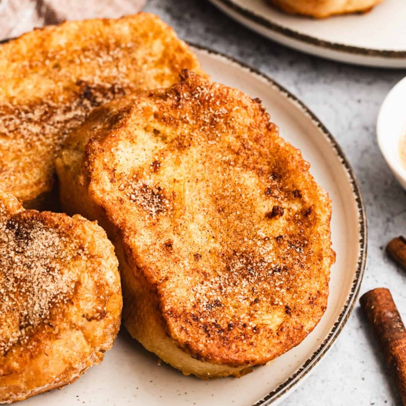

# Torrijas

*Spain's Holy Week pudding: thick stale country bread soaked in cinnamon milk, dipped in egg, fried in olive oil and drenched in honey.*

**Serves:** 4 (makes 8 torrijas)

**Prep Time:** 15 minutes (plus 1 hour soaking)

**Cook Time:** 15 minutes

## Overview
Milk warms with sugar, cinnamon stick and lemon zest; cools. Stale country bread slices 3 cm thick. Slices soak in the infused milk 10-30 minutes (don't soak too long or they fall apart). Lift onto a tray; dip in beaten egg. Pan-fry in olive oil 2 minutes per side till golden. While still hot, dunk briefly in warm honey OR toss in cinnamon sugar. Eats warm.

## Ingredients

### Soaking milk
- 500 ml whole milk
- 80 g caster sugar
- 1 cinnamon stick
- 1 strip lemon peel
- 1 strip orange peel (optional)

### Bread
- 8 thick slices of stale country bread (3 cm thick each, about 80 g per slice)

### Egg dip
- 3 eggs (large, beaten with a pinch of salt)

### Frying
- 200 ml olive oil (mild - not extra-virgin)

### To finish (choose one)
#### Honey version
- 200 g clear honey 
- 50 ml water (warm)

#### Cinnamon-sugar version
- 100 g caster sugar 
- 2 teaspoons ground cinnamon

## Method

### Stage 1 - Infuse the milk
1. Combine the milk, sugar, cinnamon stick, lemon peel and optional orange peel in a small saucepan.
1. Heat to just below a simmer (small bubbles at the edge); stir until sugar dissolves.
1. Off heat; cover; infuse 15 minutes.
1. Cool to room temperature.

### Stage 2 - Soak
1. Pour the cooled infused milk through a sieve into a wide shallow dish.
1. Lay the bread slices in the milk in a single layer.
1. Soak 10-15 minutes for soft bread; 20-30 minutes for very stale bread.
1. The slices should be saturated but still hold their shape (overly long soaking makes them collapse).

### Stage 3 - Beat eggs
1. Whisk the eggs with a pinch of salt in a wide shallow bowl.

### Stage 4 - Fry
1. Heat the olive oil in a wide pan over medium heat.
1. Lift a soaked slice with a slotted spatula; let excess milk drip off briefly.
1. Dip into the beaten egg, coating both sides.
1. Lower into the hot oil.
1. Fry 4-5 torrijas at a time; cook 2 minutes per side, turning carefully, until deep golden.
1. Lift onto a wire rack lined with kitchen paper.

### Stage 5 - Finish
1. **Honey version:** warm the honey with a splash of water; dip each torrija quickly into the warm honey (5 seconds); lift onto a serving plate.
1. **Cinnamon-sugar version:** while still hot, dredge each torrija in the cinnamon sugar.

### Stage 6 - Serve
1. Pile on a platter; eat warm.
1. A scoop of ice cream alongside is a modern addition.

## Notes
- **Stale bread is the key:** fresh bread falls apart in the milk soak. Bread that's been sitting on the counter 1-2 days is perfect. Day-fresh bread can be dried in a low oven for 30 minutes.
- **Don't over-soak:** soft sandwich bread takes 2 minutes; stale country bread takes 20 minutes. Test the centre - saturated but not collapsing is the goal.
- **Olive oil, not butter:** Spanish torrijas are fried in olive oil. Butter burns at the temperature needed and gives a different flavour profile.
- **Medium heat:** too hot and the outside burns before the egg sets; too cool and the bread absorbs oil and goes greasy.

## Storage
- Best within 30 minutes of frying.
- Reheat in a hot oven (200°C, 4 minutes) to revive the crispness; never microwave.
- Make ahead: the soaking milk keeps 3 days refrigerated; soak fresh bread to order.
