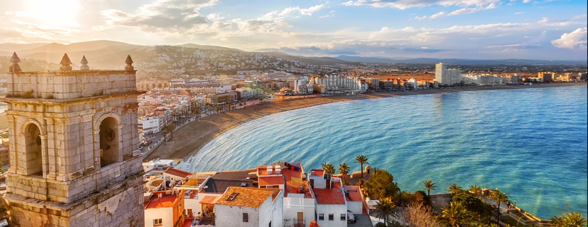

# Spanish Cuisine

Mediterranean cooking grounded in olive oil, garlic, smoked paprika and saffron. Cured pork (jamón, chorizo), seafood and short-grain rice anchor the table, in paella, fideuà, tortilla and the tapas tradition. Slow simmers, plancha-griddling and one-pot rice dishes dominate, with the sofrito (tomato, onion, garlic, paprika) starting nearly everything.
