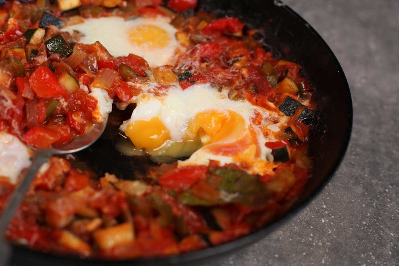

# Pisto Manchego

*La Mancha's slow-cooked pepper, courgette, aubergine and tomato stew, eaten as a tapa, a side, or with a fried egg dropped on top as a main. Nothing rushed: each vegetable cooks separately or in stages so they each retain their character before the lot melds into a sweet, oily, deeply ripe stew.*

**Serves:** 4

**Prep Time:** 15 minutes

**Cook Time:** 1 hour

## Overview
Pisto manchego is the long-cooked vegetable stew of La Mancha (the same dry sun-baked plateau Don Quixote rode across), peppers, courgette, aubergine and tomato simmered slow in generous olive oil till everything softens and glistens, eaten as a tapa, a side, or with a fried egg dropped on top as a main. Nothing about this dish is rushed: each vegetable cooks in its turn so it can soften and take on the oil before the next joins. Start with onions in a wide heavy pan, 12 to 15 minutes in olive oil till soft and golden (don't try to speed this up). In go red and green peppers for another 12 to 15 minutes till they've collapsed and turned silky, then diced aubergine for ten minutes till softened and lightly caramelised at the edges, then courgette and garlic for another five. Last in go the chopped tomatoes (or a big tin) with smoked paprika, dried oregano, a teaspoon of sugar to balance the acidity, salt and pepper, simmered uncovered for fifteen or twenty minutes more till the mixture is thick, glossy and jam-like. The oil pools around the edge by the end and that's correct; pisto is properly oily and skimping on olive oil gives a flat dry stew. Serve in shallow bowls with bread to mop up the puddles, or with a fried egg laid across each portion so the yolk runs into the warm vegetables.

## Ingredients

- 100 ml olive oil (or 60 ml; pisto is properly oily)
- 2 onions (large, chopped)
- 2 red peppers (chopped)
- 2 green peppers (chopped)
- 5 garlic cloves (crushed)
- 1 aubergine (large, diced)
- 2 courgettes (medium, diced)
- 6 ripe tomatoes (large, skinned and chopped) or 1 x 800 g tin chopped tomatoes
- 1 teaspoon sweet smoked paprika
- 1 teaspoon dried oregano
- 1 teaspoon sugar
- salt
- pepper
- 4 eggs (large, optional, to serve)

## Method

### Stage 1 - Onions
1. Heat the oil in a wide heavy pan over medium heat.
1. Add the onions; cook 12-15 minutes until soft and golden. Don't rush this.

### Stage 2 - Peppers
1. Add the red and green peppers; cook 12-15 minutes more until they've collapsed and turned silky.

### Stage 3 - Aubergine
1. Add the aubergine; cook 10 minutes until softened and lightly caramelised at edges.

### Stage 4 - Courgette
1. Add the courgette and garlic; cook 5 minutes.

### Stage 5 - Tomatoes
1. Add the tomatoes, smoked paprika, oregano, sugar, salt and black pepper.
1. Bring to a steady simmer; reduce heat slightly.
1. Cook uncovered 15-20 minutes more until the mixture is thick, glossy, jam-like.

### Stage 6 - Serve
1. Taste; adjust salt and pepper.
1. Serve in shallow bowls. Optionally fry an egg per person and lay it on top, yolk soft.
1. Eat with bread to mop the oil.

## Notes
- **Cook each vegetable in its turn:** Throwing them in together gives mush. Each addition has time to soften and take on the oil.
- **Generous oil:** Pisto is properly olive-oil-rich. Skimping makes a flat, dry stew. The oil pools around the edge by the end; that's correct.
- **Smoked paprika optional but classic:** Sweet (dulce) smoked paprika; not hot. Adds the rounded, slightly woody depth.

## Storage
- Keeps 5 days refrigerated; arguably better the next day.
- Freezes 3 months.
