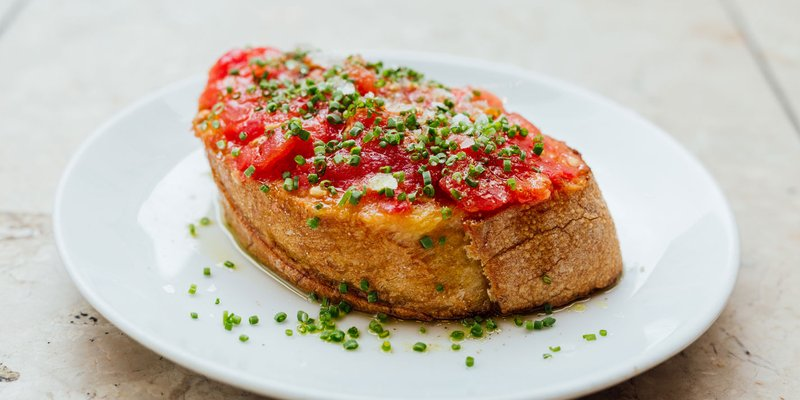

# Pan Con Tomate

*Catalonia's defining starter: toasted country bread rubbed with raw garlic and a halved ripe tomato, drizzled with good olive oil and salt.*

**Serves:** 4 (as starter or tapa)

**Prep Time:** 5 minutes

**Cook Time:** 4 minutes

## Overview
Country bread (sourdough or pan rústico) slices 1.5 cm thick. Toasts in a hot oven, on a griddle, or under a grill until pale gold and crisp on the outside but still tender inside. Garlic clove halves; cut sides rub gently over the warm toast. Ripe tomatoes halve; cut sides rub harder, pressing tomato pulp into the bread until soaked. Olive oil drizzles; flaky salt sprinkles. Eat at once.

## Ingredients
- 4 thick slices country sourdough (about 1.5 cm thick)
- 2 garlic cloves (peeled, halved)
- 2 ripe tomatoes (the ripest you can find - vine-ripened, ideally)
- 4 tablespoons extra-virgin olive oil (the best you have)
- Flaky sea salt

## Method

### Stage 1 - Toast the bread
1. Heat the oven to 200°C (or use a hot grill / griddle pan).
1. Lay the bread slices on a tray; toast 3-4 minutes until pale gold on the surface, still a little tender inside.
1. The bread should be crisp on the surface but not dry and crackery throughout.

### Stage 2 - Garlic rub
1. While the toast is still warm, take a cut garlic clove and rub the cut side gently over the surface of the bread.
1. The garlic essence transfers to the toast; you'll see the cut clove shrink as it grates against the crisp surface.
1. One pass per slice is plenty; more is overpowering.

### Stage 3 - Tomato rub
1. Halve the tomatoes crossways.
1. Take a tomato half by the skin; press the cut side firmly into the toast.
1. Rub vigorously back and forth; the pulp and juice transfer to the bread; you should be left holding just the skin.
1. Half a tomato per slice.

### Stage 4 - Oil and salt
1. Drizzle 1 tablespoon of olive oil generously over each slice (be generous - this is a oil-heavy dish).
1. Sprinkle flaky sea salt over each.

### Stage 5 - Serve
1. Eat immediately, alongside ham, cheese, anchovies, or as part of any tapas spread.

## Notes
- **Tomato quality is the dish:** out-of-season pale tomatoes give bland pan con tomate. Use the ripest, juiciest, vine-perfumed tomatoes you can find. Heritage varieties shine.
- **Crusty bread, not soft sandwich bread:** the rough open crumb of a country sourdough catches the tomato pulp. Soft white slices turn to mush.
- **Rub, don't spread:** the tomato is grated into the bread by the friction of the crusty surface. Don't slice and lay on top - that's bruschetta, not pan con tomate.
- **Olive oil is the seasoning:** Spaniards use a lot. Don't be shy.

## Storage
- Eats immediately or not at all.
- Bread continues absorbing tomato; after 20 minutes the slice is soggy.
- Toasted bread (without the rub) keeps an hour; assemble at the last second.
