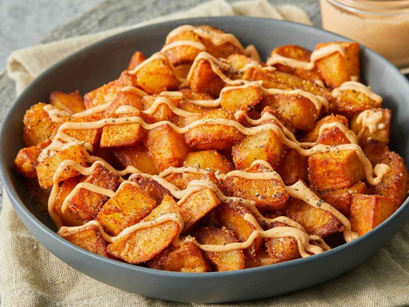

# Patatas Bravas

*Spain's most-ordered tapa: twice-fried potato cubes drenched in a smoky paprika-tomato sauce, drizzled with garlic aioli.*

**Serves:** 4 as a side / 6 as a tapa

**Prep Time:** 20 minutes

**Cook Time:** 30 minutes

## Overview
Maris Piper or floury potatoes peel and cube 2 ½ cm. Double-cook for shatter-crisp shell + fluffy interior: blanch / boil for 8 minutes till just tender, drain, cool slightly. Brava sauce: olive oil heats with garlic and a touch of flour; smoked paprika + cayenne stir in 30 seconds; tomato passata, sherry vinegar, salt, sugar; simmer for 15 minutes; blend if you want a smooth sauce or leave rustic. Optional garlic aioli: garlic-and-egg-yolk mayonnaise. Potatoes fry in hot oil 6-8 minutes till deep gold. Plate with sauce zigzagged over; aioli alongside.

## Ingredients

### Potatoes
- 1 kg Maris Piper (or other floury potatoes)
- 1 tablespoon salt (for boiling water)
- 600 ml neutral oil (for frying)

### Brava sauce
- 4 tablespoons olive oil
- 4 garlic cloves (minced)
- 1 tablespoon plain flour
- 1 tablespoon Pimentón de la Vera (smoked Spanish paprika - sweet or hot, your call)
- ¼ teaspoon cayenne (or to taste)
- 400 g tomato passata (or 1 tin chopped tomatoes)
- 2 tablespoons sherry vinegar (or red-wine vinegar)
- 1 teaspoon caster sugar
- 1 teaspoon salt
- 1 bay leaf (small)

### Garlic aioli (optional)
- 1 egg yolk
- 2 garlic cloves
- 1 teaspoon lemon juice
- 150 ml neutral oil
- 1 pinch salt

## Method

### Stage 1 - Boil potatoes
1. Peel and cube the potatoes (2 ½ cm cubes).
1. Boil in heavily salted water 8 minutes (the inside should be just tender; not falling apart).
1. Drain in a colander; spread on a tray; cool to room temperature.

### Stage 2 - Brava sauce
1. Heat the olive oil in a saucepan over medium heat.
1. Add the minced garlic; cook 30 seconds.
1. Stir in the flour; cook 1 minute (forms a paste).
1. Add the smoked paprika and cayenne; stir 30 seconds.
1. Pour in the tomato passata, sherry vinegar, sugar, salt and bay leaf.
1. Simmer 12-15 minutes till thickened and the raw-tomato edge has cooked off.
1. Remove bay leaf; blend smooth if desired; keep warm.

### Stage 3 - Aioli
1. In a small bowl, mash 2 garlic cloves to a paste with a pinch of salt.
1. Whisk in the egg yolk and lemon juice.
1. Slowly drizzle in 150 ml oil, whisking constantly, until thick and emulsified.

### Stage 4 - Fry potatoes
1. Heat 600 ml oil in a wide pan to 180°C.
1. Fry the par-boiled potatoes 6-8 minutes till deep gold and crisp all over.
1. Lift onto a wire rack; salt while hot.

### Stage 5 - Plate
1. Pile hot potatoes in a shallow bowl.
1. Zigzag warm brava sauce generously over the top.
1. Add dollops of aioli for the Barcelona-style version.
1. Serve immediately with cocktail sticks.

## Notes
- **Floury potatoes for the fluff:** waxy potatoes (Charlotte, Anya) stay dense and don't get the fluffy interior. Maris Piper, King Edward or Russet are correct.
- **Two-stage cooking (boil then fry):** boiling alone gives soft potatoes; frying raw gives uneven cooking. The combination guarantees crisp outside + fluffy inside.
- **Pimentón de la Vera is the soul:** the smoked Spanish paprika is what makes patatas bravas distinct from any other tomato-sauced potato. Buy a tin from a Spanish grocer.
- **Madrid vs Barcelona service:** Madrid serves brava only; Barcelona pairs brava and aioli. Both are correct; choose your team.

## Storage
- Best eaten immediately.
- Sauce keeps 5 days refrigerated (improves with time); reheat gently before serving.
- Aioli 3 days refrigerated.
- Cooked potatoes don't store - re-crisp leftover boiled potatoes by frying fresh to order.
