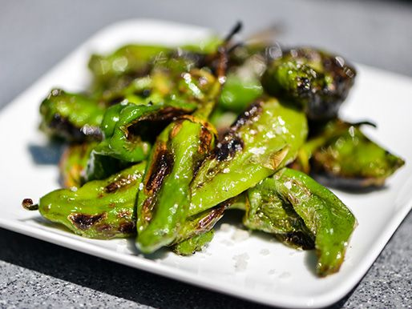

# Pimientos de Padrón

*Galicia's blistered green peppers: Padróns fried hot in olive oil and finished with flaky salt. Nine out of ten mild and sweet; the tenth fiery.*

**Serves:** 4 as a tapa

**Prep Time:** 5 minutes

**Cook Time:** 5 minutes

## Overview
Pimientos de Padrón are the small green peppers from Galicia that turn up on every Spanish tapas counter in summer: blistered in screaming-hot olive oil and finished with a heavy hand of flaky sea salt. The famous twist is that nine out of ten are mild and sweet and the tenth is fiery hot, which makes eating a plate of them an edible Russian roulette where you find out which is which only after you bite. The peppers go into a smoking-hot cast-iron pan with olive oil all at once; they should sizzle aggressively the moment they hit. Pat bone-dry first or the oil spits. Tossed three or four minutes till the skins char and blister in patches and the peppers slump slightly but still have some bite. Flaky salt scatters generously over the top; fine salt dissolves into the oil and disappears, but flaky sits on the surface for the iconic crunch. Eat hot with your fingers, by the stem from the wide end, with a cold glass of beer or Albariño.

## Ingredients
- 400 g Padrón peppers (or substitute Shishito peppers from a Japanese grocer - almost identical)
- 3 tablespoons olive oil
- 1 tablespoon flaky sea salt (Maldon or similar)

## Method

### Stage 1 - Prep
1. Rinse the peppers; pat dry thoroughly (water in the pan causes the oil to spit dangerously).

### Stage 2 - Heat the pan
1. Use a heavy skillet (cast iron is ideal); place over high heat for 2-3 minutes till smoking-hot.
1. Add the olive oil; swirl to coat.

### Stage 3 - Blister
1. Tip all the peppers in at once; they should sizzle aggressively.
1. Toss / stir constantly for 3-4 minutes.
1. The skins should char and blister in patches; the peppers should soften slightly but not collapse.
1. Don't overcook - they should still have a bit of bite.

### Stage 4 - Salt and serve
1. Tip onto a serving plate.
1. Sprinkle generously with flaky sea salt - more than you think.
1. Eat immediately, holding by the stem, biting from the wide end.

## Notes
- **Dry the peppers thoroughly:** wet peppers cause violent oil spit and don't blister cleanly.
- **HOT pan, lots of motion:** the pan needs to be smoking hot. Toss constantly so the peppers char without overcooking inside.
- **Don't deseed or split:** Padrón are eaten whole. The stem is the handle.
- **Flaky salt at the end:** fine salt dissolves into the oil; flaky sea salt sits on the surface and gives the iconic crunch.
- **Shishito is the substitute:** Japanese Shishito peppers are botanically similar and behave the same in the pan. Equally good if Padrón aren't available.

## Storage
- Eat within 10 minutes of cooking.
- Leftover peppers go limp; the texture is lost.
- The fun is the fresh blister and the salt crunch.
