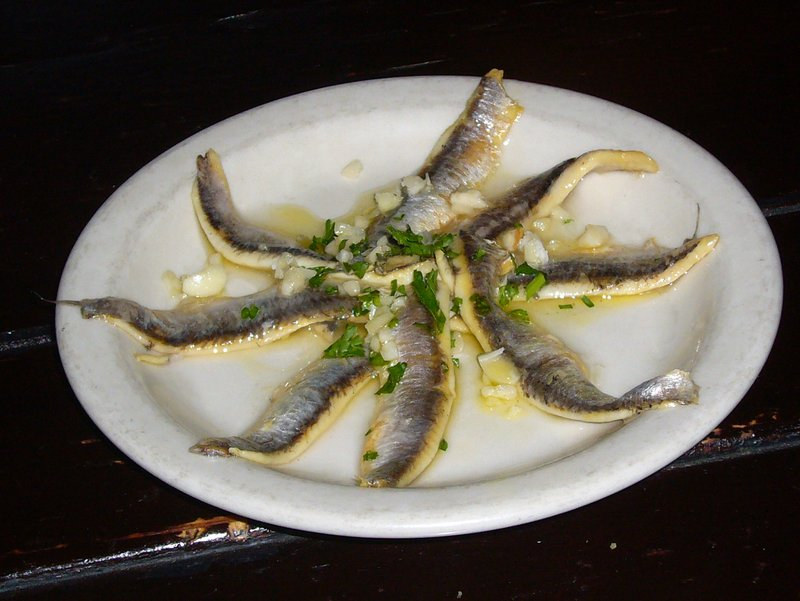

# Boquerones en Vinagre

*Spain's eternal tapa: fresh anchovy fillets cured in white-wine vinegar and salt, then bathed in olive oil with sliced garlic and parsley.*

**Serves:** 4 as a tapa

**Prep Time:** 30 minutes (plus 24 hours curing + 8 hours freezing)

**Cook Time:** 0 minutes

## Overview
Spain's eternal tapa: snowy white fillets of fresh anchovy cured in vinegar and salt, bathed in olive oil with sliced garlic and parsley, served on a plate with cocktail sticks at every bar from Madrid to Málaga. The fresh-anchovy freeze is non-negotiable for food safety; raw anchovies can carry the Anisakis parasite and must be deep-frozen before curing (or bought already-frozen-and-thawed). The vinegar bath does all the curing work; the acid denatures the proteins exactly as heat would, turning the fish translucent-to-opaque-white without any cooking. White-wine vinegar (not malt, not balsamic) is the canonical Spanish choice for its clean clear acidity. The olive oil is half the dish; generous extra-virgin oil layered with sliced garlic and parsley over the cured fish carries the flavour, so use the best to hand. The leftover oil is the bonus prize for dressing pasta or drizzling over toast.

**Food safety note:** fresh anchovies can carry Anisakis (a marine parasite). Freezing fish at -20°C for 48 hours, or -35°C for 15 hours, kills it. Freeze before curing OR buy already-frozen-and-thawed fish from a reputable supplier.

## Ingredients
- 500 g very fresh anchovies (or pre-frozen-and-thawed)
- 200 g coarse sea salt (for curing)
- 250 ml white-wine vinegar
- 250 ml water
- 5 garlic cloves (thinly sliced)
- 30 g flat-leaf parsley (finely chopped)
- 200 ml extra-virgin olive oil (the best you have)
- ½ teaspoon flaky sea salt (to finish)

## Method

### Stage 1 - Freeze (food safety)
1. If your anchovies are not pre-frozen, freeze them whole at -20°C for at least 48 hours (cracks freezers can hit -18°C; check yours or err on 72 hours).
1. Thaw overnight in the fridge.

### Stage 2 - Clean
1. With wet hands, pinch each anchovy's head and pull gently - the head, guts and central spine should come away in one motion.
1. The fish should now be a butterflied piece: two fillets joined at the tail.
1. Pat off any inner blackness or excess membrane.
1. Drop into a bowl of icy water; soak 5 minutes (cleans residual blood); drain on paper towels.

### Stage 3 - Cure
1. Lay the cleaned fillets in a single layer in a shallow dish (open flesh-side up).
1. Sprinkle a thin layer of coarse salt over.
1. Combine the vinegar and water; pour over until just covered.
1. Cover; refrigerate 24 hours.
1. The fillets will turn from translucent pinkish-grey to opaque white.

### Stage 4 - Dress
1. Drain the cured fillets; rinse briefly in cold water; pat dry.
1. Layer in a clean dish: fillets, sliced garlic, parsley, fillets, more garlic, more parsley.
1. Pour the olive oil generously over until the fillets are submerged.
1. Sprinkle the flaky sea salt over the top.
1. Cover; refrigerate at least 4 hours, ideally overnight.

### Stage 5 - Serve
1. Lift fillets onto small plates with a fork (let some olive oil come with them).
1. Eat as a tapa with bread, on a slice of pan con tomate, or with toothpicks.

## Notes
- **FREEZE FIRST:** fresh anchovies can carry Anisakis. Freezing kills it. Non-negotiable if using truly fresh fish.
- **Time the cure:** under-cured fillets are translucent and fishy; over-cured fillets are tough and harsh. 24 hours at refrigerator temperature is the standard.
- **Olive oil quality matters:** these fillets are 50% oil by flavour. Buy the best you can afford.
- **Don't substitute brine-cured anchovies:** those are a completely different product - dark, salty, intense. Boquerones en vinagre are mild, white, clean.

## Storage
- Keeps 1 week refrigerated in the olive oil.
- The oil itself becomes deeply flavoured - use it on bread, in salads, on pasta.
- Don't freeze cured fillets - the texture goes spongy.
