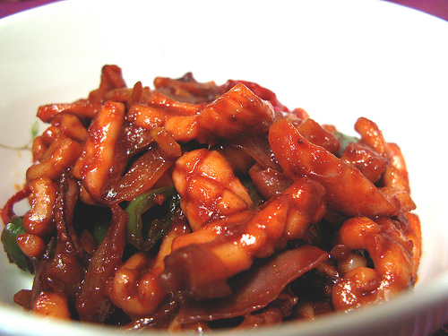

# Flash Fried Squid with Paprika and Garlic

*Spain's flash-fried squid tapa: small tender rings tossed in olive oil with smoked paprika, garlic and chilli, finished with sherry vinegar and lemon zest.*

**Serves:** 4

**Prep Time:** 15 minutes

## Overview
This is the tapa version of flash-fried squid: small tender rings and tentacles tossed in olive oil with smoked paprika, garlic and chilli, finished with sherry vinegar and lemon zest and eaten standing up with a glass of cold dry sherry in the other hand. The trick to good fried squid is two things: small squid (under 10 cm; larger ones turn chewy) and a screaming-hot pan that seals the flesh quickly without overcooking. Rings and bite-sized tentacles marinate two to four hours in olive oil with chilli and smoked paprika so the oil keeps the squid moist through the high-heat fry. Floured lightly, fried in two batches so the pan doesn't crowd (overcrowded squid steams instead of frying), with garlic added in the last twenty seconds. Tossed off the heat with sherry vinegar, shredded lemon rind and chopped parsley. Piled on a warm plate with crusty bread to soak up the paprika oil, served hot with chilled fino or manzanilla.

## Ingredients
- 500 grams very small squid (cleaned)
- 90 ml olive oil
- 1 fresh red chilli (seeded and finely chopped)
- 2 teaspoons smoked paprika
- 2 tablespoons plain flour
- 2 garlic cloves (finely chopped)
- 1 tablespoon sherry vinegar
- 1 teaspoon shredded lemon rind
- 2 tablespoons fresh parsley (finely chopped)
- salt
- pepper
- salad leaves (optional)

## Method

### Stage 1 - Marinate
1. Choose small squid that are no longer than 10 cm. 
1. Cut the body sacs into rings and cut the tentacles into bite sized pieces.
1. Place the squid in a bowl and add 2 tablespoons of the oil, half the chilli and the paprika.
1. Season with a little salt and some pepper, cover and leave to marinate for 2 - 4 hours in the refrigerator.

### Stage 2 - Fry & Season
1. Heat the remaining oil in a deep frying pan over a high heat.
1. Toss the squid in flour and divide into 2 batches.
1. Add the first batch of squid to the pan and stir-fry quickly, turning constantly for 1 - 2 minutes or until the squid rings become opaque and the tentacles have curled.
1. Sprinkle in half the garlic, stir to mix then turn out on to a plate and keep warm.
1. Repeat the stir-frying with the second batch of squid and garlic.
1. Sprinkle the sherry vinegar, lemon and remaining chilli and parsley over the squid.
1. Taste for seasoning and serve hot or cool.

## Notes
- **Squid size:** Small squid (under 10 cm) are more tender, avoid large squid which can be chewy.
- **High heat essential:** The quick fry at high temperature seals the squid and keeps it tender. Don't overcrowd the pan.
- **Paprika selection:** Use smoked paprika for depth, or mild paprika if you prefer less heat.
- **Marinating:** The oil-based marinade prevents the squid from drying out during the high-heat frying.

## Serving
- Serve with: Crusty bread to soak up the flavored oil, lemon wedges
- Garnish with: Fresh parsley and thin lemon slices
- Accompaniment: Dry sherry or crisp white wine

## Storage
- Best served hot or warm immediately after cooking
- Chilled leftovers can be served the next day (store in an airtight container)
- Keeps 1 day refrigerated
- Not recommended for freezing as texture becomes tough upon thawing
