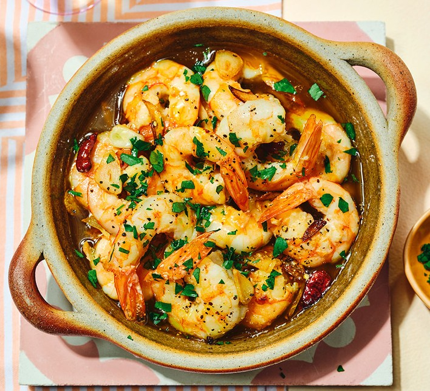

# Gambas al Ajillo

*The Madrid tapas-bar essential: whole peeled prawns sizzled in olive oil with sliced garlic and dried chilli. Bread alongside to soak the oil.*

**Serves:** 4 (as a tapa)

**Prep Time:** 5 minutes

**Cook Time:** 5 minutes

## Overview
Sliced garlic (lots - like 8 cloves for a small dish) cooks slowly in olive oil till just turning gold. Dried chilli flakes go in. Heat goes up; peeled raw prawns join. Sizzles 2-3 minutes till the prawns turn pink and curl. A splash of sherry or sherry vinegar at the end. Parsley showers over. Served at the table still bubbling. Bread is essential - half the dish is the garlic oil.

## Ingredients
- 400 g raw peeled prawns (medium, about 200-250 per kg)
- 8 garlic cloves (sliced 2 mm)
- 1 small dried red chilli (broken into pieces, or ½ teaspoon chilli flakes)
- 100 ml olive oil (good quality - this is the dish)
- 1 tablespoon dry sherry (fino or manzanilla) - optional but classic
- 1 teaspoon flaky sea salt
- 2 tablespoons fresh flat-leaf parsley (finely chopped)
- Crusty bread (essential, for serving)

## Method

### Stage 1 - Prep
1. Pat the prawns dry on paper towels (wet prawns won't sizzle; they steam).
1. Slice the garlic 2 mm thick.

### Stage 2 - Garlic infusion
1. Heat the olive oil in a small heavy pan (a Spanish cazuela is ideal - small clay dish 18 cm across) over medium-low heat.
1. Add the sliced garlic; cook 3-4 minutes, stirring, until pale gold (not browned - burnt garlic ruins the dish).
1. Add the broken dried chilli; cook 20 seconds.

### Stage 3 - Sizzle the prawns
1. Turn the heat up to medium-high.
1. Tip in the prawns; salt them.
1. Stir; cook 2-3 minutes until they turn opaque pink and curl into commas.

### Stage 4 - Finish
1. Splash in the sherry; let bubble 30 seconds.
1. Off heat; shower with chopped parsley.

### Stage 5 - Serve
1. Bring the pan straight to the table - the oil should still be bubbling at the edges.
1. Serve with crusty bread and small forks or cocktail sticks.
1. The oil at the bottom IS the dish - make sure people get bread to soak it up.

## Notes
- **Sliced garlic, not minced:** sliced garlic stays distinct in the oil; minced garlic turns to paste and burns easily. The garlic is meant to be a visible and edible component.
- **Pat the prawns dry:** wet prawns turn the sizzle into a steam, the garlic oil splashes everywhere, and you lose the iconic crackle.
- **Small pan = high temperature:** a small dish concentrates the heat. A large pan distributes the prawns too thinly and they stew.
- **Bread is not optional:** the leftover garlic oil at the bottom is half the joy. Provide enough bread.

## Storage
- Eats immediately - no leftovers.
- If you have leftover oil, it keeps 3 days refrigerated and is glorious tossed with pasta or rice.
