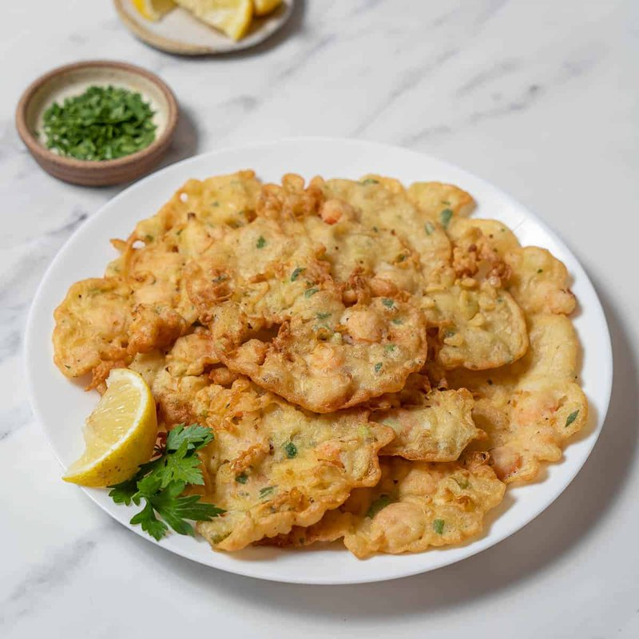

# Tortillitas de Camarones

*Cadiz's lace-thin tapa: a chickpea-and-flour batter laced with whole tiny shrimp, dropped into hot olive oil and fried shatter-crisp.*

**Serves:** 4 (makes 12 tortillitas)

**Prep Time:** 15 minutes (plus 30 minutes batter resting)

**Cook Time:** 20 minutes (in batches)

## Overview
Chickpea flour and plain flour whisk with cold water and a pinch of salt and paprika to a thin batter, like single cream. Rests for 30 minutes (the flour fully hydrates). Tiny whole brown shrimp (camarones or krill, head and shell on, eaten whole) stir in with finely chopped spring onion and parsley. Olive oil heats hot in a wide pan. A small ladle of batter drops in; spreads naturally to a thin lacy disc 10 cm across. Fries for 2 minutes, flips, fries 1 more minute. Drains briefly on a rack. Eats hot.

## Ingredients

### Batter
- 100 g chickpea (gram) flour
- 50 g plain flour
- 300 ml very cold water
- 1 teaspoon salt
- ½ teaspoon sweet smoked paprika
- ½ teaspoon ground black pepper

### Mix-in
- 200 g tiny whole brown shrimp (about 1-2 cm long, head and shell on - sold cooked at fishmongers as "brown shrimp" or "krill")
- 3 spring onions (very finely sliced)
- 30 g fresh flat-leaf parsley (finely chopped)

### Frying
- 500 ml olive oil (don't use neutral oil - the olive flavour is part of the dish)

## Method

### Stage 1 - Batter
1. In a wide bowl, whisk the chickpea flour, plain flour, salt, paprika and black pepper.
1. Pour in the cold water gradually, whisking continuously until smooth.
1. The batter should be thin - pourable from a spoon, like single cream.
1. Rest 30 minutes (essential - the chickpea flour fully hydrates and the texture relaxes).

### Stage 2 - Mix-ins
1. Just before frying, stir in the tiny shrimp, sliced spring onion and chopped parsley.

### Stage 3 - Heat the oil
1. Pour the olive oil into a wide pan to a depth of 1 ½ cm.
1. Heat to 180°C (a tiny drop of batter should sizzle and rise immediately).

### Stage 4 - Fry
1. With a small ladle, drop a generous tablespoon of batter (about 50 ml) into the hot oil.
1. The batter will spread into a thin irregular disc 10 cm across; you should see gaps and holes form naturally - this is the lace texture.
1. Add 2-3 more tortillitas to the pan (don't crowd).
1. Fry 2 minutes - the edges should crisp gold; small bubbles rise from the centre.
1. Flip with tongs or a slotted spoon; fry 1 more minute.
1. Lift onto a wire rack (paper towels make the bottoms soggy).

### Stage 5 - Serve
1. Pile hot tortillitas on a plate.
1. Eat immediately with a glass of cold fino or manzanilla sherry.

## Notes
- **THIN batter is non-negotiable:** thick batter gives a doughy fritter, not a lacy one. The batter should pour from a spoon in a steady stream.
- **Hot oil for lace:** 180°C minimum. Cool oil gives soggy thick pancakes; hot oil instantly cooks the batter into the iconic lacy crisp.
- **Tiny whole shrimp:** brown shrimp from Morecambe Bay, or any tiny shell-on krill, work perfectly. Larger prawns DON'T - the size ratio is wrong and they don't suspend in the batter.
- **Olive oil, not neutral:** the fruity Spanish olive oil flavour comes through. Use cheap-grade olive oil, not extra-virgin (too expensive for frying volume).

## Storage
- Eat within 10 minutes of frying.
- Leftover tortillitas go limp; the lace is gone within an hour.
- Re-crisping in a hot oven (200°C, 4 minutes) is acceptable but not transformative.
