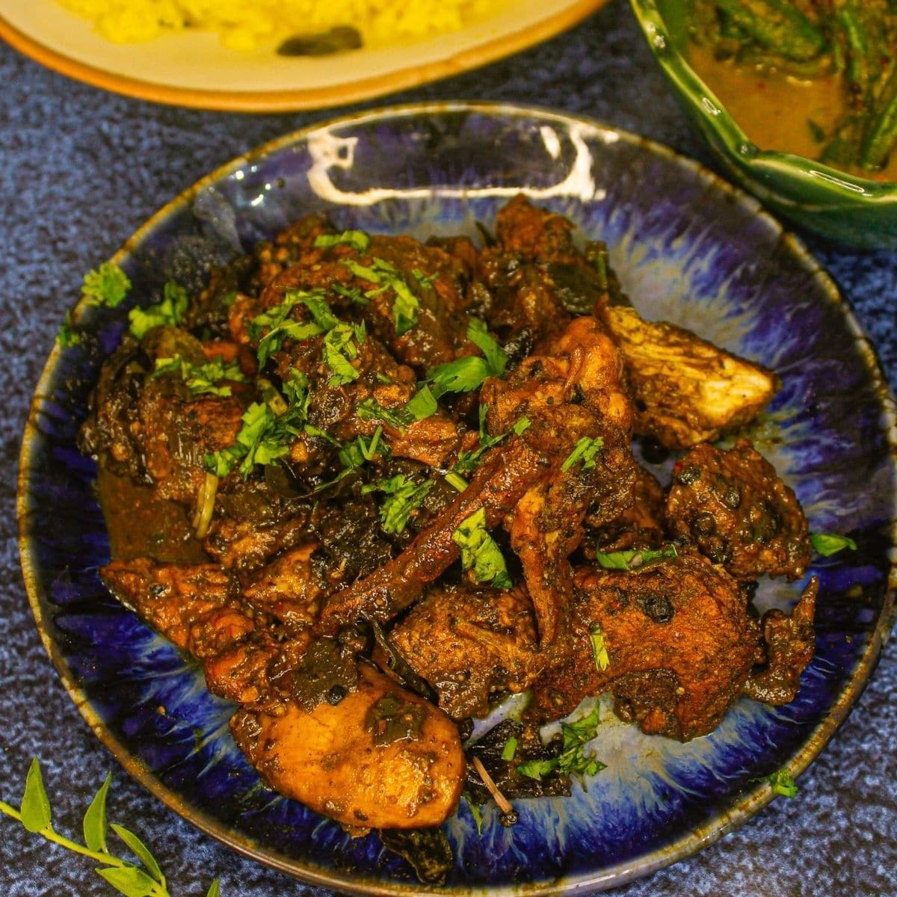

# Ambul Thiyal (Sri Lankan Sour Fish Curry)

*The southern Sri Lankan dry fish curry: chunks of tuna braised in goraka (gambooge) and black pepper until the liquid evaporates and the fish goes dark, sticky and sour, no coconut milk in sight.*

**Serves:** 4 to 6

**Prep Time:** 15 minutes

**Cook Time:** 45 minutes

## Overview
Ambul thiyal is the southern Sri Lankan coastal classic that pre-dates refrigeration: fresh tuna chunks (skipjack or yellowfin) braised in a dark, sour, intensely peppered sauce of goraka (gambooge, a dried tropical fruit that puckers your mouth), black pepper, garlic, ginger, curry leaves and cinnamon, no coconut milk, no chillies in quantity. The salt and sour preserve the fish for days at room temperature in the tropical heat, which is why this exists in the first place. The finished dish is dry rather than saucy: dark, sticky, fierce with pepper and tamarind-like sourness from the goraka, served as a small companion to a full rice & curry plate. Half a tablespoon per portion is plenty.

## Ingredients

- 700 g fresh tuna (skipjack or yellowfin; cut into 3 cm cubes)
- 4 tablespoons cleaned goraka (dried gambooge; soaked 30 minutes in 100 ml hot water, then puréed) OR substitute 3 tablespoons tamarind paste + 1 tablespoon dark vinegar

### Spice paste
- 4 garlic cloves
- 3 cm fresh ginger
- 1 tablespoon black peppercorns (coarsely cracked)
- 1 tablespoon ground cinnamon
- 2 teaspoons fine salt
- 1 teaspoon Sri Lankan roasted [curry powder](../../base-ingredients/curry-powder/bir-curry-powder.md) (or substitute: 1 tsp ground coriander + ½ tsp cumin + ¼ tsp fenugreek)
- 1 sprig fresh curry leaves
- 1 pandan leaf (5 cm; optional)
- 200 ml cold water

## Method

### Stage 1 - Build the sour paste
1. Pound the garlic, ginger, peppercorns and salt to a coarse paste in a mortar.
1. Stir into the goraka paste with the cinnamon, curry powder, curry leaves and pandan.

### Stage 2 - Marinate
1. Toss the tuna cubes thoroughly with the spice paste; massage well so every piece is dark and coated.
1. Let stand 10 minutes at room temperature.

### Stage 3 - Braise
1. Tip the marinated fish into a heavy saucepan; add the 200 ml water.
1. Bring to a simmer, then reduce to medium-low and cover. Cook 30 to 40 minutes, stirring gently every 10 minutes (gently, the fish wants to stay in chunks), until the liquid has almost completely evaporated and the fish is dark, sticky and slightly caramelised on the bottom.
1. Taste; the dish should be intensely sour, peppery and salty. Adjust salt if needed.

## Notes
- **Goraka is what makes this dish.** It's the dried smoke-cured fruit of Garcinia gummi-gutta, sold at Sri Lankan groceries. Tamarind + vinegar is an acceptable substitute, but the original is worth tracking down.
- **Don't stir aggressively.** The fish chunks should stay whole; gentle pan-shake or careful folds only.
- **Keeps for days.** This curry was invented to preserve fish in tropical heat; at room temperature it holds 3 days, refrigerated a week.

## Storage
- Refrigerate up to 7 days in a sealed jar; the flavour deepens over the first 48 hours.
