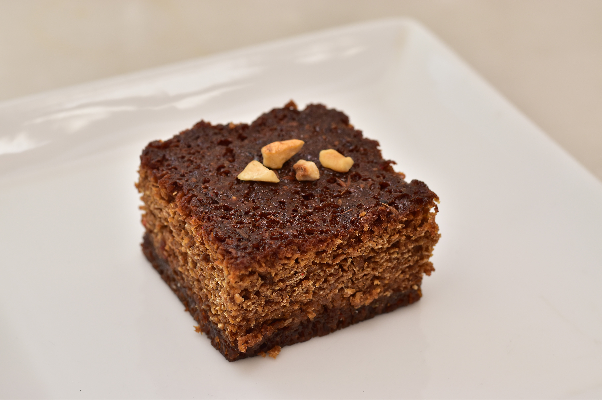

# Bibikkan

*Sri Lankan coconut treacle cake: a baked square loaded with grated coconut, dark jaggery, cashews and treacle, dense and sticky and unapologetically rich.*

**Serves:** 12

**Prep Time:** 20 minutes

**Cook Time:** 60 minutes

## Overview
Bibikkan is the Sri Lankan version of a coconut cake, but heavier and darker than any Western parallel, closer in texture to a sticky toffee pudding or a Caribbean black cake. The build is grated fresh coconut, dark kithul jaggery, semolina, eggs, treacle, butter, chopped cashews and dried fruit (raisins or candied citrus peel), with cardamom and cinnamon perfuming the lot. Baked in a square tin until the top is dark and set; cuts into dense, fudgy squares. Served at Christmas, Sinhala New Year, and any major Sri Lankan celebration where one cake isn't enough. Burgher (Eurasian) Sri Lankan households have many family recipes; this is a basic version.

## Ingredients

### Wet mix
- 250 g fresh grated coconut (or unsweetened desiccated coconut rehydrated in 100 ml hot water and squeezed)
- 200 g kithul jaggery (chopped; or substitute dark muscovado sugar + 2 tablespoons black treacle)
- 100 ml kithul palm treacle (or dark muscovado syrup)
- 100 g salted butter (melted)
- 3 large eggs

### Dry mix
- 150 g semolina (fine)
- 1 teaspoon ground cardamom
- 1 teaspoon ground cinnamon
- ½ teaspoon ground nutmeg
- ½ teaspoon fine salt
- 1 teaspoon baking powder

### Mix-ins
- 100 g raw cashews (roughly chopped)
- 100 g raisins or sultanas
- 50 g candied citrus peel (chopped fine; optional but classic)
- 1 tablespoon rose water (optional)

### To prep the tin
- A 23 cm square tin, greased and lined with baking paper

## Method

### Stage 1 - Build the jaggery base
1. Combine the chopped jaggery, treacle and melted butter in a saucepan over low heat. Stir until the jaggery has completely dissolved and the mixture is smooth and warm.
1. Cool 5 minutes (don't add eggs to a hot mixture or they cook).

### Stage 2 - Combine wet and dry
1. Preheat oven to 170°C.
1. Whisk the eggs into the warm jaggery mixture one at a time, beating well between each.
1. Stir in the grated coconut.
1. In a separate bowl, mix the semolina, cardamom, cinnamon, nutmeg, salt and baking powder.
1. Fold the dry mix into the wet, then fold in the cashews, raisins and candied peel (if using).
1. Stir in the rose water if using.

### Stage 3 - Bake
1. Tip the batter into the prepared tin; smooth the top with a spatula.
1. Bake for 55 to 65 minutes; the top should be dark mahogany and set firm, a skewer inserted in the centre comes out with sticky moist crumbs (NOT wet batter; you want under-baked-ish for the right fudgy texture).
1. Cool completely in the tin.

### Stage 4 - Cut and serve
1. Once completely cool, lift the cake out of the tin via the paper.
1. Cut into 5×5 cm squares with a sharp knife (wipe between cuts).

## Notes
- **Don't over-bake.** Bibikkan should be properly fudgy and dense; a fully-set cake-like texture means you've cooked the moisture out. Pull when a skewer comes out with sticky crumbs.
- **Fresh grated coconut vs desiccated.** Fresh is significantly moister and gives a richer cake; if using desiccated, hydrate it first.
- **Jaggery is the key sweetener.** Substituting white sugar gives a paler, less interesting cake. Kithul or coconut jaggery if possible; dark muscovado at a minimum.

## Storage
- Wrap in baking paper and keep in an airtight tin at room temperature for up to 2 weeks. The texture improves on day 2 as the flavours marry.
