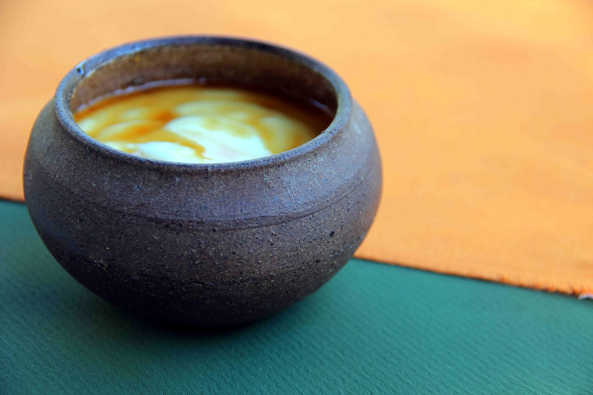

# Curd and Treacle

*Set buffalo-milk curd in a clay pot, drizzled with kithul palm treacle: the simplest dessert in Sri Lanka, sold roadside from stacks of mishi pots, served at every wedding and every weekday lunch.*

**Serves:** 4

**Prep Time:** 5 minutes (assuming pre-made curd)

**Cook Time:** 0 minutes

## Overview
Curd and treacle (mee kiri saha kithul peni) is the simplest Sri Lankan dessert and arguably the most beloved: a small clay pot (mishi) of slowly set buffalo-milk curd, drizzled with kithul palm treacle, a dark, smoky, slightly bitter syrup tapped from the kithul palm and reduced down. The curd is tarter and thicker than Greek yogurt, slightly tangy from natural fermentation; the treacle is unlike any other syrup, with caramel-and-molasses depth and a faintly smoky note. Together they're an essential pairing, sweet over sour, smooth over slightly grainy, dark over white. Sold at every roadside stall on the southern coast in stacked clay pots; served at the end of every Sri Lankan rice & curry meal.

## Ingredients

### To serve
- 500 g thick set buffalo curd (or substitute: 500 g full-fat Greek yogurt; or 500 g strained natural live yogurt; or the closest you can get is dahi)
- 100 ml kithul palm treacle (from any Sri Lankan grocer; substitute date syrup or dark maple syrup, knowing both are different in character)

### To serve (optional traditional accompaniments)
- 1 ripe banana per person (sliced; for the dressed-up plate)
- A few chunks of jaggery (palm sugar in solid form; alternative to the syrup)

## Method

1. Scoop the curd into small bowls, ideally small clay pots ("mishi") for the most authentic look. About 125 g per portion.
1. Drizzle 2 to 3 tablespoons of kithul treacle over each portion; the syrup pools in the curd, slowly absorbed.
1. Optional: slice a ripe banana onto the side.
1. Serve immediately, before the syrup absorbs entirely into the curd.

## Notes
- **Buffalo curd is the right curd.** Mee kiri (buffalo milk curd) is set thick like a panna cotta and has a slightly tangy, gamier flavour than cow's milk yogurt. It's sold at UK Sri Lankan groceries in plastic pots. Greek yogurt is the everyday substitute.
- **Kithul treacle, NOT golden syrup.** Kithul palm treacle has a complex bitter-sweet caramel character that golden syrup, honey or maple syrup don't share. Sri Lankan groceries carry it; some health food shops too.
- **Don't stir.** The visual of dark syrup pooled on white curd is part of the dish. Stirring just muddles both.

## Variations
- **Kiribath with curd and treacle.** Replace the rice in a kiribath plate with curd; pour the treacle over both. A celebration spread.
- **Curd with jaggery.** Skip the syrup; serve solid jaggery shards alongside the curd. Bite a chunk of jaggery, spoon some curd. Drier, more textural.

## Storage
- Both curd and treacle keep for weeks in the fridge / cupboard separately; assemble per portion at the moment of serving.
