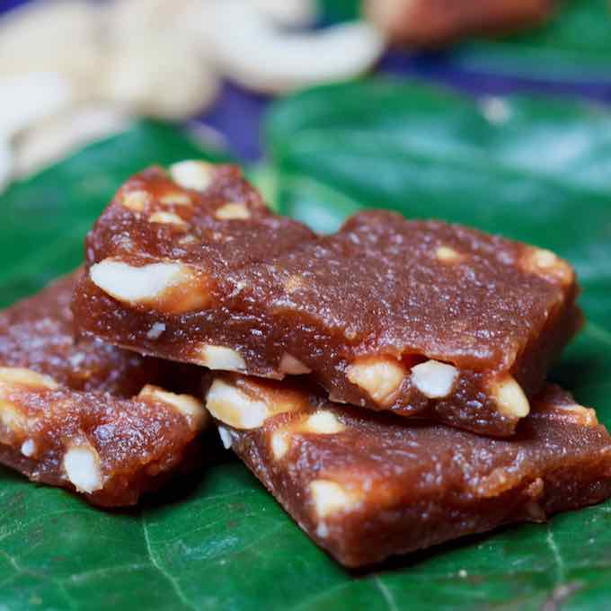

# Kalu Dodol

*Dark, dense, fudgy Sri Lankan sweet of coconut milk, jaggery, rice flour and cashews, simmered on the lowest possible heat for three hours until it goes pitch-black and pulls clean from the pan.*

**Serves:** makes about 30 small squares

**Prep Time:** 15 minutes

**Cook Time:** 3 hours

## Overview
Kalu dodol ("black dodol") is the south-coast Sri Lankan sweet that earned its reputation through sheer endurance: coconut milk, kithul palm jaggery, rice flour and chopped cashews are cooked together on the lowest possible heat for hours, stirred near-constantly, while the mixture goes from pale beige to caramel to mahogany to finally a deep, glossy, near-black slab that pulls away from the pan in one piece when nudged. The end result is dense, fudgy, almost taffy-like; a square the size of a postage stamp is a serving. Made for weddings and major holidays; specialty shops in Hambantota and Galle sell it year-round. Three hours of low-and-slow with occasional patience tests; the reward is a sweet that keeps for weeks.

## Ingredients

- 800 ml thick coconut milk (the first pressing; or two tins of full-fat coconut milk)
- 400 g kithul jaggery (or palm sugar; chopped), substitute dark muscovado sugar plus 2 tablespoons black treacle
- 150 g rice flour (sifted)
- 1 teaspoon fine salt
- 100 g raw cashews (roughly chopped)
- ½ teaspoon ground cardamom
- 1 pinch nutmeg
- 50 g coconut oil (for the final glaze and pan-greasing)

### Equipment
- A heavy-based saucepan with a tight-fitting lid (the deep stews kind)
- A long wooden spoon
- A 20×20 cm square tin or tray lined with greased baking paper

## Method

### Stage 1 - Dissolve the jaggery
1. Combine the coconut milk and chopped jaggery in the heavy saucepan over low heat. Stir until the jaggery has completely dissolved.

### Stage 2 - Whisk in the flour
1. In a small bowl, whisk the rice flour with 100 ml of the coconut-jaggery mixture (lifted from the pan) until it forms a smooth slurry with no lumps.
1. Pour the slurry back into the main pan, whisking constantly.
1. Add the salt; bring to a low simmer over medium-low heat.

### Stage 3 - The long simmer
1. Reduce heat to the LOWEST possible. Cook uncovered, stirring every 5 minutes with a long wooden spoon, for the next 2 to 2.5 hours.
1. The mixture passes through several stages:
   - First 30 minutes: it thickens and turns pale tan
   - 1 hour in: caramel-brown, still saucy
   - 1.5 hours: mahogany, getting glossy, oil starts to surface
   - 2 hours: dark brown, very thick, oil pooling clearly
   - 2.5 hours: nearly black, glossy, pulls cleanly from the pan sides when stirred
1. Stay patient. The transformation needs the time.

### Stage 4 - Add cashews and finish
1. At about 2 hours, stir in the chopped cashews, cardamom and nutmeg.
1. Continue cooking until the mixture is near-black and pulls cleanly away from the pan sides as you stir (the "test" of doneness, the spoon should leave a clean line for a moment).
1. The released coconut oil should be clearly pooling on top.

### Stage 5 - Set
1. Brush a 20×20 cm tin (lined with greased paper) with coconut oil.
1. Tip the dodol in; press flat with the back of an oiled spoon.
1. Smooth the surface.
1. Let cool completely at room temperature (don't refrigerate, it sweats).
1. Once cool and set firm (2 to 3 hours), cut into small squares with an oiled sharp knife.

## Notes
- **Low and slow is non-negotiable.** Pushing the heat to speed it up burns the bottom and ruins the texture. 2.5 hours of patience is the recipe.
- **Wooden spoon, not metal.** Metal scrapes the bottom and burns easily; a long-handled wooden spoon is the right tool.
- **The "pulls clean" test.** Drag the spoon across the pan bottom; if the dodol holds away from the sides and leaves a clear trail for a moment, it's done.

## Storage
- Keeps in an airtight container at room temperature for up to 3 weeks. Don't refrigerate; the dodol sweats and softens unattractively.
