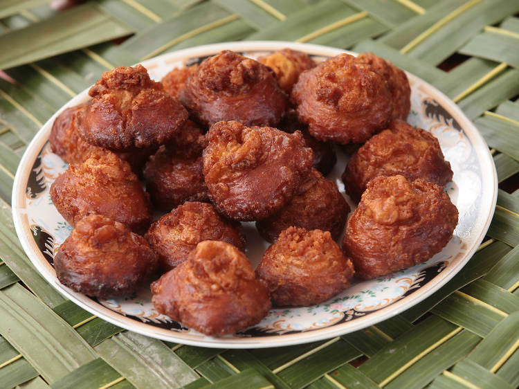

# Kavum (Sinhala Oil Cake)

*Sri Lankan Sinhala New Year sweet: a thick rice-flour-and-treacle batter dropped into hot oil with a special stick that pulls a long "tail" from the centre, fried golden-brown, eaten by hand at every April celebration.*

**Serves:** makes about 12 to 15

**Prep Time:** 30 minutes (plus 30 minutes batter resting)

**Cook Time:** 25 minutes

## Overview
Kavum (or konda kavum, "topknot oil cake") is the centrepiece of every Sinhala and Tamil New Year sweet plate in April. It's made from rice flour and dark palm treacle stirred to a thick batter, scooped onto an oiled wooden ladle and lowered into hot oil; once frying, a special pointed stick (the kavum kotuwa) is used to pull a tall central "tail" from the middle as it sets, giving the kavum its distinctive topknot shape. The exterior fries dark and crisp; the interior stays soft, almost moist, sweet with treacle. Eat by hand at the New Year aluth avurudda meal alongside kiribath, with sweets like kokis and aluwa rounding out the plate. Sold at every Sri Lankan grocery in stacked plastic boxes year-round, but homemade is the festive way.

## Ingredients

### Treacle syrup
- 250 g kithul palm treacle (or substitute: 200 g dark muscovado sugar + 50 ml water + 1 tablespoon black treacle for the molasses note)
- 50 ml cold water

### Batter
- 250 g rice flour (fine; preferably roasted rice flour or "kavum flour" sold at Sri Lankan groceries)
- 50 g semolina (or wheat flour)
- ½ teaspoon fine salt
- 1 pandan leaf (5 cm; finely chopped)
- ½ teaspoon ground cardamom

### For frying
- 750 ml coconut oil (for deep frying)

### Equipment
- A wide deep pan for frying
- A long wooden chopstick or skewer (for pulling the kavum tail)
- A slotted spoon for lifting

## Method

### Stage 1 - Treacle reduction
1. Combine the treacle and water in a saucepan over medium-low heat. Stir until the treacle dissolves and the mixture is smooth.
1. Simmer gently for 5 minutes, the syrup should thicken slightly and turn glossy.
1. Cool to lukewarm.

### Stage 2 - Mix the batter
1. In a wide bowl, combine the rice flour, semolina, salt, chopped pandan and cardamom.
1. Pour in the warm treacle gradually, stirring with a wooden spoon. The batter should be thick and droppable, the consistency of stiff peanut butter.
1. If too dry, add a tablespoon of warm water; if too loose, add another tablespoon of flour.
1. Cover and rest at room temperature for 30 minutes.

### Stage 3 - Heat the oil
1. Pour the coconut oil into a deep pan; heat to 170°C. The oil should be hot enough that a small dollop of batter sizzles and rises immediately.

### Stage 4 - Fry with the tail pull
1. Take a heaped tablespoon of batter; shape lightly between oiled hands into a flattened round.
1. Slide it carefully into the hot oil; it sinks then rises.
1. Within 10 seconds, use the chopstick to lift the centre of the kavum upwards, pulling a tall tail (1.5 to 2 cm above the surface). Hold for 5 seconds; release.
1. Continue frying 2 to 3 minutes per side, turning once. The kavum should be deeply golden-brown on all sides.
1. Lift onto kitchen paper to drain.
1. Cook one or two at a time so you can attend to each tail; this is not a stack-fry operation.

### Stage 5 - Cool
1. Cool completely on a rack; kavum hardens slightly as it cools and develops its proper texture.

## Notes
- **The tail is the visual signature.** A kavum without a topknot is just a fried fritter; pulling the tail with the chopstick is what makes it a kavum. Practice on the first one or two.
- **Treacle quality matters.** Kithul palm treacle gives the distinctive Sri Lankan flavour; substitutes work but read as a different sweet.
- **Coconut oil is the right frying medium.** Vegetable oil works but lacks the coconutty undertone.

## Storage
- Keep in an airtight container at room temperature for up to 5 days. They go slightly chewier on day 3 and are still good.
