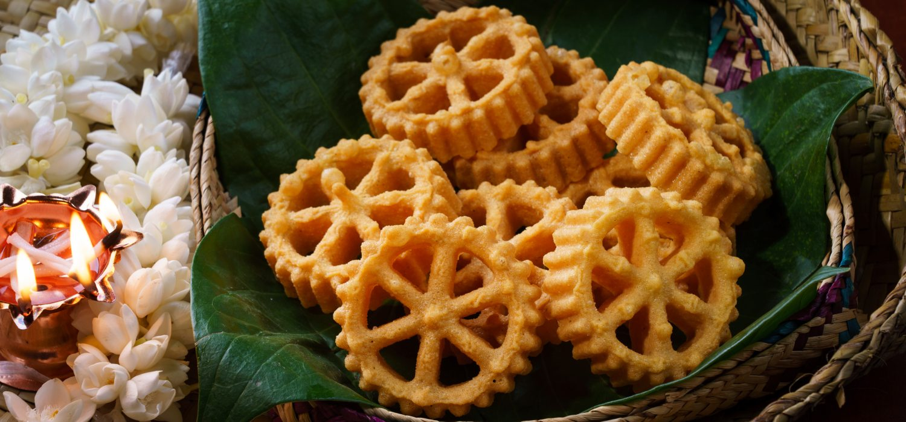

# Kokis

*Crisp deep-fried rosette cookies pressed from a metal mould dipped in coconut-rice flour batter: the Sri Lankan New Year sweet adopted from the Dutch koekjes, eaten by the handful in April.*

**Serves:** makes about 30 to 40 cookies

**Prep Time:** 20 minutes

**Cook Time:** 30 minutes

## Overview
Kokis (pronounced "ko-kiss") is the Sri Lankan adaptation of the Dutch koekje (cookie), brought to the island during the colonial period and absorbed thoroughly into the Sinhala New Year sweet table. The cookies are made by dipping an ornate metal kokis iron, a long-handled stick with a decorative flower-shaped mould at the end, first into very hot oil to heat the iron, then into a thin batter of rice flour, coconut milk, egg and turmeric, then back into the hot oil. The hot iron sets a thin layer of batter onto the mould, which slides off into the oil and fries crisp. The pattern is delicate, lacy and instantly recognisable. Sold piled high on Sinhala New Year tables alongside kavum and aluwa.

## Ingredients

### Batter
- 250 g rice flour (fine)
- 50 g plain flour
- 1 teaspoon fine salt
- ½ teaspoon ground turmeric (for the pale yellow colour and a tiny earthy note)
- 1 egg (large)
- 250 ml thin coconut milk
- 100 ml cold water (more if needed)

### Equipment
- A kokis iron (long-handled brass mould; from any Sri Lankan grocer, ~£8)
- A deep pan or wok for frying
- A slotted spoon

### For frying
- 1 litre coconut oil (or neutral vegetable oil)

## Method

### Stage 1 - Mix the batter
1. Whisk the rice flour, plain flour, salt and turmeric in a wide bowl.
1. In a separate jug, whisk the egg with the coconut milk.
1. Pour the wet into the dry, whisking until smooth.
1. Add cold water gradually until the batter is the consistency of single cream, thin enough to drip easily from a spoon, thick enough to coat the iron.
1. Let stand 10 minutes.

### Stage 2 - Heat the oil and the iron
1. Pour the oil into a deep pan or wok; heat to 175°C.
1. Submerge the kokis iron fully in the hot oil for 30 to 45 seconds. The iron MUST be properly hot, without that, the batter won't release.
1. Have a wide bowl of batter, a kitchen paper-lined plate, and a slotted spoon all within arm's reach.

### Stage 3 - Dip and fry (the rhythm)
1. Lift the hot iron from the oil; tap off excess.
1. Dip the iron into the batter so the batter covers about 80% of the mould (NOT the top of the mould, the batter must not engulf it, or the cookie won't release).
1. Hold for 1 to 2 seconds, the batter coats the hot iron and starts setting.
1. Submerge the iron back into the hot oil. The cookie sizzles and starts to puff.
1. Wait 20 seconds, then gently jiggle the iron, the kokis should release into the oil.
1. If it doesn't release, give it another 15 seconds in the oil; usually it lets go.
1. Fry the released kokis for another 30 to 45 seconds, flipping once with the slotted spoon, until pale gold.
1. Lift onto kitchen paper to drain.
1. Repeat: dip the iron back into the hot oil to keep it hot, then back into the batter for the next cookie.

## Notes
- **The iron must stay hot.** Cold iron = batter doesn't release. Keep it submerged between cookies.
- **Batter level matters.** Dip up to 80% of the mould, never over the top edge. Over-dipping = engulfed cookie that won't release.
- **First cookie is often a fail.** Don't worry. By the third you'll have the rhythm.
- **Don't crowd.** One or two kokis in the oil at a time.
- **Pale gold, not deep brown.** Kokis are very thin; they burn fast. Pull them when they're a pale honey colour.

## Storage
- Keep in an airtight tin at room temperature for up to 2 weeks. Stay crisp.
