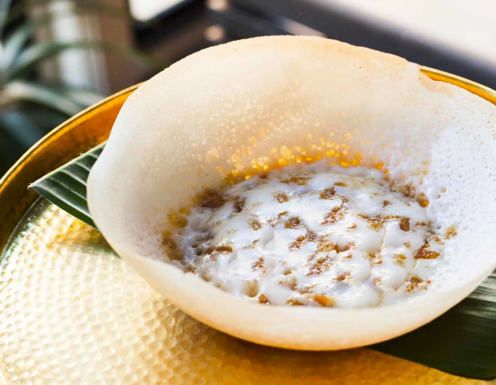

# Hoppers (Appa)

*Bowl-shaped Sri Lankan fermented rice-flour pancakes with lacy edges and a soft thick centre, cooked in a small wok-like pan: cracked open at the table, dipped into curry or sambol, eaten by hand.*

**Serves:** 4 (makes about 12 hoppers)

**Prep Time:** 15 minutes (plus 8 hours fermenting)

**Cook Time:** 30 minutes

## Overview
Hoppers, known as appa in Sinhala, appam in Tamil, are the most distinctive bread of Sri Lanka: a fermented batter of rice flour, coconut milk and yeast poured into a small bowl-shaped pan (the "appa walliya") that's swirled to coat the sides, then covered to steam. The result has crisp lacy edges where the batter thinned against the hot metal, and a soft thick spongy centre at the bottom of the bowl where it pooled. The fermentation takes overnight; the cooking is fast, one at a time. Served piled in a basket on the breakfast or dinner table with curries, sambols and a "egg hopper" variant (one cracked egg dropped into the centre as it cooks) for the showpiece.

## Ingredients

### Fermented batter
- 250 g rice flour (fine; from any South Asian grocer)
- 50 g semolina (fine; optional, for slightly more body)
- 7 g instant yeast (1 sachet)
- 1 teaspoon caster sugar
- 400 ml warm coconut milk (the second pressing, or coconut milk diluted to a single-cream consistency)
- 100 ml warm water (more if needed)
- 1 teaspoon fine salt

### For cooking
- 1 tablespoon coconut oil (for greasing the pan)

### Optional for egg hoppers
- 4 small eggs (one per egg hopper; cracked into the centre)
- Pinch of salt and pepper per egg
- A few curry leaves chopped fine for garnish

### To serve
- Sri Lankan chicken curry, pol sambol, seeni sambol, lunu miris (whichever combination is on the table)

## Method

### Stage 1 - Mix the batter (8 hours ahead)
1. Combine the rice flour and semolina in a large bowl.
1. In a small jug, stir the yeast and sugar into the warm coconut milk; let stand 10 minutes until foamy.
1. Pour the yeasted coconut milk into the flour; whisk to a smooth batter. Add the warm water gradually until the batter is the consistency of single cream (it should pour, not flop).
1. Cover with a damp tea towel and leave at room temperature for 6 to 8 hours. The batter will bubble and roughly double; it should smell sweetly fermented.

### Stage 2 - Finish the batter
1. Stir in the salt; whisk briefly to deflate slightly.
1. The batter should now be pourable; if it's too thick, splash in a little more warm water.

### Stage 3 - Cook the hoppers
1. Heat a hopper pan (small wok-shaped pan, about 15 cm) over medium-high. A small carbon-steel wok or non-stick wok-shaped pan works.
1. Brush the inside lightly with coconut oil.
1. Pour a ladleful of batter into the centre (about 80 ml).
1. Immediately pick up the pan and swirl it in a circular motion so the batter coats the sides; the swirling creates the thin lacy walls and lets the centre pool.
1. Cover with a lid; cook 2 to 3 minutes, the edges crisp and the centre sets soft and spongy.
1. The hopper should lift cleanly from the pan; tip it out onto a plate.

### Stage 4 - For an egg hopper
1. Follow steps 1 and 2 of stage 3, but BEFORE covering, crack one egg into the centre well of the hopper. Sprinkle with a pinch of salt and pepper and a few chopped curry leaves.
1. Cover and cook 3 to 4 minutes, the white sets, the yolk stays runny.
1. Lift out gently.

### Stage 5 - Serve
1. Stack hoppers in a basket, cover with a clean cloth to keep warm.
1. Serve with curry, sambol and pickle.
1. To eat: tear off pieces of crisp edge, scoop curry into the soft centre, eat by hand.

## Notes
- **The pan matters.** A proper hopper pan ("appa walliya") is sold at any Sri Lankan grocer for a few pounds; carbon-steel wok-shaped, lidded. A small non-stick wok is the best substitute. A flat pan won't give the bowl shape.
- **Fermentation is essential.** Don't skip the 6 to 8 hour rise. The fermented batter is what gives hoppers their tang and bubbly texture.
- **First few hoppers are rough.** The pan needs to be the right temperature; your first attempt may stick or be lopsided. By the third hopper you'll have the swirl rhythm down.
- **One at a time.** This is not a stack-of-pancakes operation; each hopper takes 2 to 3 minutes and the pan needs to be re-greased every couple. Get a system going.

## Variations
- **Egg hoppers (bittara appa).** As above, with an egg cracked in.
- **Honey hoppers (kithul pani appa).** Sweet variant: skip the salt, increase the sugar to 2 tablespoons, serve with kithul palm treacle and grated coconut.
- **Milk hoppers (kiri appa).** Pour a tablespoon of thick coconut cream into the centre of the cooking hopper. Custard-like centre, served as a dessert variant.

## Storage
- Best fresh from the pan. Refrigerated leftover hoppers reheat poorly; the lacy edges go limp.
- The batter holds in the fridge for 24 hours, but pull it out 1 hour before cooking and stir well.
