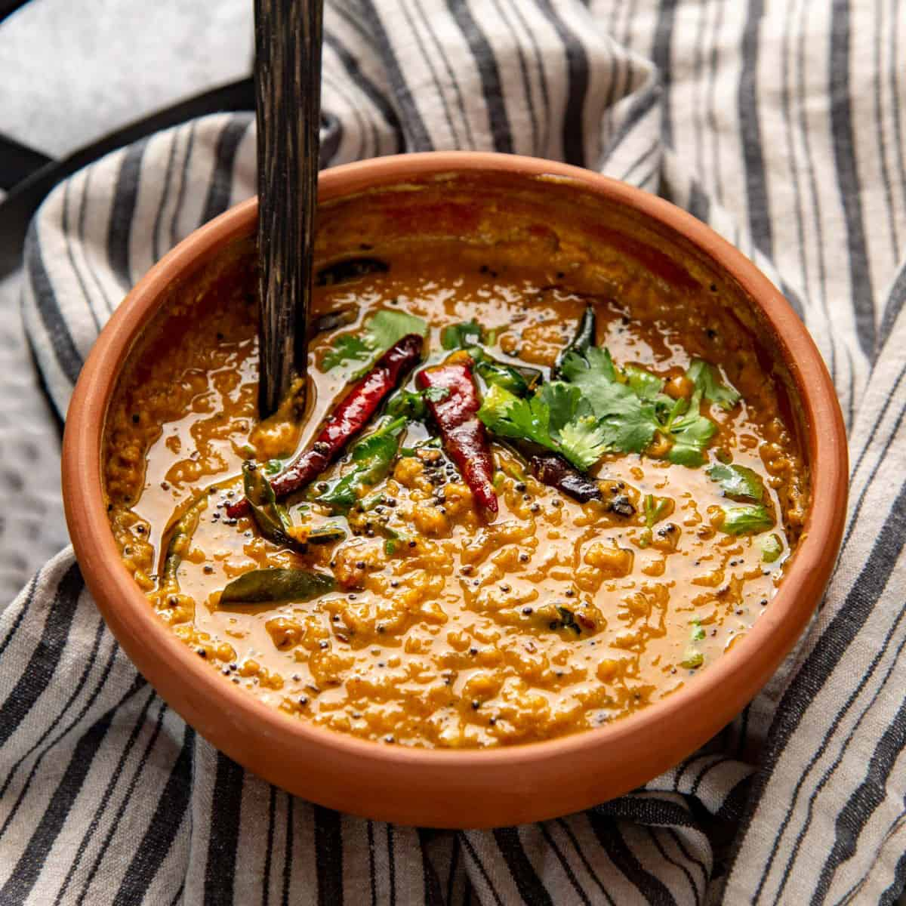

# Parippu (Sri Lankan Dal Curry)

*Sri Lankan red lentil curry: parippu (masoor dal) simmered in coconut milk with mustard seeds, curry leaves, fenugreek and a tempering of onion and chilli, the everyday dal that anchors a rice and curry plate.*

**Serves:** 4

**Prep Time:** 10 minutes

**Cook Time:** 30 minutes

## Overview
Parippu is the Sri Lankan everyday dal: red split lentils (masoor dal) cooked soft in coconut milk with mustard seeds, fenugreek, fresh curry leaves, pandan leaf, turmeric and a tempering (tarka) of onion, green chilli and dried red chilli fried hard in coconut oil and tipped over the finished pot at the end. The coconut milk is the Sri Lankan move that distinguishes parippu from north Indian dals; the mustard seeds and curry leaves anchor it as island cooking. Spoon over rice with a side of pol sambol, papadams, and whatever curry is on the table; it's the unfailing centrepiece of a Sri Lankan rice & curry plate.

## Ingredients

### Dal
- 200 g red split lentils (masoor dal; rinsed in cold water until the water runs clear)
- 600 ml cold water
- 1 small onion (finely diced)
- 2 garlic cloves (finely chopped)
- 2 cm fresh ginger (grated)
- ½ teaspoon ground turmeric
- ½ teaspoon fenugreek seeds
- 1 teaspoon mustard seeds
- 1 sprig fresh curry leaves (15 to 20 leaves)
- 1 pandan leaf (5 cm piece; optional but classic)
- 1 green chilli (slit lengthways)
- 1 teaspoon fine salt
- 200 ml thick coconut milk (the second pressing; or full-fat tinned)

### Tempering (tarka)
- 2 tablespoons coconut oil
- 1 small onion (thinly sliced)
- 1 sprig curry leaves
- 2 dried red chillies (broken in half)
- ½ teaspoon mustard seeds

## Method

### Stage 1 - Cook the lentils
1. Combine the rinsed lentils, water, diced onion, garlic, ginger, turmeric, fenugreek, mustard seeds, curry leaves, pandan, green chilli and salt in a heavy saucepan.
1. Bring to a boil, then reduce to a simmer and cook 20 to 25 minutes, stirring occasionally, until the lentils are completely soft and starting to break down.

### Stage 2 - Add coconut milk
1. Pour in the thick coconut milk; stir well and simmer another 5 minutes. Don't let it boil hard; the coconut milk can split.
1. Taste and adjust salt.

### Stage 3 - Temper and finish
1. Heat the coconut oil in a small pan over medium-high heat.
1. Add the sliced onion, curry leaves, dried chillies and mustard seeds.
1. Fry hard for 2 to 3 minutes until the onion is deep golden and the mustard seeds pop.
1. Tip the entire hot tempering over the dal; stir once and serve.

## Notes
- **Rinse the lentils properly.** Cloudy water means starch; rinse until clear for a clean-tasting dal.
- **Curry leaves are non-negotiable.** Dried curry leaves are a poor substitute; track down fresh ones at any South Asian grocer.
- **Coconut oil for the temper, not vegetable oil.** The coconut oil's aroma is part of the dish's signature; substituting kills it.

## Storage
- Refrigerate up to 3 days in a sealed container; reheat with a splash of water to loosen. The dal thickens overnight.
