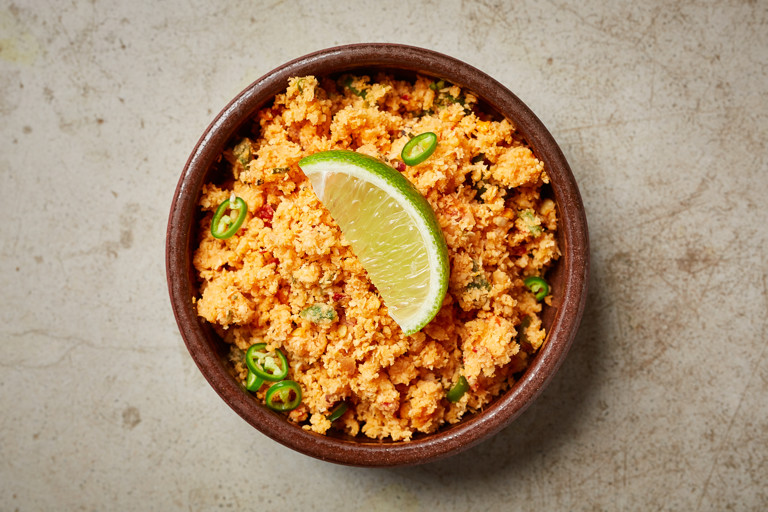

# Pol Sambol

*Sri Lanka's table sambal: fresh grated coconut, dried red chillies, lime, onion and Maldive fish flakes pounded together fiery red. Eaten with everything.*

**Serves:** 4 as a condiment

**Prep Time:** 10 minutes

**Cook Time:** 0 minutes

## Overview
Fresh grated coconut (or rehydrated desiccated coconut) is mashed with dried red chillies, salt and lime juice in a mortar - or pulsed briefly in a small food processor. Red onion, Maldive fish flakes and curry leaves are folded through. The mixture stays moist; the chillies soak in and turn the sambol deep red.

## Ingredients

- 200 g freshly grated coconut (frozen and thawed is fine; or 100 g desiccated coconut rehydrated with 100 ml hot water for 10 min)
- 4 dried red chillies (Kashmiri or Guntur), or 2 teaspoons Sri Lankan red chilli powder
- 1 small red onion (very finely chopped)
- 2 tablespoons Maldive fish flakes (umbalakada; pounded, optional)
- 1 ½ teaspoons salt
- Juice of 1 lime (about 2 tablespoons)
- 4 fresh curry leaves (finely shredded; optional)
- 1 teaspoon sugar (optional, balances the heat)

## Method

### Stage 1 - Pound the chilli
1. Tear the dried chillies and remove the stems.
1. Pound in a mortar with the salt to a coarse paste (or pulse in a small processor).

### Stage 2 - Combine
1. Add the grated coconut to the mortar (or transfer everything to a wide bowl).
1. Mix with the chilli, fish flakes if using, lime juice, sugar, and curry leaves.
1. Squeeze and rub the mixture together with your fingers - the friction blooms the chilli colour and bruises the coconut so it absorbs the lime.

### Stage 3 - Onion
1. Stir in the chopped red onion last (so it stays crunchy).
1. Taste; adjust salt and lime.

### Stage 4 - Serve
1. Serve at room temperature alongside Sri Lankan curries, rice, hoppers, or scooped onto buttered toast.

## Notes
- **Fresh coconut is best:** Frozen grated coconut (Caribbean / South Asian grocers) is the everyday substitute. Desiccated rehydrated works in a pinch but lacks the body.
- **Chilli amount is personal:** Sri Lankan pol sambol is properly fiery. Start with two dried chillies if you're heat-shy and add more.
- **Eat fresh:** The sambol turns watery after 24 hours in the fridge. Make in 10 minutes; eat the same day.

## Storage
- Best eaten the day made. Refrigerated keeps 2 days.
