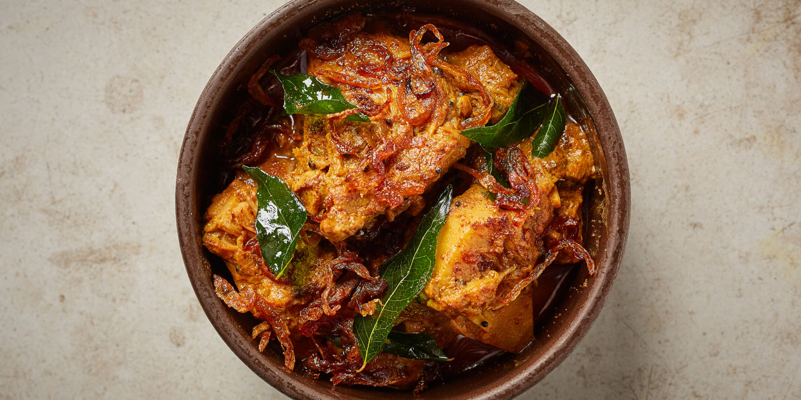

# Polos Curry (Sri Lankan Young Jackfruit Curry)

*Young green jackfruit chunks braised with toasted curry powder, coconut milk, mustard seeds and pandan: the Sri Lankan vegetarian curry that tastes meaty enough to mistake for pulled pork.*

**Serves:** 4 to 6

**Prep Time:** 20 minutes

**Cook Time:** 60 minutes

## Overview
Polos is young (unripe) green jackfruit, which has a stringy, fibrous texture that turns into something uncannily meat-like when braised. The Sri Lankan polos curry pulls this lever hard: chunks of fresh polos (or tinned green jackfruit in brine, not the ripe sweet kind in syrup) cook down with toasted Sri Lankan curry powder, garlic, ginger, coconut milk, mustard seeds, fenugreek, pandan and curry leaves until the jackfruit is dark, glossy and shreds with a spoon. Vegetarian by happy accident; the body and umami match a pulled-pork curry and you'd never guess it's a fruit. Serve over rice with pol sambol and a fried egg if you're going full Sri Lankan rice & curry plate.

## Ingredients

### Polos prep
- 1 kg young green jackfruit (fresh, peeled, cored and cut into 3 cm chunks; OR 800 g tinned young/green jackfruit in brine, drained and rinsed)
- Cold salted water (for soaking fresh polos to remove latex; skip if using tinned)

### Tempering and aromatics
- 3 tablespoons coconut oil
- 1 large onion (finely diced)
- 4 garlic cloves (finely chopped)
- 3 cm fresh ginger (grated)
- 2 green chillies (slit lengthways)
- 1 teaspoon mustard seeds
- ½ teaspoon fenugreek seeds
- 1 sprig fresh curry leaves
- 1 pandan leaf (5 cm)
- 1 cinnamon stick

### Spice paste
- 2 tablespoons Sri Lankan roasted curry powder (the dark roasted blend, NOT the unroasted yellow Indian-style one)
- 1 teaspoon Kashmiri chilli powder
- ½ teaspoon ground turmeric
- 1 teaspoon ground black pepper
- 2 teaspoons fine salt

### Liquid
- 200 ml hot water
- 400 ml thick coconut milk
- 1 tablespoon tamarind paste (or 1 tablespoon lemon juice)

## Method

### Stage 1 - Prep the polos
1. If using fresh jackfruit: peel under running water (the latex is sticky; oiled hands help). Cut into 3 cm chunks. Soak in cold salted water 30 minutes; drain.
1. If using tinned: drain, rinse thoroughly, squeeze gently to remove brine, cut any large pieces to 3 cm.

### Stage 2 - Par-cook the polos
1. Bring a pan of fresh salted water to a boil; add the polos chunks.
1. Simmer for 15 to 20 minutes until just tender (a knife slides through). Drain.

### Stage 3 - Build the curry base
1. Heat the coconut oil in a heavy saucepan over medium heat.
1. Add the mustard seeds, fenugreek, curry leaves, pandan and cinnamon. Fry 30 seconds until the mustard seeds pop.
1. Add the onion; cook 5 to 7 minutes until soft and golden.
1. Add the garlic, ginger and green chillies; cook 1 minute.
1. Stir in the curry powder, chilli, turmeric, pepper and salt; cook 30 seconds until fragrant (don't let it scorch).

### Stage 4 - Braise
1. Add the par-cooked polos chunks; turn to coat in the spice base.
1. Pour in the hot water and tamarind paste; stir.
1. Cover and simmer 20 minutes; the polos should be deep brown and shreddable.
1. Stir in the coconut milk; simmer uncovered another 10 minutes; the sauce thickens to a glossy gravy that clings to the polos.
1. Taste; adjust salt.

## Notes
- **Roasted Sri Lankan curry powder is non-negotiable.** The dark roasted blend (where coriander, cumin and fennel are dry-toasted hard before grinding) is what gives the curry its signature smoky depth. The unroasted yellow curry powder won't give the same result.
- **Tinned jackfruit must be in brine or water, not syrup.** The sweet ripe variety is for desserts; polos curry needs the unripe one.
- **Latex is sticky.** Fresh jackfruit weeps a milky sap; oil your hands and knife before cutting. Disposable gloves work too.

## Storage
- Refrigerate up to 3 days; the curry deepens overnight and is arguably better on day 2.
