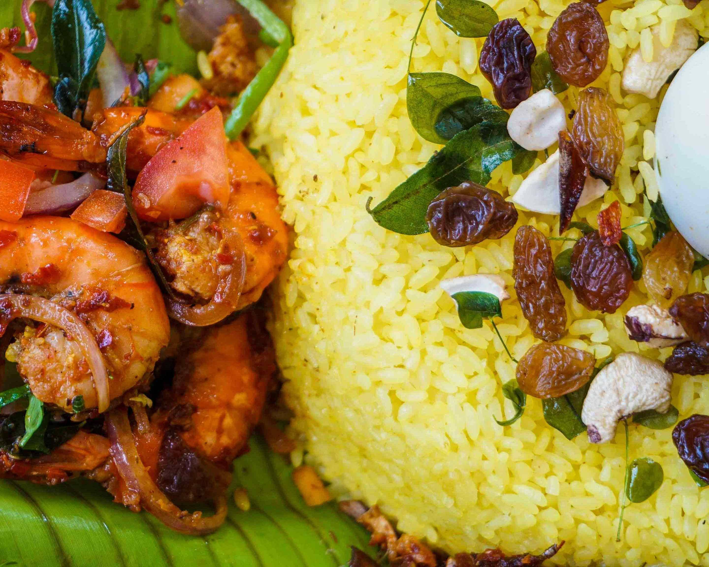

# Kaha Bath (Sri Lankan Yellow Rice)

*Sri Lankan turmeric rice with coconut milk, pandan, cinnamon, cardamom, cloves and curry leaves: the saffron-yellow centrepiece of every Sri Lankan celebration rice & curry plate.*

**Serves:** 6

**Prep Time:** 10 minutes

**Cook Time:** 25 minutes

## Overview
Kaha bath ("yellow rice" in Sinhala) is Sri Lanka's festive rice: basmati or samba rice cooked in coconut milk with turmeric, pandan, cinnamon, cardamom, cloves, curry leaves and a small chopped onion fried in coconut oil. The whole pot perfumes the kitchen and the rice turns a deep saffron-yellow from the turmeric. Served with multiple curries and sambols as the centre of a rice & curry plate at weddings, birthdays and any meal that wants ceremony. The cashew-and-raisin topping is the dressed-up version; everyday kaha bath skips that and lets the rice speak for itself.

## Ingredients

### Rice
- 400 g basmati rice (or samba rice; rinsed in cold water until clear and drained)
- 2 tablespoons coconut oil
- 1 small onion (finely diced)
- 2 garlic cloves (finely chopped)
- 1 cinnamon stick
- 4 green cardamom pods (lightly crushed)
- 4 cloves
- 1 pandan leaf (10 cm; tied in a knot)
- 1 sprig fresh curry leaves
- 1 teaspoon ground turmeric
- 1 ½ teaspoons fine salt
- 400 ml thick coconut milk
- 250 ml hot water

### Optional dressed-up garnish
- 50 g raw cashews
- 30 g raisins or sultanas
- 1 tablespoon ghee or coconut oil

## Method

### Stage 1 - Toast the aromatics
1. Heat the coconut oil in a heavy saucepan with a tight-fitting lid over medium heat.
1. Add the cinnamon, cardamom, cloves, pandan and curry leaves; fry 30 seconds until fragrant.
1. Add the onion and garlic; cook 5 minutes until soft and translucent.

### Stage 2 - Toast the rice
1. Add the drained rice; stir to coat with the flavoured oil. Cook 2 minutes, stirring, so each grain gets a film of oil.
1. Stir in the turmeric and salt; the rice should turn pale yellow.

### Stage 3 - Simmer
1. Pour in the coconut milk and hot water. Bring to a vigorous boil.
1. Stir once, reduce to the lowest possible heat, cover tightly and cook 15 minutes. Don't lift the lid.
1. Take off the heat and let stand covered for another 10 minutes to finish steaming.

### Stage 4 - Fluff and serve
1. Lift the lid, remove the pandan, cinnamon and whole spices if you like (or leave them in for visual drama).
1. Fluff with a fork, the rice should be golden, separate, and faintly fragrant.

### Optional garnish
1. Heat the ghee in a small pan; fry the cashews until golden (1 to 2 minutes), then add the raisins and cook 30 seconds more (they puff slightly).
1. Scatter over the rice just before serving.

## Notes
- **Basmati vs samba.** Basmati is the everyday choice and what most UK home cooks have. Samba is the short-grain Sri Lankan native and gives a slightly stickier result; harder to find but worth seeking out from Sri Lankan groceries.
- **Don't lift the lid during the simmer.** The steam is doing the work; opening the lid drops the temperature and gives unevenly cooked rice.
- **Whole spices stay in.** Don't bother fishing out cardamom pods or cloves, they're part of the visual signature.

## Storage
- Refrigerate up to 3 days; rewarm with a splash of water under a covered lid.
