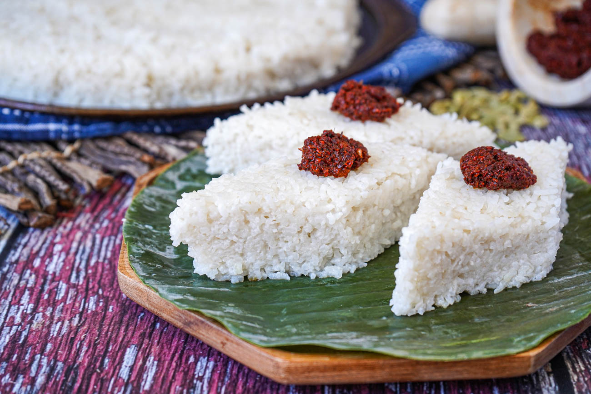

# Kiribath (Milk Rice)

*Sri Lankan rice cooked in coconut milk until creamy and set, cut into diamonds, served at every Sinhala New Year, every birthday and the first meal of every month: the bread-and-butter of Sri Lankan celebration cooking.*

**Serves:** 6 to 8

**Prep Time:** 5 minutes

**Cook Time:** 35 minutes

## Overview
Kiribath ("milk rice") is the simplest and most ceremonially loaded dish in Sri Lankan cooking. White rice, usually samba, is cooked first in water, then finished in thick coconut milk until the grains absorb the milk and the whole thing sets into a creamy, sliceable block. Cooled briefly, pressed flat, cut into diamond-shaped pieces, served warm. The dish marks every significant beginning: Sinhala and Tamil New Year (April), the first meal of every Sinhala month, the start of any major life event. It's almost always served with lunu miris (a chilli-onion-Maldive-fish sambol) for savoury, OR with kithul palm treacle and ripe banana for sweet. Both pairings are correct and a celebration plate usually has both.

## Ingredients

### Kiribath
- 400 g short-grain rice (samba is canonical; sushi rice or pudding rice both work; long-grain basmati doesn't bind the same way)
- 500 ml cold water (for the first cook)
- 1 teaspoon fine salt
- 1 pandan leaf (10 cm; tied in a knot)
- 400 ml thick coconut milk (the first pressing; or full-fat tinned)

### To serve
- Lunu miris (Maldive fish + chilli + onion + lime sambol; savoury pairing)
- Kithul palm treacle (palm-sugar syrup; sweet pairing)
- Ripe bananas (kolikuttu/seeni kesel if available; or any ripe banana)
- Jaggery shards (sweet pairing, alternative to treacle)

## Method

### Stage 1 - First cook in water
1. Rinse the rice in cold water until the water runs clear.
1. Combine the rice, water, salt and pandan in a heavy saucepan.
1. Bring to a boil, then reduce to a simmer and cover tightly. Cook 12 to 15 minutes until the water is fully absorbed and the rice is soft but not yet stuck together.

### Stage 2 - Add coconut milk
1. Pour in the thick coconut milk; stir well to break up any clumps.
1. Reduce heat to very low and cook UNCOVERED 10 to 12 minutes, stirring occasionally, until the milk has been absorbed and the rice has turned creamy and starts to release from the pan sides.
1. The texture should be like a stiff risotto, wet enough to spread, dry enough to hold its shape when pressed.

### Stage 3 - Set
1. Tip the hot kiribath onto a lightly oiled flat plate or shallow tray (a 25 cm round plate is traditional).
1. Spread evenly to about 2 cm thick using the back of a spoon or a small offset spatula moistened with water.
1. Smooth the top.
1. Let stand 10 minutes to set.

### Stage 4 - Cut and serve
1. With a wet sharp knife, score the kiribath into traditional diamond shapes: first cut parallel lines about 4 cm apart in one direction, then crossing diagonal lines for diamonds.
1. Lift carefully onto a serving plate; the diamonds should hold their shape.
1. Serve warm or at room temperature with both lunu miris (savoury side) and palm treacle + sliced banana (sweet side) on the plate.

## Notes
- **Samba rice is the right grain.** Short-grain "sushi rice" is the easiest substitute in the UK; both have the starch profile that binds kiribath. Basmati ends up loose and won't set.
- **Cut with a wet knife.** Dipping the blade in water between cuts keeps the rice from sticking. Sloppy cuts spoil the look.
- **Both pairings on the plate.** Most Sri Lankan households serve kiribath with both sweet (treacle + banana) and savoury (lunu miris) together; diners alternate. Don't pick just one.

## Variations
- **Imbul kiribath.** Stuffed kiribath: a sweetened coconut-jaggery filling rolled into a kiribath cylinder, cut into discs. A New Year specialty.
- **Mung kiribath.** Add 100 g cooked mung beans to the rice in stage 2. Slightly more substantial; common at Sinhala New Year.

## Storage
- Best within 4 hours of cutting. Refrigerated kiribath goes hard within 24 hours; rewarm briefly in a steamer to soften.
