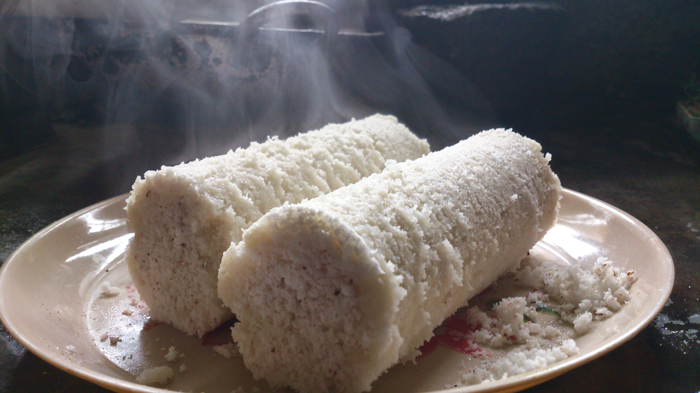

# Pittu

*Steamed cylinders of red rice flour layered with grated coconut, cooked in a bamboo or aluminium pittu maker, served with coconut milk and curry: Sri Lanka's quietest national breakfast.*

**Serves:** 4

**Prep Time:** 15 minutes

**Cook Time:** 25 minutes

## Overview
Pittu is a steamed dish of seasoned red rice flour layered with grated coconut inside a small cylindrical mould, the pittu bambuwa, traditionally a length of bamboo, cooked over boiling water until the rice cooks through and binds with the coconut. The result is a soft, crumbly, lightly nutty cylinder eaten broken into chunks, drowned in fresh coconut milk and dipped into curry. Common at breakfast across Sri Lanka and the Tamil-speaking areas of southern India. The bamboo gives a faint smoky note that aluminium pittu makers don't quite match, but both work.

## Ingredients

### Dry mix
- 400 g red rice flour (kurakkan or red parboiled rice flour, from Sri Lankan groceries; or substitute regular fine rice flour for a paler pittu)
- 1 teaspoon fine salt
- 100 g freshly grated coconut (or unsweetened desiccated coconut rehydrated in 4 tablespoons hot water)

### Wet mix
- 200 ml warm water (more if needed)

### Equipment
- A pittu bambuwa (bamboo cylinder, ~3-4 cm diameter, ~15 cm long; from Sri Lankan groceries) OR an aluminium pittu maker
- A standard tiered steamer

### To serve
- 400 ml thick coconut milk (warm)
- Pinch of salt
- 1 small green chilli (sliced; optional, for the savoury pour)
- 1 ripe banana per person (alternative sweet pairing)
- A curry on the side: parippu, fish curry, kiri hodi
- A spoon of kithul palm treacle (sweet variant)

## Method

### Stage 1 - Sandy dough
1. In a wide bowl, mix the rice flour and salt.
1. Sprinkle the warm water over the flour a tablespoon at a time, rubbing the flour between your fingertips so each addition gets absorbed.
1. The final texture should be sandy and crumbly, like wet sand, squeeze a handful and it should hold its shape but break apart easily when poked.
1. Don't overhydrate; if it forms a dough, you've gone too far.

### Stage 2 - Layer with coconut
1. In a separate bowl, mix the grated coconut with a small pinch of salt.

### Stage 3 - Fill the pittu mould
1. Hold the pittu cylinder vertically.
1. Layer in: 1 tablespoon of coconut, 2 tablespoons of the sandy flour, another tablespoon of coconut, another 2 tablespoons of flour. Continue until the cylinder is full, ending with coconut on top.
1. Don't press down, the dish needs steam to circulate; packed pittu cooks unevenly.

### Stage 4 - Steam
1. Set the steamer up with rapidly boiling water.
1. Stand the filled cylinders upright in the steamer; cover.
1. Steam 15 minutes. The pittu should be set, holding its shape when tipped out.

### Stage 5 - Unmould and serve
1. Run a thin knife around the inside of the cylinder if it sticks; tap upside down onto a plate.
1. The pittu comes out as a cylinder; break into 2 to 3 chunks with a fork.
1. Warm the coconut milk with a pinch of salt and the sliced chilli if using.
1. Serve the pittu chunks alongside the coconut milk in a small jug, plus a curry of choice.
1. To eat: pour coconut milk over the pittu chunks until they soak, then dip into curry. The pittu mostly disintegrates into a porridge-like meal in the bowl, which is the point.

## Notes
- **Red rice flour is traditional but optional.** The deep brick-red colour and slightly nutty flavour come from kurakkan or red parboiled rice. White rice flour gives a paler, milder pittu that's equally legitimate.
- **Sandy not doughy.** If you can roll the flour mix into a ball, you've added too much water. Pittu should crumble.
- **Don't pack tight.** Loose layering is essential. Pittu cooks by steam moving through the loose grains; pressed pittu stays raw in the middle.

## Variations
- **Kurakkan pittu.** Finger millet (kurakkan) flour replaces half the rice flour; deeper savoury flavour, darker colour. Popular in the hill country.
- **Sweet pittu.** Mix in 3 tablespoons jaggery and a pinch of cardamom with the coconut layer; serve with banana and treacle instead of curry.

## Storage
- Best fresh from the steamer. Refrigerated pittu hardens; rewarm briefly in a steamer to soften.
