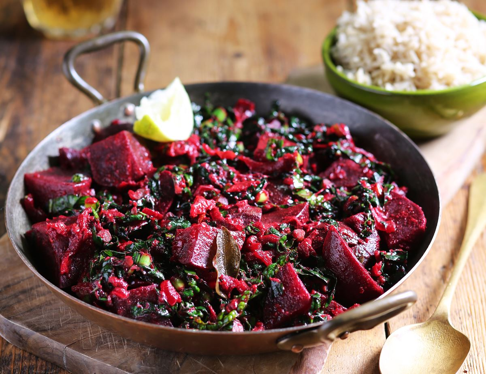

# Sri Lankan Beetroot Curry

*Sliced beetroot simmered in coconut milk with mustard seeds, curry leaves, fenugreek, cinnamon and a splash of vinegar: a magenta-pink curry that lands on every Sri Lankan rice & curry plate.*

**Serves:** 4

**Prep Time:** 10 minutes

**Cook Time:** 25 minutes

## Overview
Beetroot curry is one of the small mainstay curries on a Sri Lankan rice & curry plate, never the main dish, always present as a colourful counterpoint. Raw beetroot is peeled and sliced thin, then simmered in coconut milk with mustard seeds, fenugreek, curry leaves, pandan, a small green chilli and a splash of cider or coconut vinegar that brightens the earthy sweetness. The result is a deep pink-magenta curry that stains everything else on the plate; some Sri Lankans add a teaspoon of sugar to push it sweeter, others go heavy on the chilli for a sharper version. Both work.

## Ingredients

- 500 g raw beetroot (peeled and sliced into thin half-moons, about 3 mm thick)
- 2 tablespoons coconut oil
- 1 small onion (finely sliced)
- 3 garlic cloves (finely chopped)
- 2 cm fresh ginger (grated)
- 1 green chilli (slit lengthways)
- 1 teaspoon mustard seeds
- ½ teaspoon fenugreek seeds
- 1 sprig fresh curry leaves
- 1 pandan leaf (5 cm)
- 1 cinnamon stick (5 cm)
- 1 teaspoon [Sri Lankan curry powder](../../../base-ingredients/curry-powder/sri-lankan.md) (roasted)
- ¼ teaspoon ground turmeric
- 1 teaspoon fine salt
- 200 ml thin coconut milk (or thick coconut milk + 100 ml water)
- 1 tablespoon cider vinegar (or coconut vinegar)

## Method

1. Heat the coconut oil in a saucepan over medium heat. Add the mustard seeds, fenugreek, curry leaves, pandan and cinnamon; fry 30 seconds until the seeds pop.
1. Add the onion; cook 5 minutes until soft and translucent.
1. Add the garlic, ginger and green chilli; cook 1 minute.
1. Stir in the curry powder, turmeric and salt; cook 30 seconds.
1. Add the sliced beetroot; turn to coat in the spice base.
1. Pour in the coconut milk; bring to a low simmer. Cover and cook 15 to 18 minutes until the beetroot is tender (a knife slides through easily).
1. Stir in the vinegar; cook uncovered 2 minutes more. The sauce should be a deep magenta and just clinging to the slices.

## Notes
- **Slice thin, not chunky.** Thick beetroot chunks need much longer to cook and never quite reach the tender state. 3 mm half-moons are right.
- **Vinegar at the end.** Adding it early stops the beetroot softening; at the end it just brightens the flavour.

## Storage
- Refrigerate up to 4 days; the colour deepens and the flavour gets sharper.
