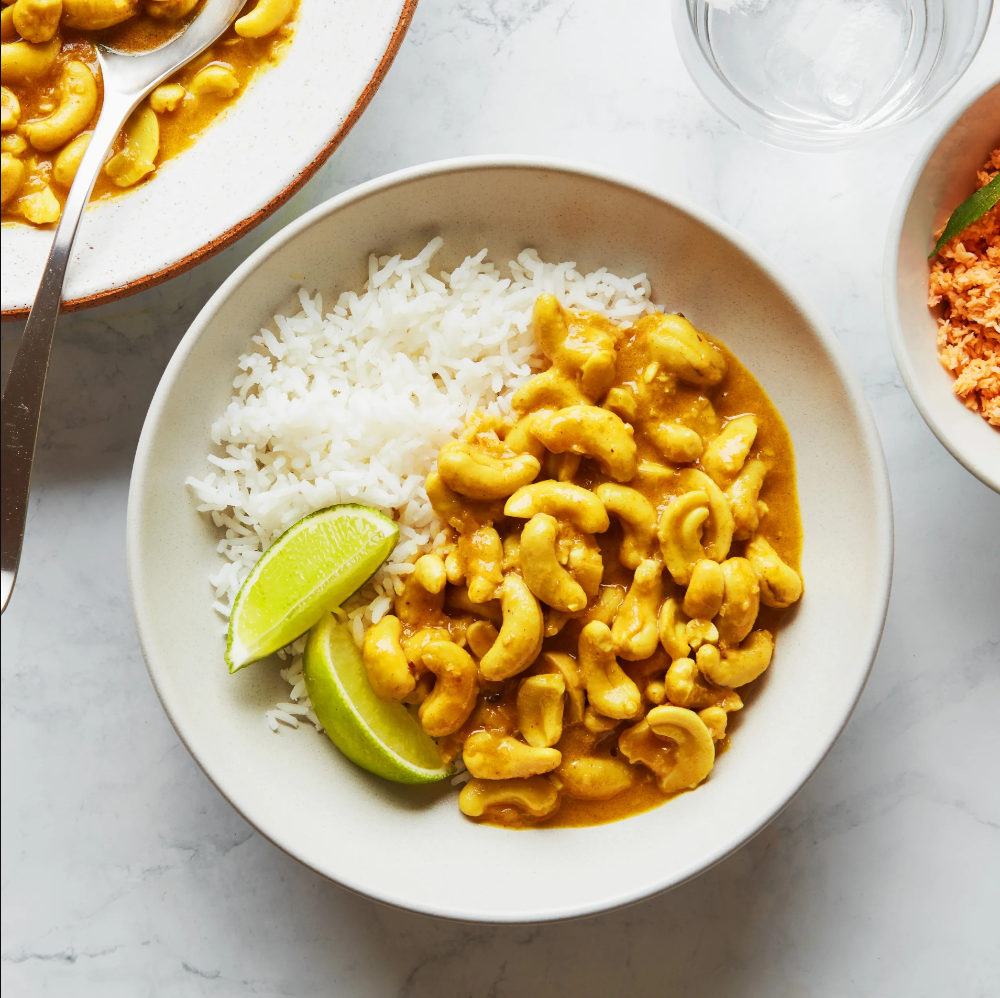

# Cashew Curry

*Raw cashews simmered in coconut milk with mustard seeds, curry leaves, fenugreek, pandan and turmeric until creamy and tender: the Sri Lankan curry that tastes far richer than its modest ingredient list suggests.*

**Serves:** 4

**Prep Time:** 5 minutes (plus 30 minutes soaking)

**Cook Time:** 30 minutes

## Overview
Sri Lankan cashew curry is one of the great surprise curries, three of its main ingredients are cashews, coconut milk and salt, and it tastes opulent. Raw cashews are soaked briefly to soften, then simmered in thin coconut milk with curry leaves, pandan, mustard seeds, fenugreek, turmeric and a slit green chilli, then finished with thick coconut milk and a slow reduction until the sauce coats the nuts in a creamy yellow gravy. Doubles as a luxurious side at a rice & curry plate or, scaled up, as a vegetarian centrepiece in its own right. The dish is especially associated with Sri Lankan wedding rice plates and Christmas Eve feasts.

## Ingredients

### Cashew prep
- 250 g raw cashews (whole, unsalted, unroasted)
- Boiling water (to cover)

### The curry
- 2 tablespoons coconut oil
- 1 small onion (finely diced)
- 3 garlic cloves (finely chopped)
- 2 cm fresh ginger (grated)
- 1 green chilli (slit lengthways)
- 1 teaspoon mustard seeds
- ½ teaspoon fenugreek seeds
- 1 sprig fresh curry leaves
- 1 pandan leaf (5 cm)
- 1 cinnamon stick
- 1 teaspoon ground turmeric
- 1 teaspoon [Sri Lankan curry powder](../../../base-ingredients/curry-powder/sri-lankan.md) (unroasted/yellow; NOT the dark roasted one)
- 1 ½ teaspoons fine salt
- 200 ml hot water
- 200 ml thick coconut milk

## Method

### Stage 1 - Soak the cashews
1. Place the cashews in a heatproof bowl; cover with boiling water by 2 cm.
1. Leave to soak for 30 minutes; the cashews should plump and lose their hard edge.
1. Drain.

### Stage 2 - Build the curry base
1. Heat the coconut oil in a saucepan over medium heat. Add the mustard seeds, fenugreek, curry leaves, pandan and cinnamon; fry 30 seconds until the mustard pops.
1. Add the onion; cook 5 minutes until soft and translucent (don't let it brown).
1. Add the garlic, ginger and green chilli; cook 1 minute.
1. Stir in the turmeric, curry powder and salt; cook 30 seconds.

### Stage 3 - Simmer
1. Add the drained cashews; turn to coat.
1. Pour in the hot water; bring to a low simmer. Cover and cook 15 minutes, the cashews should be tender and the liquid reduced.
1. Stir in the thick coconut milk; simmer uncovered 5 to 7 minutes until the sauce thickens to a pale yellow gravy that coats the cashews.

## Notes
- **Raw cashews only.** Roasted or salted cashews ruin the dish; the curry needs the unroasted nut's softness and neutral flavour.
- **Yellow (unroasted) curry powder.** The dark roasted Sri Lankan blend overpowers; cashew curry wants the milder, brighter yellow variant.
- **Don't over-reduce.** The sauce should pour, not cling, leave it slightly loose. It thickens further as it stands.

## Storage
- Refrigerate up to 3 days; the curry thickens overnight and rewarms beautifully with a splash of coconut milk to loosen.
