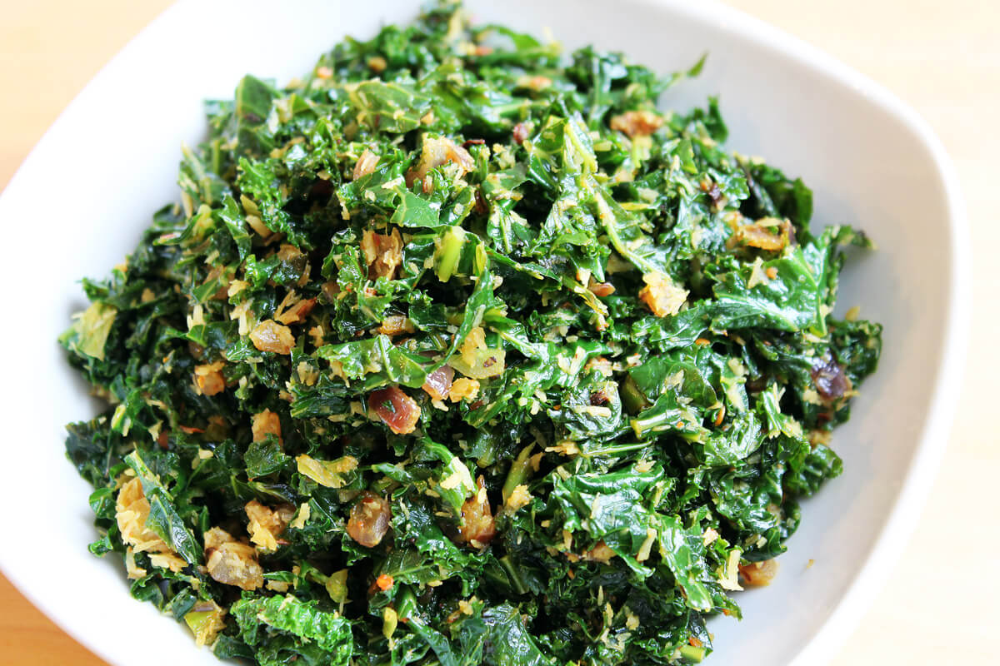

# Mallung (Sri Lankan Coconut Greens)

*Finely shredded leafy greens (cabbage, kale, gotukola or kohila) flash-stirred with grated coconut, mustard seeds, curry leaves and lime: the lightest, freshest side on a Sri Lankan plate, ready in five minutes.*

**Serves:** 4

**Prep Time:** 10 minutes

**Cook Time:** 5 minutes

## Overview
Mallung (also spelled mallum or sambola) is the Sri Lankan way of cooking leafy greens, shredded finely, stir-fried fast and dry with fresh grated coconut, turmeric, mustard seeds, curry leaves and a squeeze of lime. The point is to keep the greens bright and slightly crunchy rather than wilted into pulp. Gotukola (pennywort) is the most distinctive choice and slightly bitter; mukunuwenna (a wild green common in Sri Lanka), kohila (lasia spinosa) and the imported cabbage version (cabbage mallung) are also classics. In the UK, kale, savoy cabbage, spring greens, or chard all work, anything sturdy that holds up to fast heat.

## Ingredients

- 250 g leafy greens (kale, savoy cabbage, spring greens, gotukola if you can find it; tough stems removed, leaves finely shredded into ribbons 3 mm wide)
- 2 tablespoons coconut oil
- 1 small onion (finely diced)
- 2 garlic cloves (chopped fine)
- 1 green chilli (deseeded and finely chopped)
- 1 teaspoon mustard seeds
- 1 sprig fresh curry leaves
- ½ teaspoon ground turmeric
- 1 teaspoon fine salt
- 80 g freshly grated coconut (or unsweetened desiccated coconut rehydrated in 3 tablespoons hot water)
- 1 tablespoon fresh lime juice
- ¼ teaspoon ground black pepper

## Method

1. Heat the coconut oil in a wok or wide pan over high heat.
1. Add the mustard seeds and curry leaves; fry 30 seconds until the mustard pops.
1. Add the onion, garlic and green chilli; cook 1 minute (stay short, onions should retain bite).
1. Stir in the turmeric and salt; cook 10 seconds.
1. Add the shredded greens; stir-fry hard for 2 minutes. The leaves should wilt but stay vibrant green, not turn dull.
1. Add the grated coconut; toss through for another minute.
1. Off the heat, stir in the lime juice and black pepper.

## Notes
- **High heat, fast cook.** Mallung should be 4 to 5 minutes total cook time, no more. Long cooking turns it army-green and dull.
- **Fresh coconut is the right kind.** Desiccated rehydrated coconut is acceptable but lacks the moist sweetness; if using, soak it 5 minutes in hot water and squeeze gently.
- **Greens choice matters less than you think.** Cabbage is the most common at Sri Lankan rice & curry stalls; kale gives a slightly more substantial version; gotukola adds the distinctive Sri Lankan bitter note.

## Storage
- Best within an hour of cooking. Refrigerated mallung loses its colour overnight; eat it fresh.
