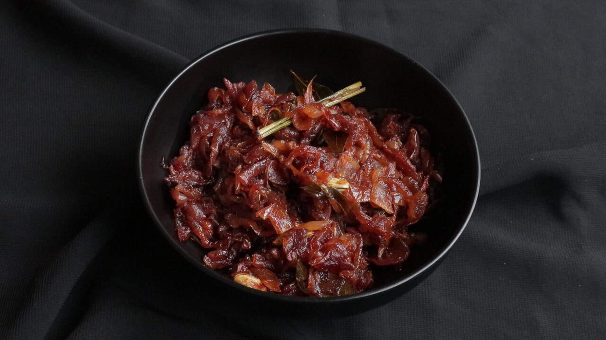

# Seeni Sambol

*Sweet caramelised onion relish with Maldive fish, chilli, tamarind and palm sugar: the dark, sticky, deeply savoury Sri Lankan accompaniment to rice, curry, kiribath and string hoppers.*

**Serves:** 8 (makes about 400 g, keeps for a fortnight)

**Prep Time:** 15 minutes

**Cook Time:** 35 minutes

## Overview
Seeni ("sugar" in Sinhala) sambol is the sweet-onion relish that appears at every Sri Lankan rice & curry plate, alongside hoppers, inside short eats, on toast as a snack. Red onions are sliced thin and cooked down hard in coconut oil with curry leaves, pandan, mustard seeds, chilli, Maldive fish (or shrimp paste), tamarind paste and a generous block of palm sugar (jaggery) until everything goes dark, sticky and intensely concentrated. Spoonable but not saucy, it should hold its shape on a plate. Keeps for a fortnight refrigerated and gets better as it sits.

## Ingredients

- 500 g red onions (sliced thin into half-moons)
- 4 tablespoons coconut oil
- 1 sprig fresh curry leaves
- 1 pandan leaf (10 cm)
- 1 teaspoon mustard seeds
- 4 cloves garlic (finely chopped)
- 3 cm fresh ginger (grated)
- 1 cinnamon stick
- 2 teaspoons Kashmiri chilli powder (or 1 teaspoon hotter chilli if you want it fierce)
- 1 tablespoon Maldive fish (umbalakada, dry-shredded; or 1 tablespoon dried shrimp paste / belacan, OR omit for vegetarian)
- 60 g jaggery or palm sugar (chopped), substitute dark muscovado sugar
- 2 tablespoons tamarind paste
- 1 ½ teaspoons fine salt
- 100 ml hot water

## Method

1. Heat the coconut oil in a wide pan over medium heat. Add the curry leaves, pandan, mustard seeds and cinnamon; fry 30 seconds until the mustard pops.
1. Tip in the sliced onions; cook 12 to 15 minutes, stirring every couple of minutes, until they collapse and turn deeply golden, not just soft, you want real colour.
1. Add the garlic and ginger; cook 1 minute.
1. Stir in the chilli powder, Maldive fish (if using) and salt; cook 1 minute.
1. Add the jaggery, tamarind and hot water. Reduce heat to low; simmer 15 to 18 minutes, stirring every few minutes, until the mixture is dark mahogany, sticky and most of the liquid is gone.
1. Taste and adjust: more sugar if too sour, more tamarind if too sweet, more salt if flat.
1. Cool to room temperature before transferring to a sealed jar.

## Notes
- **Maldive fish (umbalakada) is the umami backbone.** It's dried, smoked, shredded skipjack tuna sold at Sri Lankan groceries; intense fishy-savoury. Shrimp paste is a decent substitute. Vegetarian version skips both and adds 1 extra teaspoon of soy sauce.
- **Real palm sugar matters.** Kithul or coconut jaggery has caramel depth that white sugar can't match.
- **Cook the onions hard, not soft.** Pale soft onions give a wet relish; deeply caramelised onions give the dark sticky sambol.

## Storage
- Refrigerate up to 2 weeks in a sealed jar. The flavour deepens overnight; this is one of those things that's better on day 3 than day 1.
