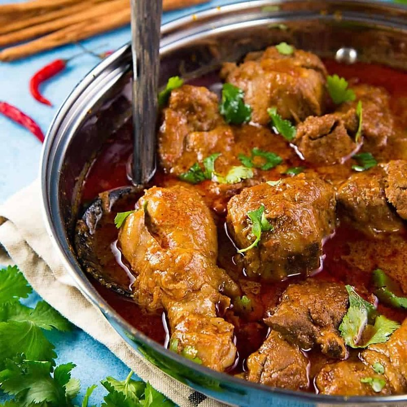

# Sri Lankan Chicken Curry

*Sri Lanka's coconut-rich curry: chicken simmered in coconut milk with toasted whole-spice curry powder, curry leaves, pandan and lemongrass.*

**Serves:** 4

**Prep Time:** 20 minutes

**Cook Time:** 45 minutes

## Overview
Whole spices dry-toast until smoky, then grind to a Sri Lankan curry powder (coriander, cumin, fennel, cardamom, cinnamon, cloves, fenugreek). Onion melts in coconut oil with curry leaves, pandan and lemongrass. Chicken pieces sear briefly; the spice mix blooms; thin coconut milk simmers everything until tender; thick coconut milk finishes the sauce. Lime at the table.

## Ingredients

### Sri Lankan curry powder (or use 3 tablespoons store-bought "Sri Lankan roasted curry powder")
- 2 tablespoons coriander seeds
- 1 tablespoon cumin seeds
- 1 tablespoon fennel seeds
- 4 cardamom pods
- 1 cinnamon stick (small, or 1 teaspoon ground)
- 4 cloves
- ½ teaspoon fenugreek seeds
- 4 dried red chillies

### Curry
- 1 kg chicken thighs and drumsticks (bone-in, skin removed)
- 3 tablespoons coconut oil
- 2 onions (large, sliced thin)
- 6 garlic cloves (crushed)
- 3 cm fresh ginger (grated)
- 2 sprigs fresh curry leaves
- 1 pandan leaf (knotted; or 4 kaffir lime leaves)
- 1 stalk lemongrass (bashed)
- 1 cinnamon stick (small)
- 2 teaspoons ground turmeric
- 2 teaspoons sweet paprika
- 1-2 long green chillies (slit lengthwise)
- 1 tablespoon Maldive fish flakes (or fish sauce; optional)
- 400 ml tin coconut milk (separated into thick and thin - see method)
- 200 ml chicken stock (or water)
- 2 teaspoons salt (or to taste)
- ½ lime (juice)

## Method

### Stage 1 - Curry powder
1. Toast the coriander, cumin, fennel, cardamom, cinnamon, cloves, fenugreek and dried chillies in a dry pan over medium heat 4-5 minutes, shaking, until deep mahogany brown and intensely fragrant. The toasted colour is what makes Sri Lankan curry powder distinct.
1. Cool; grind to a fine powder.

### Stage 2 - Tempering
1. Don't shake the coconut milk tin. Open it and spoon the thick cream from the top into a separate small bowl (about 100 ml); leave the thin liquid in the tin.
1. Heat the coconut oil in a heavy pan over medium heat.
1. Add the onions; cook 8-10 minutes until soft and golden.
1. Add the garlic, ginger, curry leaves, pandan, lemongrass and cinnamon stick; cook 1-2 minutes until aromatic.

### Stage 3 - Bloom
1. Add the toasted curry powder, turmeric and paprika; stir 30 seconds - the oil should turn deep red.
1. Add the chicken; toss to coat thoroughly.

### Stage 4 - Simmer
1. Pour in the thin coconut milk (from the tin, stock and Maldive fish flakes if using.
1. Add the slit green chillies and salt.
1. Bring to a steady simmer; reduce heat; partly cover and cook 25-30 minutes until the chicken is tender and the sauce has reduced.

### Stage 5 - Finish
1. Stir in the reserved thick coconut cream; cook 3 minutes more without boiling hard.
1. Off the heat, squeeze in the lime juice.
1. Discard the pandan, lemongrass and cinnamon if you can find them.

### Stage 6 - Serve
1. Serve with steamed rice, pol sambol, and a coconut-milk vegetable curry alongside.

## Notes
- **Toasting matters:** Sri Lankan curry powder (kalu pothu) is unusually dark - the curry's mahogany colour and roasted depth come from this. Untoasted, it tastes plain.
- **Maldive fish flakes (umbalakada):** Sun-dried, smoked tuna; gives the umami kick. Fish sauce is the next-best substitute. Skip for vegetarian / pescatarian reasons.
- **Pandan and curry leaves:** Both are non-negotiable for the proper aroma. Available frozen at Asian grocers.

## Storage
- Keeps 4 days refrigerated; tastes deeper on day 2.
- Freezes 3 months.
