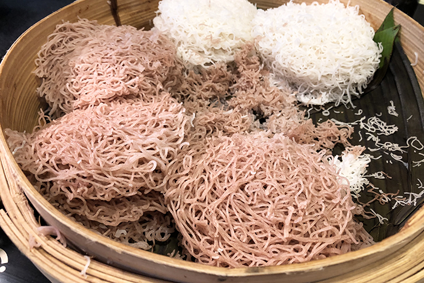

# String Hoppers (Idiyappam)

*Tangled disks of rice flour noodles squeezed through a press onto small wicker mats and steamed: the Sri Lankan and Tamil breakfast bread served with curry and coconut sambol.*

**Serves:** 4 (makes about 16 string hoppers)

**Prep Time:** 20 minutes

**Cook Time:** 15 minutes

## Overview
String hoppers (idiyappam in Tamil, indi appa in Sinhala) are tangled disks of thin steamed noodles made by pressing a soft, hot rice-flour dough through a perforated mould. Each disk is about 8 cm across and looks like a small bird's nest. They're a breakfast staple in Sri Lanka and Tamil Nadu, served with dal, curry, coconut sambol, sodhi (a mild coconut milk gravy), and sometimes a dribble of coconut milk and palm-sugar syrup for a sweet variant. The press is sold for a few pounds at any South Asian grocer; pre-made fresh string hoppers are also widely available in the UK from Sri Lankan/Tamil shops if you're not making them yourself.

## Ingredients

### Dough
- 400 g rice flour (very fine; the "string hopper flour" if you can find it, which is steam-cooked)
- 1 teaspoon fine salt
- 400 ml just-boiled water (more if needed)
- 2 tablespoons coconut oil (for greasing)

### Equipment
- A string hopper press (idiyappam press; a few pounds at South Asian groceries)
- Small wicker or steel string-hopper mats (or small saucers lined with greased paper)
- A steamer (idli steamer or a tiered metal steamer)

### To serve
- Sodhi (mild coconut milk gravy) OR
- Dal (parippu)
- Pol sambol
- A small pour of coconut milk + a piece of palm sugar/jaggery (for the sweet variant)

## Method

### Stage 1 - Toast the flour (skip if using pre-steamed string hopper flour)
1. Heat the rice flour in a dry pan over low heat for 8 to 10 minutes, stirring constantly, until it smells nutty but isn't browned. This drives off raw flour taste.
1. Tip into a heatproof bowl.

### Stage 2 - Make the dough
1. Stir the salt into the flour.
1. Pour over the just-boiled water gradually, mixing with a wooden spoon (the dough is too hot to touch initially).
1. Once cool enough to handle, knead briefly into a smooth, soft dough, the consistency of warm playdough. If too dry, add a splash more boiling water.

### Stage 3 - Prep the mats and press
1. Lightly oil the string hopper press's interior.
1. Grease the mats (or saucers/paper) lightly with coconut oil.

### Stage 4 - Press the strings
1. Pack a fist-sized ball of warm dough into the press cylinder.
1. Hold the press over a mat and turn the handle, moving the press in a small circular motion as you go. Strings will extrude in spirals, forming a tangled disk about 8 cm across on the mat.
1. Repeat onto each mat until you have a batch.

### Stage 5 - Steam
1. Stack the loaded mats in a tiered steamer (or place onto a steamer rack).
1. Cover and steam over rapidly boiling water for 5 to 7 minutes. The strings turn opaque and slightly translucent at the edges.
1. Lift out carefully; transfer to a serving plate by inverting onto a plate (the disks should come off the mats cleanly).

### Stage 6 - Serve
1. Pile the warm string hoppers onto a plate.
1. Serve with sodhi or dal poured into a side bowl, pol sambol on the side, and either a wedge of lime or (for the sweet version) a small jug of coconut milk and a piece of palm sugar.

## Notes
- **Steamed rice flour is the easier route.** "String hopper flour" is pre-steamed at the mill, so you can skip the dry-toast step. Regular rice flour works but needs the toast to drive off raw flour flavour.
- **Hot water, not cold.** The dough has to be made with just-boiled water; cold water gives a sticky paste that won't extrude properly.
- **Work warm.** As the dough cools it stiffens; press the strings while it's still warm. If the dough hardens partway through, microwave it for 20 seconds with a damp paper towel on top.
- **Pre-made fresh string hoppers** are sold in stacks at any UK Tamil/Sri Lankan shop. If you're new to this, buy a stack first to learn what the final texture should be, then try making them at home.

## Storage
- Best within 2 hours of steaming. Refrigerated string hoppers go hard within 24 hours; reheat by re-steaming for 2 minutes.
- The dough holds wrapped in cling film for 4 hours at room temperature; longer than that and it dries out.
