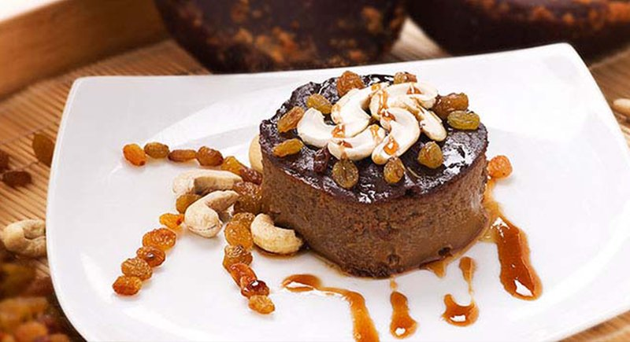

# Watalappam

*Sri Lanka's steamed coconut-jaggery custard: heavily scented with cardamom, cloves and nutmeg, topped with toasted cashews. The Eid centrepiece.*

**Serves:** 6

**Prep Time:** 15 minutes

**Cook Time:** 50 minutes (plus 2 hours chilling)

## Overview
Eggs whisk with grated kithul jaggery (or palm sugar) until the sugar starts to dissolve. Coconut milk and ground spices fold in. The mixture strains through a sieve into ramekins (or one wide dish), gets steamed gently until just-set with a slight wobble. Topped with toasted cashews; served chilled or at room temperature.

## Ingredients

- 200 g kithul jaggery (or palm sugar / dark brown sugar; grated or finely chopped)
- 4 large eggs
- 400 ml thick coconut milk
- 100 ml whole milk (or extra coconut milk)
- 1 teaspoon ground cardamom
- ¼ teaspoon ground cloves
- ¼ teaspoon ground nutmeg
- ½ teaspoon vanilla extract (optional)
- A pinch of salt

### Topping
- 50 g unsalted cashews (toasted and roughly chopped)

## Method

### Stage 1 - Dissolve the jaggery
1. If using kithul jaggery in solid form, grate or chop it finely.
1. Combine with the eggs in a bowl; whisk gently - don't froth - until the sugar has mostly dissolved.

### Stage 2 - Combine
1. Whisk in the coconut milk, milk, cardamom, cloves, nutmeg, vanilla, and salt.
1. Strain through a fine sieve into a jug (catches any unmelted sugar bits and fibrous jaggery).

### Stage 3 - Pour
1. Divide between 6 ramekins (or pour into a single 1 ½ L wide oven-proof bowl).

### Stage 4 - Steam
1. Set up a steamer with simmering water; cover the ramekins loosely with foil to keep condensation off the surface.
1. Steam over medium-low heat 35-45 minutes (longer for one big bowl) until the centres just set with a faint wobble. A skewer in the middle should come out clean.
1. Lift out carefully; cool to room temperature.

### Stage 5 - Chill and serve
1. Cover and refrigerate at least 2 hours, ideally overnight.
1. Top with toasted cashews just before serving.
1. Eat chilled or at room temperature.

## Notes
- **Kithul jaggery is non-negotiable for the real flavour:** Sri Lankan/South Asian grocers sell it in solid blocks. Palm sugar is a workable substitute; muscovado-style dark brown sugar gives a flatter result.
- **Steam, don't bake:** Watalappam is steamed, not oven-baked - the gentle moist heat gives the silky set without the cracked surface a baked custard gets.
- **Don't over-whisk:** Frothy eggs make a bubbly, holey custard. Gentle whisking only.

## Storage
- Keeps 3 days refrigerated; the spices deepen.
- Don't freeze.
