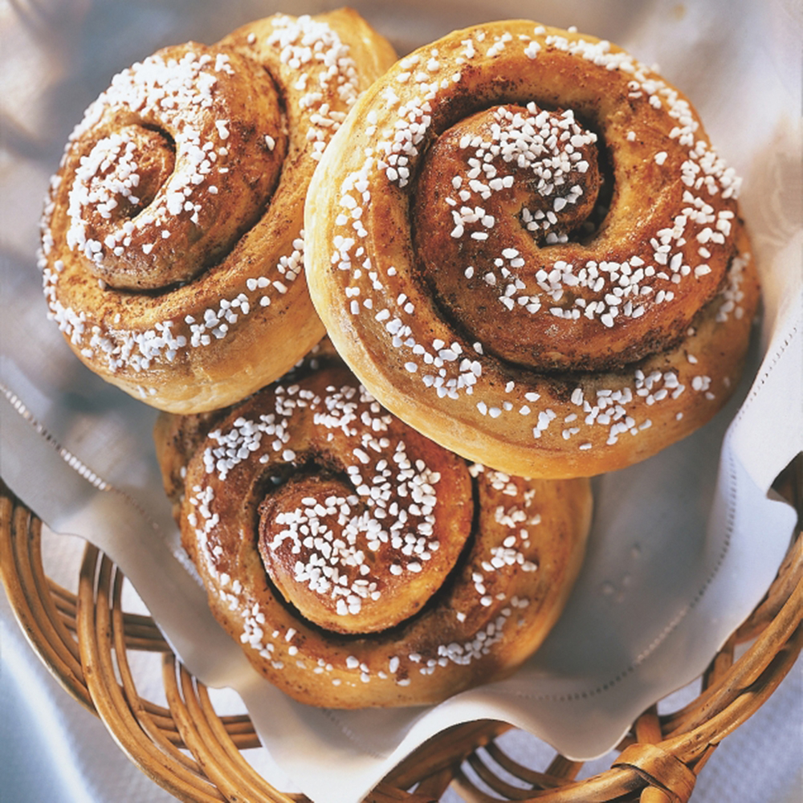

# Kanelbullar (Swedish Cinnamon Buns)

*Sweden's iconic cinnamon bun: a soft cardamom-scented enriched dough rolled around a butter-cinnamon-sugar filling, shaped into the traditional Swedish twist (not a swirl), brushed with egg wash, topped with pearl sugar, and baked till deep golden. The fika tradition's centrepiece; the bun every Swede grew up with and every Stockholm coffee shop sells by the thousand.*

**Serves:** Makes 16 buns

**Prep Time:** 45 minutes (plus 2 hours dough rising)

**Cook Time:** 12 minutes

## Overview
Kanelbullar (literally "cinnamon buns") are Sweden's most iconic baked good and the centrepiece of the fika tradition. So woven into the national culture that the country celebrates Kanelbullens dag (Cinnamon Bun Day) on 4 October every year. Two things distinguish Swedish kanelbullar from the American cinnamon roll. Cardamom in the dough: essential, not optional (Sweden imports more cardamom per capita than India). And the shaping: the traditional Swedish kanelbulle is twisted into a knot, not rolled into a swirl. The dough is rolled into a rectangle, spread with filling, folded in thirds, cut into strips, and each strip is twisted and wound into a knot. Topped with egg wash and pärlsocker (chunky pearl sugar that doesn't melt). The Swedish balance: less sugar than American versions, less cinnamon, and the cardamom gives a perfumed bass note no other cinnamon bun has.

## Ingredients

### Dough
- 500 g plain flour
- 80 g caster sugar
- 1 sachet (7 g) instant yeast
- 1 ½ teaspoons fine sea salt
- 2 teaspoons ground cardamom (freshly ground from green pods if possible; pre-ground works but loses some perfume)
- 300 ml whole milk (warm)
- 1 large egg
- 100 g butter (softened, cubed)

### Filling
- 100 g butter (softened to spreading consistency)
- 80 g caster sugar
- 80 g light brown sugar
- 2 tablespoons ground cinnamon
- 1 teaspoon ground cardamom (more cardamom, extra)
- Pinch of salt

### Topping
- 1 egg (beaten with 1 tablespoon milk; for egg wash)
- 50 g pearl sugar (pärlsocker, the traditional Swedish chunky white sugar; substitute with crushed sugar cubes if unavailable, or coarse demerara)
- 2 tablespoons flaked almonds (optional)

### To serve
- Strong coffee (Swedish-style)
- Or tea
- The fika ritual, never alone

## Method

### Stage 1 - Make the dough
1. In a stand mixer with the dough hook, combine flour, sugar, yeast, salt, and ground cardamom.
2. In a separate jug, whisk together warm milk and the egg.
3. Add the wet to the dry; knead 4-5 minutes on medium speed till a rough dough forms.
4. Add the softened butter cubes a few at a time, kneading till each batch incorporates before adding the next.
5. Knead another 6-8 minutes till the dough is smooth, elastic, and only slightly tacky.

### Stage 2 - First rise
1. Place the dough in a lightly oiled bowl.
2. Cover with cling film or a damp tea towel.
3. Rise in a warm spot 60-90 minutes till doubled in size.

### Stage 3 - Make the filling
1. In a small bowl, beat together the softened butter, both sugars, cinnamon, cardamom, and salt till smooth and spreadable.

### Stage 4 - Roll out and fill
1. Punch down the risen dough.
2. On a lightly floured surface, roll into a rectangle about 50cm × 30cm and 5mm thick.
3. Spread the cinnamon-butter filling evenly across the entire surface, all the way to the edges.

### Stage 5 - Fold and cut (the Swedish twist method)
1. Fold the rectangle into thirds (like folding a letter, bring the bottom third up over the middle, then the top third down over both, giving three layers).
2. With a sharp knife or pizza wheel, cut the folded rectangle widthwise into 16 strips (each about 3cm wide).
3. Each strip should be three layers thick.

### Stage 6 - Twist and shape (knot method)
1. Take one strip; cut a slit down its centre vertically, stopping about 2cm from the top (so the strip becomes a long Y-shape).
2. With the two prongs hanging down, twist them around each other like a rope.
3. Wind the twisted rope into a small spiral knot; tuck the loose end underneath.
4. Place on a parchment-lined baking sheet.
5. Repeat for all 16 strips.
6. Don't worry about perfect uniformity, Swedish kanelbullar look slightly rustic.

### Stage 7 - Second rise
1. Cover the shaped buns loosely with a damp tea towel.
2. Rise 30 minutes in a warm spot till slightly puffy.

### Stage 8 - Top and bake
1. Preheat the oven to 220°C (425°F).
2. Brush each bun generously with the egg wash.
3. Sprinkle generously with pearl sugar (and flaked almonds if using).
4. Bake 10-12 minutes till deep golden brown.
5. The filling inside should be visibly bubbling at the edges.

### Stage 9 - Cool slightly and serve
1. Lift onto a wire rack; cool 5 minutes (long enough that the filling sets a little).
2. Best eaten warm with strong coffee.
3. The fika ritual: a kanelbulle, a coffee, a brief social pause, then back to work.

## Notes
- **Cardamom in the dough is essential:** this is what makes a kanelbulle Swedish rather than American. Don't skip.
- **Knot shape, not a swirl:** the twist is the traditional Swedish look. Spiral-rolled buns are kanelsnurror (a different shape) or just American cinnamon rolls.
- **Pearl sugar on top:** doesn't melt during baking; gives the traditional crunch. Demerara is a poor substitute.
- **Less sweet than American versions:** the Swedish balance is restrained.
- **Eat warm with coffee:** the fika ritual. Don't eat alone.

## Variations
- **Kardemummabullar (cardamom buns):** swap the cinnamon filling for an all-cardamom filling. Equally traditional and arguably even more Swedish.
- **Saffron buns (lussekatter):** at Christmas, swap to a saffron-yellow dough with raisin eyes; the Sankta Lucia Day specialty.
- **Vegan version:** swap milk for oat milk, egg for flax egg, butter for vegan butter.
- **With cream cheese frosting:** less traditional, more modern (American influence): drizzle a cream-cheese frosting over after baking.
- **Smaller mini cocktail version:** half-size buns for a fika spread or canapé.

## Serving
- At every Swedish coffee shop (the traditional Kafferosteriet, Vete-Katten in Stockholm, Espresso House) · at home for the daily fika · at a Christmas julbord on the sweet side · with a strong coffee mid-afternoon · on Kanelbullens dag (Cinnamon Bun Day, October 4th) when Swedes eat them in defiance of normal portion size.

## Storage
- Best fresh on the day they're baked.
- Cooled buns keep in a sealed tin at room temp 2-3 days; reheat briefly in a warm oven (140°C) for 4 minutes to soften.
- Freeze cooked 2 months; thaw at room temp and refresh in the oven.
- Dough can rise overnight in the fridge for a slower-flavour version.
