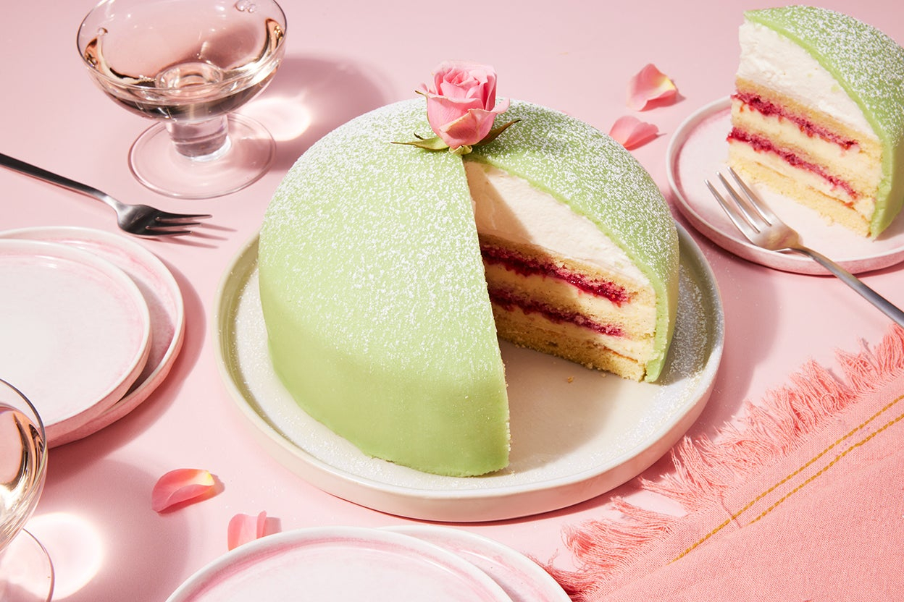

# Prinsesstårta (Princess Cake)

*Sweden's national green-marzipan-domed celebration cake: layers of thin sponge sandwiched with raspberry jam, pastry cream and a tall dome of whipped cream, all enveloped in a smooth sheet of green-tinted marzipan and crowned with a single pink marzipan rose. The Swedish birthday and Mother's Day classic; an icon of the Stockholm konditori window.*

**Serves:** 10-12

**Prep Time:** 1.5 hours (plus chilling)

**Cook Time:** 25 minutes (sponge)

## Overview
Prinsesstårta (Princess Cake) is one of Sweden's most iconic celebration cakes and a fixture of every Swedish konditori window from Stockholm to Malmö. The cake was created in the 1920s by Jenny Åkerström, a Swedish home-economics teacher who taught the three Swedish princesses (Margaretha, Märtha, and Astrid) - hence the name. The construction: three thin layers of light vanilla sponge (sometimes flavoured with cardamom) sandwiched with raspberry jam, vanilla pastry cream, and finally a tall mounded dome of lightly sweetened whipped cream that gives the cake its distinctive bowler-hat shape. The whole assembly is then wrapped in a smooth thin sheet of pale green-tinted marzipan (the traditional Swedish princess colour - though pink and yellow variants exist for different occasions), the marzipan smoothed over the dome to give a perfect curved surface. Crowned with a single rose made from pink marzipan and a small dusting of icing sugar. The cake is best eaten the day it's assembled (the cream stays fluffy) but can be made up to 24 hours ahead.

## Ingredients

### Sponge (vanilla)
- 4 large eggs
- 120 g caster sugar
- 100 g plain flour
- 1 tablespoon cornflour
- 1 teaspoon baking powder
- 1 teaspoon vanilla extract
- Pinch of salt

### Pastry cream (vaniljkräm)
- 300 ml whole milk
- 1 vanilla pod (split and scraped; or 2 teaspoons vanilla extract)
- 3 large egg yolks
- 60 g caster sugar
- 2 tablespoons cornflour
- 1 tablespoon butter

### Whipped cream dome
- 500 ml double cream (cold)
- 2 tablespoons icing sugar
- 1 teaspoon vanilla extract

### Filling
- 4 tablespoons high-quality raspberry jam (Swedish hjortronsylt - cloudberry jam - is the deluxe alternative)

### Green marzipan covering
- 400 g good-quality marzipan (50% almond minimum)
- Green food colouring gel (start with 5-6 drops; pale pistachio green is the traditional Swedish shade)
- Icing sugar (for rolling)

### Decoration
- 50 g pink marzipan (for the rose; pre-coloured or tinted with red food gel)
- Icing sugar (for dusting)

### To serve
- A small cup of Swedish coffee
- Or champagne (for a celebration)

## Method

### Stage 1 - Make the sponge
1. Preheat oven to 180°C (350°F).
2. Grease and line a 23cm round cake tin with parchment.
3. Whisk the eggs and sugar together with electric beaters for 6-8 minutes till pale, thick, and tripled in volume. The "ribbon stage" - the whisk should leave a trail that holds for 5 seconds.
4. Sift the flour, cornflour, baking powder, and salt over the top.
5. Add vanilla extract.
6. Fold in gently with a metal spoon or spatula; don't deflate.
7. Pour into the prepared tin.
8. Bake 22-25 minutes till risen, golden, and springy to the touch.
9. Cool in the tin 10 minutes; turn out onto a wire rack to cool completely.

### Stage 2 - Make pastry cream
1. Heat the milk with the split vanilla pod (or vanilla extract) in a saucepan till just below boiling.
2. In a separate bowl, whisk the egg yolks with the sugar and cornflour till pale.
3. Slowly pour the warm milk into the yolks, whisking constantly.
4. Return the mixture to the saucepan.
5. Cook over medium-low heat, whisking constantly, 4-5 minutes till thickened to a heavy custard.
6. Take off the heat; whisk in the butter till smooth.
7. Cover with cling film pressed onto the surface (prevents a skin).
8. Cool, then refrigerate to chill completely.

### Stage 3 - Slice the sponge
1. Use a long serrated knife to slice the cooled sponge horizontally into 3 equal-thickness layers.
2. The bottom and middle layers will be sandwiched; the top layer goes on the dome.

### Stage 4 - Make the whipped cream
1. In a cold bowl, whip the double cream with icing sugar and vanilla till it holds firm peaks (just past medium-stiff but still scoopable).
2. Reserve about a third of the whipped cream for the dome shape; the rest is for layering.

### Stage 5 - Assemble (layer 1)
1. Place the bottom sponge layer on a cake plate or 23cm cardboard base.
2. Spread a thin even layer of raspberry jam over.
3. Spread half the chilled pastry cream over the jam.

### Stage 6 - Assemble (layer 2)
1. Place the middle sponge layer on top.
2. Spread the remaining pastry cream over.
3. Add a thin layer of whipped cream over the pastry cream.

### Stage 7 - Assemble (layer 3 and the dome)
1. Place the top sponge layer on.
2. Now build the dome: pile the reserved whipped cream into a tall mound centred on the cake.
3. With an offset spatula, smooth the cream into a domed bowler-hat shape (taller at the centre, sloping down to the edges).
4. The dome should rise about 6-8 cm above the top sponge.

### Stage 8 - Make the marzipan covering
1. Knead the marzipan with the green food colouring gel till the colour is uniform.
2. Add colour gradually - pale pistachio green is the traditional shade, not bright emerald.
3. Roll the marzipan out on a surface lightly dusted with icing sugar to a circle about 35cm diameter and 4mm thick.

### Stage 9 - Wrap the cake
1. Carefully lift the marzipan onto the cake (the easiest way is to drape it over a rolling pin).
2. Centre it over the dome; let it fall down around the sides.
3. Smooth the marzipan over the dome and down the sides with your hands or a marzipan smoother. Smooth out any wrinkles.
4. Trim the excess around the base with a sharp knife.

### Stage 10 - Add the rose
1. Pinch off a small piece of pink marzipan; roll into a small ball.
2. Flatten with your fingers into a thin disc - this is the centre of the rose.
3. Roll smaller marzipan balls into thin discs and wrap them around the centre as overlapping petals.
4. Place the rose on top of the cake (slightly off-centre is fine).

### Stage 11 - Chill briefly
1. Refrigerate 30 minutes to set everything.

### Stage 12 - Serve
1. Dust with a light snowfall of icing sugar.
2. Slice with a sharp knife (warm in hot water + dry it between slices for clean cuts).
3. With strong coffee or champagne.

## Notes
- **Thin sponge layers:** the cake has 3 layers, not the modern 4-5. The slim sponges let the cream shine.
- **Tall dome of whipped cream:** the structural signature. Don't be modest with the cream pile.
- **Pale pistachio green:** the traditional Swedish shade. Bright emerald is wrong.
- **Pink marzipan rose:** the traditional Swedish decoration. Simple is better.
- **Make on the day:** the cream is best fresh. Up to 24 hours in fridge is OK.

## Variations
**Pink princess cake:** swap the green marzipan for pink; for a girl's birthday or breast-cancer-awareness charity bake.
**Yellow princess cake:** for a Sankta Lucia or Christmas variant.
**Cardamom sponge:** add 1 teaspoon ground cardamom to the sponge for a Swedish-spiced version.
**With fresh raspberries inside:** add a layer of fresh raspberries between the pastry cream and whipped cream.
**With cloudberry jam (hjortronsylt):** the deluxe Northern Swedish version.
**Mini individual prinsesstårta:** make in small dome moulds, one per person.

## Serving
At Swedish birthdays (the traditional celebration cake) · at Mother's Day · at a fika that has graduated into a formal occasion · at a Stockholm konditori display window (always in pale green) · at a wedding (often the second cake alongside the main one).

## Storage
- Best the day it's assembled.
- Refrigerates 24 hours (the cream stays fluffy if covered loosely; uncovered, it skins).
- Don't freeze (the cream texture suffers; the marzipan dries).
- The components separately keep longer: marzipan keeps for weeks in a sealed bag; sponge layers freeze; pastry cream refrigerates 2 days.
