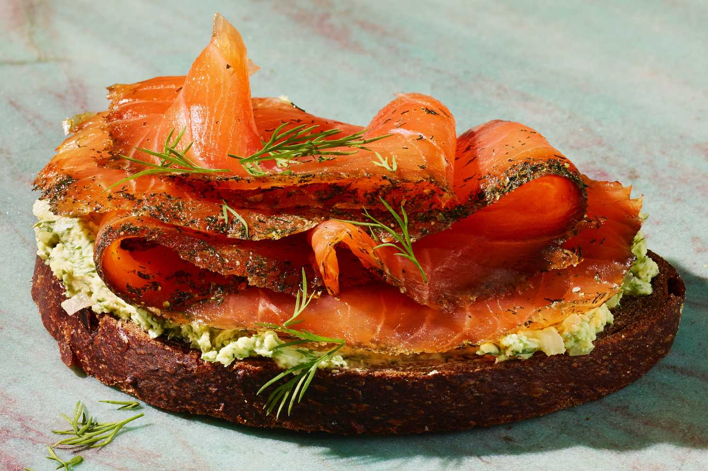

# Gravlax

*Sweden's cured salmon: a side of fresh salmon buried in salt, sugar and chopped fresh dill for 48 hours till the flesh firms to a silky cure. Sliced paper-thin and served with hovmästarsås (the Swedish mustard-dill sauce), Scandinavian rye crisp bread and pickled cucumber. The smörgåsbord and Christmas-buffet centrepiece.*

**Serves:** 8-12 (as a starter or smörgåsbord component)

**Prep Time:** 20 minutes (plus 48 hours curing)

**Cook Time:** None (the salt-and-sugar cure does the work)

## Overview
Gravlax (literally "buried salmon" - from the medieval Scandinavian practice of burying salt-cured salmon in the cold ground for preservation) is one of the canonical Nordic dishes and the centrepiece of every Swedish Christmas julbord (Christmas table) and Midsommar buffet. Modern gravlax is no longer buried, but the principle holds: a side of fresh salmon (skin-on, deboned) is covered in a curing mix of coarse salt + sugar (in roughly 2:3 ratio - more sugar than salt is the Swedish balance) + a tightly packed coat of chopped fresh dill (huge amounts; you want a green carpet) + crushed white peppercorns. Weighed down and refrigerated for 48 hours, during which the salt draws out moisture, the sugar pulls in, and the salmon firms from translucent and floppy to opaque, silky, and slice-able. Sliced paper-thin, against the grain, and served with hovmästarsås (the canonical Swedish accompaniment - a mustard-and-dill sweet-tangy mayonnaise-style sauce), Scandinavian crisp bread (knäckebröd), and quick-pickled cucumber.

## Ingredients

### Curing
- 1 kg fresh salmon fillet (skin-on, pin-boned; centre cut for evenness)
- 80 g coarse sea salt (or kosher salt; flaky)
- 120 g caster sugar
- 1 tablespoon crushed white peppercorns (or black)
- 2 large bunches fresh dill (about 100 g; tough stems removed, leaves and fine stems chopped fine)
- 2 tablespoons brandy or aquavit (optional; adds depth)

### Equipment
- A glass or ceramic dish big enough to hold the salmon flat
- Cling film
- A second smaller dish or tray to weight on top
- Tins of beans or a chopping board as the weight

### Hovmästarsås (Swedish mustard-dill sauce)
- 4 tablespoons Dijon mustard
- 2 tablespoons grain mustard
- 4 tablespoons caster sugar
- 4 tablespoons white wine vinegar (or apple cider)
- 200 ml vegetable oil (or sunflower)
- 1 small bunch fresh dill (chopped fine)
- ½ teaspoon fine sea salt
- ¼ teaspoon ground white pepper

### To serve
- Scandinavian crisp bread (knäckebröd) or rye crackers
- Pumpernickel or dense rye bread
- Quick-pickled cucumber slices (cucumber + vinegar + sugar + dill, rested 30 min)
- Lemon wedges
- A glass of cold akvavit
- Cold pilsner beer

## Method

### Stage 1 - Prep the salmon
1. Lay the salmon skin-side-down on a board.
2. Run your fingers along it to find any remaining pin-bones; pull them out with tweezers.
3. Pat the salmon dry with paper towels.

### Stage 2 - Make the cure mix
1. In a bowl, combine salt, sugar, and crushed peppercorns.
2. Mix thoroughly.

### Stage 3 - Apply the cure
1. Lay half the chopped dill in an even bed in your dish.
2. Lay the salmon on top, skin-side-down.
3. Sprinkle brandy or aquavit (if using) over the flesh.
4. Sprinkle the salt-sugar mix evenly over the entire flesh side (more in thicker areas, less at the thin tail).
5. Pile the remaining chopped dill on top, pressing it in to make a green blanket covering the entire fish.

### Stage 4 - Weight and refrigerate
1. Cover the salmon tightly with cling film.
2. Place a flat tray or chopping board on top.
3. Add weights (heavy cans, a brick, a kettlebell) - about 2-3 kg total weight.
4. Refrigerate 48 hours.
5. After 24 hours, drain off any accumulated liquid (a clear amber brine), turn the salmon over (now flesh-side-up in the cure), and re-weight for the second 24 hours.

### Stage 5 - Make hovmästarsås
1. In a small bowl, whisk Dijon mustard, grain mustard, sugar, and vinegar till smooth.
2. Gradually whisk in the oil in a slow stream (like making mayonnaise) till emulsified and thick.
3. Stir in the chopped dill, salt, and white pepper.
4. Refrigerate 1 hour for the flavours to meld.

### Stage 6 - Slice and serve
1. After 48 hours, remove the salmon from the cure.
2. Rinse briefly under cold water to remove excess salt-sugar (don't soak; the cure is in the flesh now).
3. Pat very dry.
4. Place on a board; with a very sharp long knife, slice paper-thin diagonal slices from the top down to but not including the skin (the slices should be 2-3 mm thick).

### Stage 7 - Plate
1. Lay slices in a single layer on a serving platter.
2. Scatter extra chopped dill over.
3. Place a small bowl of hovmästarsås alongside.
4. Crisp bread, lemon wedges, and pickled cucumber on the side.
5. Cold akvavit in tiny glasses, beer in tall glasses.

## Notes
- **2:3 salt-sugar ratio:** the Swedish balance - sweeter than Danish or Norwegian. Adjust to taste once you've made it once.
- **Masses of dill, not garnish:** the dill forms a full green carpet over both sides.
- **48 hours minimum:** less than 36 hours and the centre of the fish is still raw; more than 72 hours and it gets too firm and salty.
- **Drain at 24 hours and flip:** distributes the cure evenly through the fish.
- **Cure salmon vs smoked salmon:** gravlax is cured (no heat or smoke). Smoked salmon is smoked. Different products; both excellent.

## Variations
**Citrus-cured:** add the zest of a lemon and an orange to the cure for a bright variant.
**Beet-cured (Beetroot gravlax):** add 200 g grated raw beetroot to the cure - gives the salmon a vivid magenta colour at the edges.
**Pepper-crusted:** swap white pepper for crushed pink peppercorns + black peppercorns.
**Gin-cured:** swap brandy for juniper-heavy gin; complements the dill.
**With horseradish cream instead of hovmästarsås:** a less sweet, sharper accompaniment.

## Serving
At a Christmas julbord (a long table of cold and hot Swedish dishes) · at Midsommar lunch in the garden with new potatoes · at a Stockholm cocktail party as canapés on crisp bread · at home for a weekend lunch with bread, sauce and a cold beer.

## Storage
- Cured gravlax keeps refrigerated 7 days, wrapped tightly in cling film.
- Slice as needed (the unsliced side stays fresher).
- Freezes 2 months (slightly firmer texture on thaw, still excellent).
- Hovmästarsås refrigerates 2 weeks.
