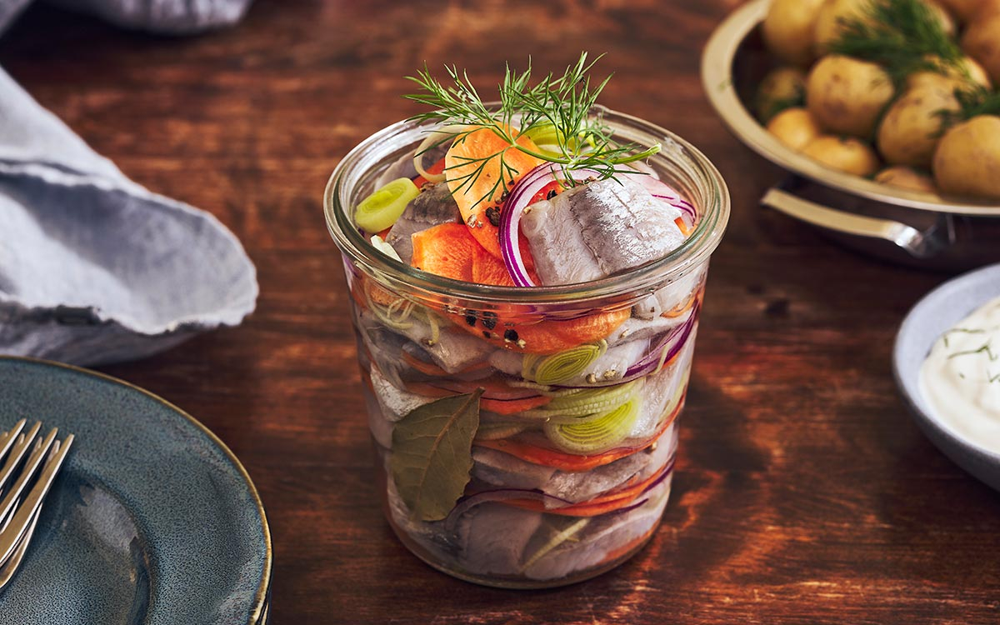

# Inlagd Sill (Swedish Pickled Herring)

*Sweden's iconic pickled herring: salt-cured herring fillets sliced into bite-size pieces and steeped in a sweet-tangy vinegar brine with red onion, dill, allspice, mustard seeds and bay. The cornerstone of every smörgåsbord, the traditional Midsommar starter, and the dish that defines Swedish snaps-drinking culture (you eat herring with akvavit; the salt cuts the spirit).*

**Serves:** 6-8 (as a smörgåsbord component)

**Prep Time:** 20 minutes (plus 24-48 hours marinating)

**Cook Time:** 5 minutes (to make the brine)

## Overview
Inlagd sill (literally "pickled herring") is one of Sweden's most foundational dishes and a fixture of every smörgåsbord, Christmas julbord, Easter buffet and Midsommar feast, sometimes served in three or four different versions on the same table (mustard-pickled, glasmästarsill, ginger-pickled, dill-pickled, etc.), each in its own small glass dish. The base recipe: salt-cured herring fillets (matjessill or saltsill, the pre-cured Scandinavian herrings sold in jars or vacuum packs; not raw fish) are rinsed briefly to remove excess salt, then steeped for 24-48 hours in a sweet-tangy 1:2:3 brine of white wine vinegar + sugar + water, with thinly sliced red onion, fresh dill, allspice berries, yellow mustard seeds, bay leaves and crushed white peppercorns. The herring softens and absorbs the brine, becoming silky, sweet-sharp, and aromatic. Served chilled in small portions on rye bread or Scandinavian crisp bread with new potatoes, sour cream and chopped chives. The Swedish snaps-drinking ritual (small shots of ice-cold akvavit between bites of herring) is essential, the salt-and-vinegar of the herring cuts the spirit's burn.

## Ingredients

### Herring
- 400 g pre-cured Scandinavian salt herring fillets (matjessill, saltsill, or any cured herring fillet from a jar or vacuum pack, these are the traditional Scandinavian pickled-herring base, NOT raw or smoked herring; substitute with rollmops if completely unavailable)

### Brine (1:2:3 ratio - the Swedish traditional)
- 100 ml white wine vinegar (or distilled vinegar)
- 200 g caster sugar
- 300 ml cold water

### Aromatics
- 1 medium red onion (thinly sliced into half-moons)
- 1 small bunch fresh dill (about 30 g; chopped fine; reserve some sprigs for garnish)
- 2 bay leaves
- 1 tablespoon yellow mustard seeds
- 1 tablespoon allspice berries (whole)
- 1 teaspoon white peppercorns (whole; or black)
- 1 teaspoon ginger (fresh, peeled and sliced thin; optional, adds depth)

### To serve
- New potatoes (boiled in salted water with a sprig of dill; served warm)
- Soured cream (gräddfil) or crème fraîche
- Chopped fresh chives
- Rye bread (knäckebröd or pumpernickel)
- Small ice-cold akvavit shots
- A cold lager

## Method

### Stage 1 - Rinse the herring
1. Take the cured herring fillets out of their original brine.
2. Rinse briefly under cold running water to remove some of the curing salt (don't soak; you want some of the cure to remain for flavour).
3. Pat dry with paper towels.

### Stage 2 - Slice the herring
1. Lay each fillet flat on a board.
2. Slice across the grain into 2cm pieces (bite-size).
3. Set aside in a clean bowl.

### Stage 3 - Make the brine
1. In a small saucepan, combine the vinegar, sugar, and water.
2. Add the mustard seeds, allspice berries, peppercorns, bay leaves, and sliced ginger (if using).
3. Bring to a gentle simmer over medium heat; cook 3-4 minutes till the sugar has fully dissolved and the spices have started to release their aroma.
4. Take off the heat; cool completely (this is essential, pouring warm brine onto the herring would cook it).

### Stage 4 - Layer in a jar
1. Find a glass jar or non-reactive container (about 1 litre capacity).
2. Layer 1: a few rings of sliced red onion at the bottom.
3. Layer 2: a layer of herring pieces.
4. Layer 3: a sprinkle of chopped dill.
5. Layer 4: a few more onion rings.
6. Repeat layering till all the herring and onion are used; finish with herring + dill at the top.

### Stage 5 - Pour the cooled brine over
1. Slowly pour the cooled brine (with its spices) into the jar.
2. The herring and onions should be fully submerged.
3. If they're not, top up with a little more 1:2:3 vinegar-sugar-water.
4. Close the jar tightly.

### Stage 6 - Refrigerate
1. Refrigerate 24 hours minimum; 48 hours is better.
2. The herring will soften and absorb the brine flavour; the onions will turn pinker; the brine will turn a pale amber.

### Stage 7 - Serve
1. Lift portions of herring + onion out of the brine with a slotted spoon (the brine clings).
2. Arrange on small plates (smörgåsbord style) or on slices of rye bread / crisp bread.
3. Top with a dollop of sour cream and a generous sprinkle of chopped chives.
4. Warm boiled new potatoes alongside.
5. A reserved sprig of dill on top for garnish.

### Stage 8 - The snaps ritual
1. Pour ice-cold akvavit (Skåne, OP Anderson) into small glasses.
2. Eat a bite of herring, take a sip of akvavit, repeat.
3. The Swedes sing a snapsvisa (snaps song) before each round.

## Notes
- **Pre-cured herring, not raw:** matjessill or saltsill, start from already-cured fillets. Curing raw herring is a separate process.
- **1:2:3 brine ratio (vinegar:sugar:water):** the Swedish traditional balance, sweeter and milder than Dutch or German pickled herring. Adjust to taste once you've made the traditional version.
- **Cool the brine completely:** warm brine cooks the fish; ruins the texture.
- **24-48 hour minimum:** less and the herring is still salty-strong; more is fine.
- **Snaps alongside:** the akvavit-and-herring pairing is structural. The vinegar-salt-acid cuts the spirit.

## Variations
**Senapssill (mustard-pickled):** add 4 tablespoons of Dijon mustard to the brine; very traditional Christmas variant.
**Glasmästarsill (glassblower's herring):** add fresh ginger slices, sliced carrot, horseradish, a layered colourful variant.
**Curry-pickled:** add 1 tablespoon curry powder to the brine.
**Tomato-pickled (löksill):** add tomato paste + paprika to the brine.
**Apple-and-onion:** add slices of sweet apple alongside the onion.

## Serving
At the Swedish julbord (Christmas table) as one of many small dishes · at Midsommar lunch with new potatoes and akvavit · at Easter brunch · at a Stockholm restaurant smörgåsbord at noon · at home with rye crisp bread and a beer.

## Storage
- Pickled herring refrigerates 2-3 weeks in its brine (it actually improves for the first week).
- Don't freeze.
- Once cracked, the jar keeps best with the herring fully submerged in brine.
