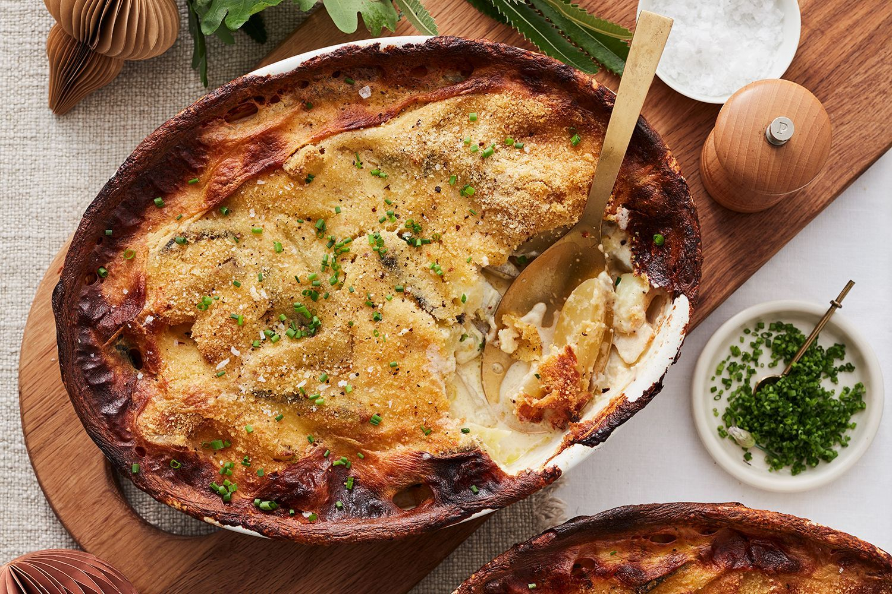

# Janssons Frestelse (Jansson's Temptation)

*Sweden's anchovy-potato gratin: julienned potatoes layered with sweet onions and Swedish anchovies (which are actually pickled sprats), drenched in cream and baked till the top crisps golden and the inside is silky and salty-sweet. The traditional Swedish Christmas julbord dish; also a midnight-supper classic after a night out.*

**Serves:** 6

**Prep Time:** 25 minutes

**Cook Time:** 50 minutes

## Overview
Janssons frestelse (Jansson's Temptation) is one of Sweden's most beloved comfort dishes and a fixture of every Christmas julbord, Easter buffet and late-night svensk pub menu: julienned potatoes (cut into matchsticks about 5mm thick, never grated) layered in a baking dish with thinly sliced sweet onions and "Swedish anchovies" - which is one of the great food-naming traps. Swedish "ansjovis" are NOT the salt-cured Mediterranean anchovies most cooks know; they're actually pickled European sprats, cured in a sweet-spiced brine with cloves, allspice, white peppercorns, sandalwood and bay (Abba brand is the traditional Swedish jar). They're sweeter, milder, and less aggressively fishy than Italian anchovies. The dish drenches all this in double cream + a splash of the spiced brine from the anchovy jar, tops with breadcrumbs and butter, and bakes till the top crisps golden and the inside is silky, salty-sweet, deeply savoury. The name's etymology is contested (Pelle Janzon, the Swedish opera singer? a Janzon family cookbook? a 1929 short story?), but the dish dates from at least the late 1920s.

## Ingredients

- 1 kg waxy potatoes (Maris Piper, Yukon Gold, or Désirée; peeled and julienned into 5mm matchsticks)
- 2 large sweet onions (thinly sliced into half-moons)
- 1 tin (125 g) Swedish ansjovis (Abba brand) - about 12-16 fillets, plus 4 tablespoons of the spiced pickling brine reserved
  - Substitute if Swedish brand unavailable: use 1 tin of marinated brisling sardines or 12 European pickled sprats; if only Italian salt-cured anchovies are available, rinse them well to reduce saltiness and add 2 tablespoons of sugar + a pinch each of allspice and ground cloves to the cream to approximate
- 50 g butter
- 400 ml double cream
- 100 ml whole milk
- 1 teaspoon ground white pepper
- 4 tablespoons coarse breadcrumbs (panko works)
- 1 tablespoon butter (extra; melted, for the breadcrumbs)
- Salt (cautious; the anchovies are salty already)

### To serve
- A green salad with vinaigrette
- Cold Swedish lager (Pripps Blå, Falcon, Norrlands Guld)
- Or a small glass of ice-cold akvavit

## Method

### Stage 1 - Prep
1. Preheat oven to 200°C (400°F).
2. Butter a 25cm × 20cm baking dish (or similar; about 2 litres capacity).
3. Julienne the potatoes into matchsticks (you can use a mandoline with a julienne attachment, or a sharp knife and patience). Place in a bowl of cold water as you go to prevent browning.
4. Drain the potatoes thoroughly and pat dry with a clean towel.

### Stage 2 - Sauté the onions
1. Melt 30 g of the butter in a wide pan over medium heat.
2. Add sliced onions; cook 10-12 minutes till deeply soft and just lightly golden at the edges.
3. Don't caramelise hard; you want sweet, not brown.

### Stage 3 - Layer
1. Layer 1: half the potatoes spread evenly across the bottom of the dish.
2. Layer 2: all of the softened onions spread over.
3. Layer 3: lay the anchovy fillets across the onions, evenly distributed.
4. Layer 4: the remaining potatoes spread on top.
5. Press down lightly with the back of a spatula.

### Stage 4 - Pour over the cream
1. In a jug, whisk together the double cream, milk, 4 tablespoons of reserved anchovy brine, and white pepper.
2. Pour this evenly over the layered dish.
3. The liquid should rise about three-quarters up the dish; it shouldn't fully submerge the top layer of potatoes.

### Stage 5 - Top with breadcrumbs
1. Toss the breadcrumbs in the melted extra butter.
2. Sprinkle evenly over the top of the dish.
3. Dot the remaining 20 g of butter in small dabs across the top.

### Stage 6 - Bake
1. Bake 45-50 minutes till the top is deeply golden brown and the potatoes are tender when pierced with a fork.
2. If the top is browning too fast in the first 20 minutes, loosely cover with foil; uncover for the last 15 minutes.

### Stage 7 - Rest and serve
1. Let stand 5-10 minutes before serving (the gratin sets slightly).
2. Spoon onto plates.
3. Cold beer, cold akvavit; a simple green salad for cutting the richness.

## Notes
- **Swedish ansjovis ≠ Mediterranean anchovies:** crucial distinction. Use Abba brand if you can find it; the dish depends on the sweet-spiced cure.
- **Reserve the brine:** 4 tablespoons in the cream is essential to the flavour profile.
- **Julienned, not grated:** the texture stays distinct. Grated turns to mush.
- **Don't oversalt:** the anchovies and their brine carry the salt.
- **Top must crisp:** bake uncovered for the last stretch.

## Variations
**With herring instead of ansjovis:** a non-traditional but lighter version.
**Vegetarian (Vansin frestelse):** swap the anchovies for chopped black olives + capers + a teaspoon of MSG or seaweed flakes for umami depth.
**Spicier:** add a pinch of cayenne to the cream.
**With sliced chorizo:** for a non-Swedish riff that works.
**Mini portion ramekins:** for a starter; bake in individual ramekins for 25 minutes.

## Serving
At the Swedish Christmas julbord on the evening of Christmas Eve (often the dish that's been gently warming in the oven all afternoon) · at a Midsommar feast · at the end of a long night out as the "back to mine" comfort food · with cold beer.

## Storage
- Refrigerates 4 days; reheats beautifully in a 180°C oven 20 minutes.
- Doesn't freeze well (potato texture suffers).
- Tastes arguably even better the next day.
