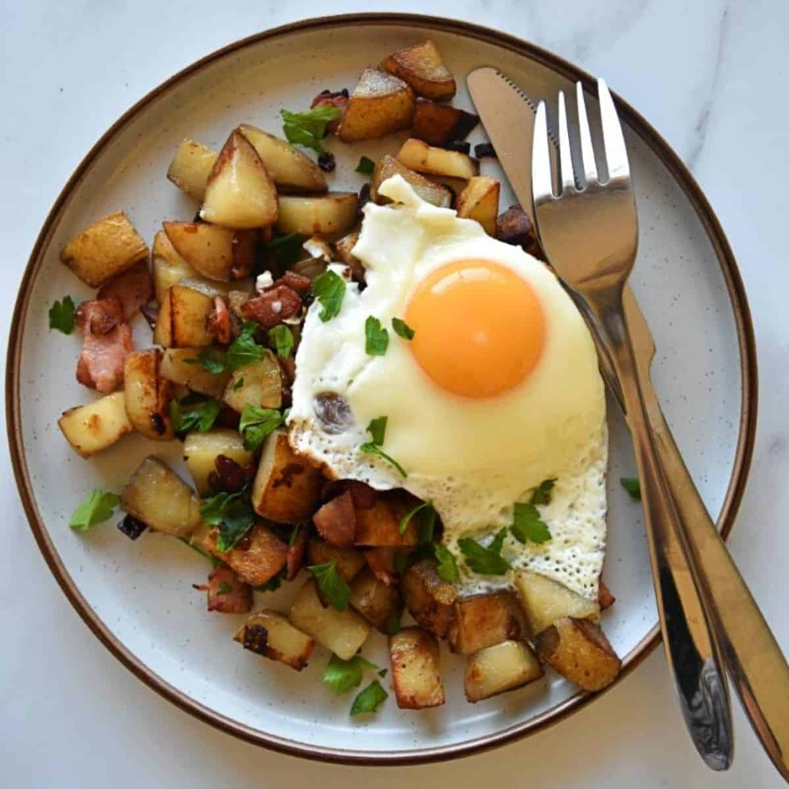

# Pyttipanna (Swedish Hash)

*Sweden's leftovers hash: small cubes of cold cooked potato, onion, sausage and any other leftover meat all fried hard in butter till deeply golden and crispy at the edges, served with a sunny-side-up fried egg on top, pickled beetroot, and a small spoon of Dijon mustard. The Swedish weeknight everything-up dinner and the traditional hangover breakfast.*

**Serves:** 4

**Prep Time:** 15 minutes

**Cook Time:** 20 minutes

## Overview
Pyttipanna (literally "small bits in a pan") is the Swedish leftover-utilisation dish and the traditional Monday-night dinner (made from Sunday's leftover roast). The construction is loose by design: small cubes of cold cooked potato (the traditional base), small cubes of cold cooked meat (typically a falukorv-style smoked Swedish sausage; or ham, leftover roast beef, or any meat from the previous day's meal), finely chopped onion. All fried hard in butter in a wide pan till the edges crisp and brown. Served with a sunny-side-up fried egg on top of each portion (the runny yolk is the sauce), pickled beetroot (rödbetor - the traditional Swedish accompaniment, the sweet-vinegary lift), a small spoon of Dijon mustard on the side, and chopped fresh parsley. Eat with a fork, often standing at the kitchen counter.

## Ingredients

### Base
- 700 g cold pre-cooked potatoes (boiled or roasted the day before; cubed into 1cm dice)
- 400 g leftover cooked meat (Swedish falukorv smoked sausage, ham, leftover roast beef, kassler - pick one or mix; cubed into 1cm dice)
- 1 large yellow onion (finely chopped)
- 60 g butter
- 2 tablespoons vegetable oil
- 1 teaspoon fine sea salt
- 1 teaspoon ground black pepper

### To finish
- 4 large eggs
- 1 tablespoon butter (for frying eggs)
- 1 small bunch fresh parsley (chopped)

### To serve
- Pickled beetroot (sliced or chopped; from a jar; the traditional accompaniment)
- Dijon mustard
- A glass of cold milk OR a small lager
- Optional: HP sauce or ketchup (less traditional)

## Method

### Stage 1 - Prep
1. Cube the cold cooked potatoes into 1cm dice (uniformity helps the crisp).
2. Cube the cooked meat the same size.
3. Chop the onion fine.

### Stage 2 - Sauté the onion
1. Heat the butter and oil in a wide pan over medium-high heat.
2. Add the chopped onion; cook 6 minutes till softened and translucent.

### Stage 3 - Fry the meat first
1. Push the onion to one side of the pan.
2. Add the cubed meat to the other side; spread in a single layer.
3. Cook 4-5 minutes, undisturbed, till the meat browns on the bottom.
4. Stir together with the onion; cook 2 minutes more.

### Stage 4 - Add the potatoes
1. Add the cubed cold potatoes to the pan.
2. Don't stir for 4-5 minutes; let the potatoes get a deep golden crust on the bottom.
3. Then toss / stir; let them crisp on another side.
4. Repeat - total 12-15 minutes of cooking, with periodic stirring to give all sides a crust.
5. Season with salt and pepper.
6. Keep warm.

### Stage 5 - Fry the eggs
1. In a separate pan, melt the tablespoon of butter.
2. Fry 4 eggs sunny-side up till the whites are set and the yolks are still runny.

### Stage 6 - Plate
1. Mound a portion of pyttipanna onto each plate.
2. Top with a sunny-side-up fried egg.
3. A spoonful of pickled beetroot at the side.
4. A small dollop of Dijon mustard.
5. Sprinkle chopped parsley over the top.

### Stage 7 - Serve immediately
1. With cold milk or a small lager.
2. Eat with a fork; break the yolk into the hash.

## Notes
- **Cold cooked potatoes:** the crisp depends on this. Hot or freshly-boiled won't work the same. Day-before leftovers are perfect.
- **Uniform 1cm dice:** all components the same size so they crisp together.
- **Don't stir too often:** the potatoes need uninterrupted contact with the hot pan to develop the crust.
- **Pickled beetroot non-negotiable:** the sweet-acid lift is what makes pyttipanna a complete meal rather than just hash.
- **Falukorv ideal:** the Swedish smoked sausage. Any quality smoked sausage works as substitute.

## Variations
**Vegetarian (växt-pytt):** swap the meat for cubed halloumi, smoked tofu, or chopped roasted vegetables.
**Beef-and-potato only:** old-school version with just leftover roast beef.
**With brown butter:** swap the cooking butter for ghee or brown butter for extra nuttiness.
**Pyttipanna med rödbetor i:** beetroot diced into the hash rather than on the side (less traditional but a nice variant).
**With salty fish:** add diced cold smoked salmon or pickled herring at the end.

## Serving
At a Swedish home Monday dinner using Sunday's leftover roast · at a Stockholm pub at midnight as the "I drank too much" meal · at a Swedish breakfast counter with coffee and beer · at home as a weeknight all-in-one.

## Storage
- Best fresh; the crisp doesn't survive storage.
- Cooked pyttipanna refrigerates 2 days; reheat hard in a hot pan to re-crisp.
- Fried eggs cook fresh each time.
- Pickled beetroot keeps refrigerated for weeks.
