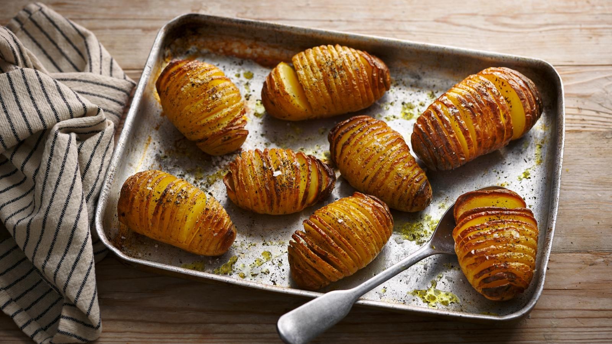

# Hasselback Potatoes

*Sweden's accordion potatoes: whole potatoes sliced thin almost all the way through (but not separated), brushed with butter and baked till the slices fan out crispy on top and the inside stays tender. Invented at the Hasselbacken restaurant in Stockholm in 1953; the world's most photogenic potato side dish.*

**Serves:** 4-6

**Prep Time:** 15 minutes

**Cook Time:** 50 minutes

## Overview
Hasselback potatoes are Sweden's most exported potato preparation and the dish that gets re-invented endlessly on every food blog: whole medium-size potatoes (skin on, scrubbed) are sliced thinly across the top, about 3mm slices, going almost all the way through but stopping a few millimetres above the base so the potato stays in one piece (the slices "fan" while attached). Brushed generously with melted butter, scattered with coarse salt, and baked at high heat till the fanned slices crisp and curl outward into accordion pleats while the inside stays soft and creamy. Created in 1953 by Leif Elisson, a chef trainee at the Hasselbacken restaurant on Djurgården island in Stockholm (the dish is named after the restaurant, not the other way round).

## Ingredients

- 8 medium yellow waxy potatoes (Charlotte, Maris Piper, or Yukon Gold; each about 150g; skin-on, scrubbed clean)
- 80 g butter (melted)
- 2 tablespoons olive oil
- 2 teaspoons coarse sea salt or flaky salt
- 1 teaspoon ground black pepper
- 2 cloves garlic (crushed; optional, mixed into the butter)
- 4 sprigs fresh thyme (optional)

### Optional toppings (for the last 10 min of baking)
- 4 tablespoons grated Parmesan
- 4 tablespoons breadcrumbs
- 1 tablespoon chopped fresh rosemary

### To serve
- Sour cream or crème fraîche
- Chopped fresh chives
- Lemon wedges
- Alongside meatballs, salmon, roast beef, or any Sunday roast

## Method

### Stage 1 - Slice the potatoes (the Hasselback cut)
1. Place each potato on a board, longest side horizontal.
2. The trick to slicing nearly-but-not-all-the-way: rest the potato in the bowl of a wooden spoon, OR lay it between two parallel chopsticks. The bowl/chopsticks stop your knife from going all the way through.
3. With a sharp knife, slice the potato into 3mm-thick slices across the top.
4. Each slice should reach down to about 5mm above the base (slices stay connected at the bottom).

### Stage 2 - Prep the butter
1. Preheat oven to 220°C (425°F).
2. In a small bowl, mix the melted butter, olive oil, crushed garlic (if using), and a pinch of salt.

### Stage 3 - First brush
1. Place the sliced potatoes in a baking dish or on a parchment-lined sheet, slice-side up.
2. Brush each potato generously with the butter-oil mixture, working some down between the slices.
3. Sprinkle coarse salt over the tops.
4. Tuck thyme sprigs between some of the slices (if using).

### Stage 4 - First bake
1. Bake 30 minutes.
2. The slices will start to fan apart as the potato cooks and dries slightly.

### Stage 5 - Re-brush
1. Take out the dish; brush each potato again with the butter mixture, getting it down between the now-fanned-out slices.
2. Sprinkle with extra salt and pepper.

### Stage 6 - Second bake
1. Return to the oven; bake 15-20 minutes more till the slices are deeply golden and crispy at the tips and the centres are tender when pierced.
2. Optional last-10-minutes step: sprinkle a mix of grated Parmesan + breadcrumbs over the tops; bake till bubbly and golden.

### Stage 7 - Serve
1. Lift onto plates.
2. Top with a dollop of sour cream and a scatter of chives.
3. Lemon wedge alongside for squeezing.

## Notes
- **Don't cut all the way through:** the wooden-spoon-or-chopsticks trick is the traditional chef's move. Practise on one potato first.
- **Brush at least twice:** the second brushing gets butter into the now-open slices.
- **High heat for the crisp:** 220°C minimum.
- **Skin on:** the skin crisps into a beautiful texture; peeled hasselback loses half the appeal.

## Variations
- **Cheesy hasselback:** insert thin slivers of cheese (Gruyère, Cheddar, mozzarella) between the slices halfway through baking.
- **Bacon-fat hasselback:** swap the butter for bacon fat; add bacon bits between the slices.
- **Sweet potato hasselback:** swap white potatoes for sweet potatoes; same technique, slightly shorter cook time.
- **Hasselback with mushroom-butter:** mix the butter with finely chopped mushrooms and garlic before brushing.
- **Crushed-potato style:** after baking, gently press down on the top to fully open the slices; serve sour-cream-loaded baked-potato-style.

## Serving
- Alongside Swedish meatballs (the traditional pairing) · with gravlax or smoked salmon · with any Sunday roast · at a Stockholm restaurant dinner · at home as the side that everyone photographs.

## Storage
- Best fresh from the oven.
- Cooked refrigerate 3 days; reheat in a hot oven 15 minutes to re-crisp.
- Don't microwave (the slices go soggy).
- Don't freeze.
