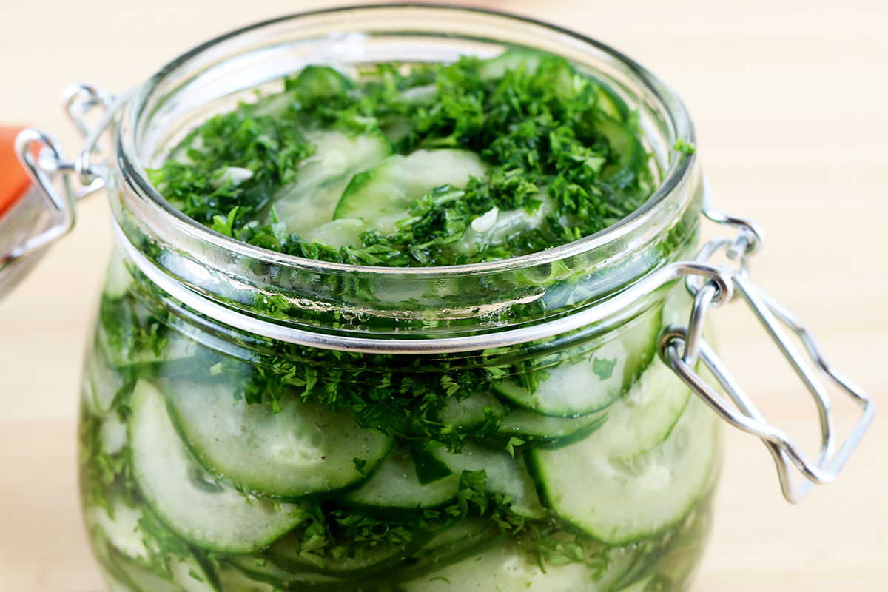

# Pressgurka (Swedish Pressed Cucumber Salad)

*Sweden's pressed cucumber salad: paper-thin cucumber slices salted and weighted till they release their water, then dressed in a 1:2:3 vinegar-sugar-water brine with chopped fresh dill. The traditional accompaniment to Swedish meatballs, roast beef, and the smörgåsbord salt-cured dishes; the cool-sweet-tangy lift on every Swedish plate.*

**Serves:** 6

**Prep Time:** 15 minutes (plus 30 minutes pressing + 30 minutes marinating)

**Cook Time:** None

## Overview
Pressgurka (literally "pressed cucumber") is the traditional Swedish cucumber pickle that appears on the plate alongside meatballs, roast beef, jansson's temptation, and every smörgåsbord cold buffet. The technique: paper-thin slices of cucumber (the traditional method uses a mandoline for true paper-thin slicing; a sharp knife works with patience) are layered with salt and weighted under a plate so they release their water and concentrate in flavour; the now-translucent salty slices are then drained, rinsed briefly, and dressed in the same 1:2:3 vinegar-sugar-water brine used for pickled herring, with masses of chopped fresh dill (more than you think you need) and a grind of white pepper. Rests 30 minutes more for the flavours to meld. Served cold in small glass dishes alongside warm savoury dishes; the cool sweet-acid bite cuts through rich cream gravies and salty cured meats.

## Ingredients

- 1 large English cucumber (about 400 g; or 2 smaller cucumbers)
- 1 ½ teaspoons fine sea salt (for pressing)

### Brine (1:2:3 ratio)
- 50 ml white wine vinegar
- 100 g caster sugar
- 150 ml cold water

### Dill and seasoning
- 1 small bunch fresh dill (about 30 g; chopped fine; reserve a sprig or two for garnish)
- ½ teaspoon ground white pepper (or black)

## Method

### Stage 1 - Slice the cucumber
1. Wash and dry the cucumber.
2. Don't peel (the skin is part of the texture and colour).
3. With a mandoline (or a very sharp knife and care), slice into PAPER-THIN rounds about 1-2mm thick.
4. The slices should be almost translucent.

### Stage 2 - Salt and press
1. Layer the slices in a colander set over a bowl (to catch the released liquid).
2. Sprinkle the salt evenly between the layers.
3. Cover with cling film or a flat plate; place a weight on top (a tin of beans, a kettlebell - about 2 kg).
4. Press for 30 minutes.
5. Lots of cucumber liquid will drain into the bowl below.

### Stage 3 - Rinse briefly
1. After pressing, rinse the cucumber slices briefly under cold running water to remove most of the surface salt (don't soak; the salt has already done its work and you want some remaining flavour).
2. Pat gently dry with paper towels or a clean kitchen towel.
3. The slices will now be limp, translucent, and shrunken - that's the right look.

### Stage 4 - Make the brine
1. In a small bowl, whisk together the vinegar, sugar, and water.
2. Stir till the sugar fully dissolves.

### Stage 5 - Dress
1. Place the pressed cucumber slices in a clean bowl.
2. Pour the brine over.
3. Add the chopped dill and white pepper.
4. Toss gently to combine.

### Stage 6 - Marinate
1. Cover; refrigerate 30 minutes minimum.
2. Up to 24 hours is fine (gets better in the first 2-3 hours).

### Stage 7 - Serve
1. Lift the pressgurka into small glass dishes with a slotted spoon.
2. A reserved dill sprig on top for garnish.
3. Serve cold alongside warm Swedish savoury dishes - particularly meatballs, gravlax, jansson's temptation, sausages, or roast beef.

## Notes
- **Paper-thin slices:** the traditional Swedish texture. Mandoline is the way.
- **Press for 30 minutes minimum:** the pressing concentrates the cucumber and prevents the salad turning watery in the brine.
- **1:2:3 brine ratio (vinegar:sugar:water):** the Swedish balance - sweeter than English cucumber pickles.
- **Masses of dill:** Swedish recipes use much more dill than you'd expect. Don't be shy.

## Variations
**With red onion:** add paper-thin slices of red onion to the press; turns the salad pink.
**With mustard seeds:** add 1 teaspoon yellow mustard seeds to the brine for a Senap-style pressgurka.
**Spicier:** add a pinch of cayenne or chopped fresh chilli (less traditional, more modern).
**Sweeter:** increase the sugar slightly for a Swedish-Christmas-style sweeter pickle.
**Quick version:** skip the pressing step (just salt the slices, rest 5 minutes, then dress); a less traditional but quicker version.

## Serving
Alongside Swedish meatballs (the traditional pairing) · alongside roast beef · alongside gravlax or pickled herring on the smörgåsbord · alongside jansson's temptation · at a Midsommar buffet · at a Swedish Christmas julbord.

## Storage
- Refrigerates 4-5 days; flavour deepens over the first 2-3 days then plateaus.
- Don't freeze (the cucumber texture collapses).
- Always serve cold.
