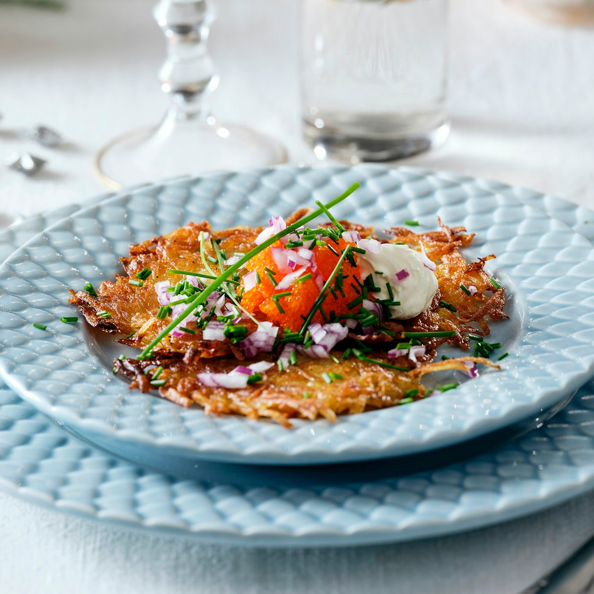

# Råraka (Swedish Potato Pancakes)

*Sweden's potato pancakes: coarsely grated raw potato squeezed of moisture, formed into thin patties and fried in butter till deeply golden and crispy outside, with a soft fluffy interior. Served with sour cream, lingonberry preserve and chopped chives. The Swedish bistro classic; cousin to the Jewish latke but distinctly its own thing.*

**Serves:** 4 (makes 8 patties)

**Prep Time:** 15 minutes

**Cook Time:** 20 minutes

## Overview
Råraka (literally "raw-grated") is Sweden's potato-pancake tradition and a fixture of Swedish home cooking and bistro menus across the country. The defining difference from the Jewish latke (which has the same principle but a different recipe) is what's NOT in it: råraka is just grated potato + salt + nothing else. No flour, no egg, no onion. The potato's own starch is the only binder. Coarsely grated raw potato, salted lightly and immediately, the moisture squeezed out vigorously (the canonical Swedish step - wet potato won't crisp), then formed into thin loose patties and fried in plenty of butter till deeply golden and crispy on the outside while the inside stays soft, fluffy and just-cooked-through. Served with cold sour cream, lingonberry preserve, and a fistful of chopped fresh chives. Three details: NO flour, NO egg, NO onion (the Swedish minimalist approach), squeeze the potato thoroughly (essential), fry in butter (not oil; the butter flavour is part of the dish).

## Ingredients

- 1 kg starchy potatoes (Maris Piper or Russet; peeled)
- 1 ½ teaspoons fine sea salt
- 80 g butter (for frying; in batches - about 20 g per batch)
- 1 tablespoon vegetable oil (added to the butter; raises smoke point)
- Ground black pepper (optional)

### To serve
- 200 ml soured cream or crème fraîche
- 4 tablespoons lingonberry preserve
- 1 small bunch fresh chives (chopped fine)
- Optional: bleak roe (löjrom) for a more luxurious version
- A cold beer or sparkling water

## Method

### Stage 1 - Grate the potatoes
1. Peel the potatoes.
2. Coarsely grate them on the large holes of a box grater. Don't use the fine side; you want long strands, not mush.

### Stage 2 - Salt and squeeze
1. Place the grated potato in a clean kitchen towel.
2. Sprinkle with the salt; toss briefly.
3. Twist the towel into a bundle and squeeze HARD over the sink. Lots of liquid will come out - keep going till the bundle feels relatively dry.
4. This is the most important step. Wet potato won't crisp.
5. Place the squeezed potato in a bowl.

### Stage 3 - Optional: add the released starch back
1. The liquid that came out of the potato contains starch.
2. Let it stand in a separate bowl 2-3 minutes; the white starch sediment will settle at the bottom.
3. Carefully pour off the watery top.
4. Scrape the starch sediment back into the bowl with the grated potato. (This gives the patties a tiny bit more crispness; some cooks skip it.)

### Stage 4 - Form patties
1. With your hands, divide the grated potato into 8 portions (each about a small handful).
2. Squeeze each portion into a loose disc about 10 cm wide and 1cm thick. They should be loose-textured, not compressed into hockey-pucks.

### Stage 5 - Fry in batches
1. Heat about 20 g of butter and a splash of the oil in a wide pan over medium-high heat.
2. When the butter foams, lower in 2 patties (don't crowd).
3. Cook 4-5 minutes till the bottom is deeply golden and crispy.
4. Flip carefully (use a wide spatula); cook 4-5 minutes on the other side.
5. Don't press down with the spatula; you want air pockets.
6. Drain briefly on paper towels.
7. Repeat with the remaining patties, adding more butter and oil per batch.

### Stage 6 - Season
1. Sprinkle with a little more salt and a grind of black pepper while hot.

### Stage 7 - Plate
1. Place 2 warm råraka on each plate.
2. A generous dollop of sour cream on top of one.
3. A spoonful of lingonberry preserve at the side.
4. A heap of chopped chives sprinkled over.
5. Optional: a small spoon of bleak roe (löjrom) on the sour cream for a Stockholm bistro touch.

## Notes
- **NO flour, NO egg, NO onion:** the Swedish minimalist canon. Adding any of these makes it a latke, not råraka.
- **Squeeze the potato hard:** the moisture has to come out. Use a clean kitchen towel or muslin.
- **Add the starch back (optional):** the canonical Swedish chef's move for extra crisp.
- **Fry in butter:** the butter flavour is part of the dish. Don't substitute neutral oil.
- **Loose patties:** don't compress into hockey-pucks. Loose texture = crispy with airy inside.

## Variations
**Råraka med löjrom (with bleak roe):** the Stockholm bistro deluxe version - top each pancake with a generous spoon of bleak roe and a wedge of red onion. Eat with chilled vodka or champagne.
**With smoked salmon and crème fraîche:** smoked salmon and a dollop of crème fraîche; a luxurious brunch version.
**Vegetarian / vegan:** swap the butter for olive oil and the sour cream for a cashew cream.
**With horseradish cream:** instead of sour cream; a sharper hit.
**Mini cocktail-sized:** smaller patties (5 cm) for canapés at a Swedish-themed cocktail party.

## Serving
At a Stockholm bistro for lunch · alongside meatballs as a side · at a Swedish brunch with smoked salmon · at a smörgåsbord as a hot dish · at home with sour cream and lingonberry.

## Storage
- Best fresh from the pan.
- Cooked refrigerate 2 days; reheat in a hot oven (200°C) 5 minutes to re-crisp (never microwave).
- Don't freeze cooked (texture suffers).
- Grated raw potato squeezed dry will brown quickly; cook within 30 minutes of grating.
