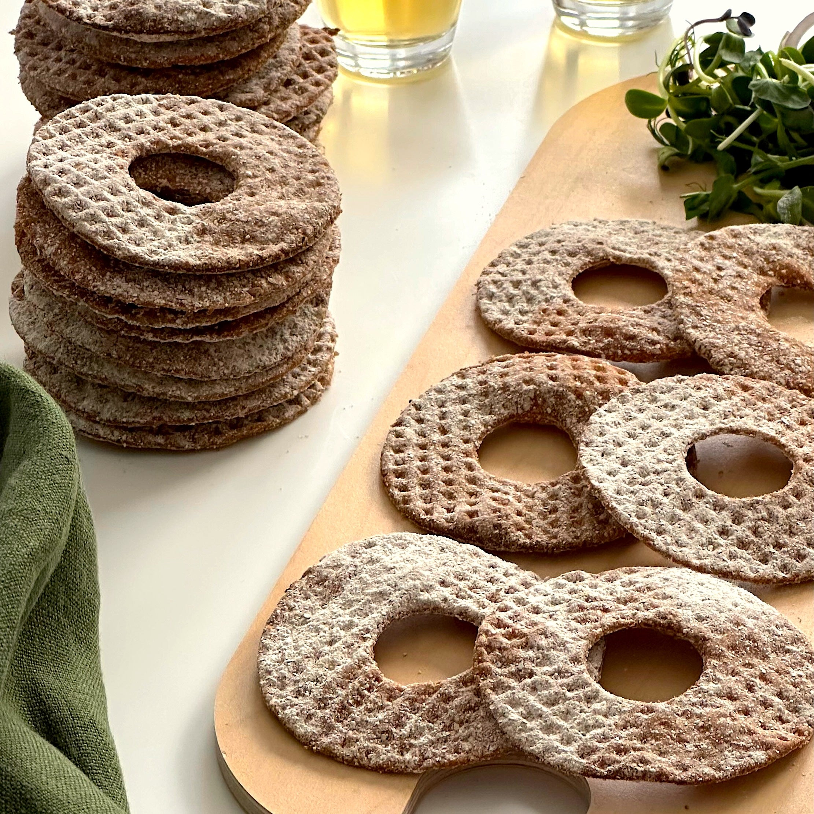

# Knäckebröd med Smör (Swedish Crispbread with Butter)

*Sweden's crispbread snack: a crisp, dense rye crispbread (the round-with-a-hole-in-the-middle traditional shape) spread generously with cold salted butter, sprinkled with flaky sea salt and a dusting of caraway. The Swedish lunchbox staple, fika side, and smörgåsbord bread; eaten three or four pieces a day by every Swede.*

**Serves:** 4 (8 pieces - 2 per person)

**Prep Time:** 5 minutes

**Cook Time:** None (assumes pre-made crispbread)

## Overview
Knäckebröd med smör (literally "crispbread with butter") is the simplest and most Swedish of all daily eating rituals, the bread that turns up at every Swedish breakfast, every lunch, every fika, every smörgåsbord, every late-night-pick-from-the-fridge: a piece of Swedish crispbread (knäckebröd, a thin dense crisp dry rye bread, traditionally shaped as a 30cm wide round with a hole in the middle so a wooden pole could be stuck through it for storage in farmhouse rafters, modernised today into the square or rectangular pieces sold in cardboard boxes by Wasa, Leksands and AXA) spread generously with cold salted butter (the butter sits in distinct pats; don't smear it thinly, Sweden uses butter generously). Sprinkled with flaky sea salt and a dusting of caraway seeds or whole cumin seeds. Eat with the hands; the crispbread snaps. Often eaten with a slice of mild cheese on top, or topped with sliced hard-boiled egg, smoked salmon, pickled herring, or whatever else is on the table.

## Ingredients

### Bread and butter
- 8 pieces Swedish knäckebröd (Wasa Original, Leksands, or AXA brand, about 4 large round crispbreads broken in half if using the traditional round; or 8 rectangular pieces from a box)
- 100 g cold salted butter (Swedish butter ideal, Bregott, Arla, or any quality salted butter)

### Topping
- 1 teaspoon flaky sea salt (Maldon style)
- 1 teaspoon caraway seeds OR whole cumin seeds (lightly crushed in a mortar)
- ½ teaspoon ground black pepper (optional)
- 1 tablespoon chopped fresh chives (optional)

### Optional additions (knäckebröd toppings work as platforms for these)
- 80 g mild Swedish cheese (Västerbottensost, Prästost, or any mild semi-hard cheese; sliced thin)
- 4 slices smoked salmon
- 2 hard-boiled eggs (sliced)
- Pickled herring fillets
- Sliced raw red onion
- Liver pâté (leverpastej, the Swedish breakfast staple)
- Sliced cucumber

### To serve
- Strong Swedish coffee for breakfast / fika
- Cold milk for kids
- Beer for an evening snack
- A glass of cold akvavit for the smörgåsbord version

## Method

### Stage 1 - Bring butter to spreading consistency
1. The butter should be cold but not rock-hard, about 10 minutes out of the fridge is right.
2. Cut the butter into 8 pieces (one per crispbread).

### Stage 2 - Layer the butter on
1. Take a piece of knäckebröd.
2. Place a generous pat of butter (about 12g) on top.
3. With a butter knife, spread the butter across the surface, but don't thin it out completely, Swedish butter use is generous; you should see distinct buttery thickness.

### Stage 3 - Top
1. Sprinkle a small pinch of flaky sea salt over the buttered crispbread.
2. Sprinkle a pinch of caraway seeds or cumin seeds.
3. Optional: a grind of black pepper; a scatter of chopped chives.

### Stage 4 - Optional: add a topping
1. For breakfast: lay a slice of mild Swedish cheese on top.
2. For lunch: lay a slice of smoked salmon, then sliced hard-boiled egg.
3. For dinner: top with herring + red onion + chives.
4. For fika: just the butter and salt, the traditional minimalist version.

### Stage 5 - Serve
1. Eat immediately with hands.
2. The crispbread snaps as you bite; that's the point.
3. Wash down with coffee, milk, beer, or akvavit depending on time of day.

## Notes
- **Proper Swedish crispbread:** Wasa, Leksands, AXA, not English oat biscuits or American "crispbread" which are usually quite different. Look for the Swedish brands at Swedish-style shops or larger supermarkets.
- **Cold salted butter, generous:** Sweden uses butter generously. Thin smears are wrong.
- **Flaky salt + caraway:** the traditional Swedish topping. Cumin works as substitute.
- **Eat immediately:** the crispbread softens within an hour of buttering if left to sit.

## Variations
**Västerbottensost open sandwich:** add a thick slice of the traditional Swedish hard cheese (Västerbotten) on top.
**Skagentoast on knäckebröd:** top with shrimp salad (mayo, shrimps, dill, lemon) for the Stockholm seafood-snack version.
**With pickled herring:** the smörgåsbord traditional, herring + butter + crispbread.
**With liver pâté and cucumber:** the Swedish-breakfast traditional.
**Vegan version:** swap butter for vegan butter; same technique.

## Serving
At every Swedish breakfast (with cheese or pâté) · at every fika (with butter alone, perhaps with cheese) · at every smörgåsbord as the bread that holds the cold dishes · at lunch with a tin of pickled herring · at the end of an evening of drinking when nothing more substantial is needed.

## Storage
- Crispbread keeps in its sealed packaging for months; once opened, 2 weeks at room temp in a dry sealed box.
- Buttered crispbread should be eaten immediately; the bread softens within an hour.
- Butter refrigerates indefinitely.
