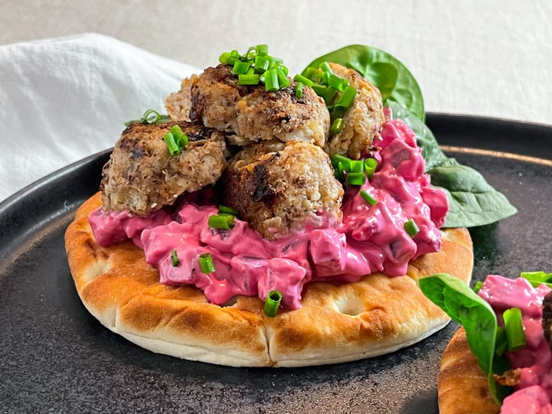

# Köttbulle-Smörgås (Swedish Meatball Sandwich)

*Sweden's meatball sandwich: cold Swedish meatballs sliced into rounds, layered on dark rye bread with a smear of lingonberry preserve, sliced cucumber, butter and chopped raw onion. The Swedish school-lunch and office-canteen staple; what every Swede grew up eating with their late-afternoon coffee.*

**Serves:** 4

**Prep Time:** 10 minutes

**Cook Time:** None (assumes pre-cooked meatballs)

## Overview
The köttbulle-smörgås (meatball sandwich) is one of Sweden's most workaday lunchtime open sandwiches and a fixture of every Swedish bageri (bakery counter), office canteen, and packed-lunch sandwich shop across the country: cold leftover Swedish meatballs (from yesterday's husmanskost dinner) sliced into 4-5mm rounds, layered onto a slice of dark Swedish rye bread (rågbröd - denser and darker than American rye, with a slight molasses sweetness) that's been spread with cold butter and a thin smear of lingonberry preserve. Topped with thinly sliced cucumber, finely chopped raw red onion, chopped fresh dill or chives, a grind of black pepper, and (optionally) a small dollop of soured cream or a slice of mild cheese. Eaten open-face with a fork, or closed-up with another slice of bread on top for the grab-and-go version. Three details: cold sliced meatballs (NOT warm), lingonberry preserve under the meatballs (the canonical Swedish sweet-tart lift), dark rye bread (rågbröd).

## Ingredients

### Sandwich base
- 8 slices Swedish dark rye bread (rågbröd) OR 4 large slices for closed sandwiches
- 60 g cold salted butter
- 4 tablespoons lingonberry preserve

### Meatballs
- 12-16 cold Swedish meatballs (from a previous dinner; or freshly made and chilled completely; see [köttbullar recipe](../kottbullar.md))

### Toppings
- ½ cucumber (sliced very thin into rounds)
- 1 small red onion (very finely chopped)
- 1 small bunch fresh dill or chives (chopped fine)
- 4 tablespoons soured cream or crème fraîche (optional)
- 4 slices mild Swedish cheese (optional; Prästost or any mild semi-hard)
- Ground black pepper

### To serve
- A cold glass of milk OR a small lager OR strong coffee
- A side of pickled beetroot (rödbetor)
- Or a side of pressgurka (Swedish cucumber salad)

## Method

### Stage 1 - Prep
1. Make sure the meatballs are completely cold (straight from the fridge).
2. Slice each meatball horizontally into 3-4 rounds (about 4-5mm thick).

### Stage 2 - Butter the bread
1. Spread cold butter generously across each slice of rye bread.
2. The butter layer should be distinct (Swedish butter use is generous).

### Stage 3 - Add lingonberry
1. Spread a thin layer of lingonberry preserve over the butter on each slice.
2. The lingonberry should be a thin smear, not a thick spread.

### Stage 4 - Layer the meatball slices
1. Arrange 3-4 cold meatball-slices on each piece of bread in an overlapping row.
2. The slices should cover most of the bread surface.

### Stage 5 - Top
1. Lay a few rounds of thinly sliced cucumber alongside or on top of the meatball slices.
2. Sprinkle a generous heap of finely chopped red onion over.
3. Scatter chopped dill or chives.
4. Grind black pepper over.
5. Optional: a small dollop of soured cream on top.
6. Optional: a slice of mild cheese laid alongside.

### Stage 6 - Closed or open?
1. **Open-face (smörgås):** serve as-is, plated, eat with a fork-and-knife. The canonical Swedish presentation.
2. **Closed (mackа):** top with another slice of buttered rye bread (lingonberry-side down) for a closed sandwich. The grab-and-go version for school lunchboxes.

### Stage 7 - Serve
1. With cold milk or beer.
2. A side of pickled beetroot or pressgurka for the lift.

## Notes
- **Cold meatballs:** essential. Hot meatballs steam the bread and ruin it. This is a leftovers dish.
- **Lingonberry preserve under the meatballs:** the canonical Swedish move. The sweet-tart preserve is what makes it not just "meatballs on bread".
- **Dark rye bread:** the canonical base. Lighter wheat bread doesn't work the same.
- **Onion chopped fine:** not sliced - chopped fine gives the right bite.

## Variations
**Open-face elaborate version (smörgås):** top with a small mound of pressgurka cucumber salad + sliced hard-boiled egg + dill for the smörgåsbord-ready presentation.
**With meatballs reheated in gravy:** less canonical (a hot meatball sandwich); the Swedish version of an American meatball sub.
**Vegetarian:** swap meatballs for the Swedish växtbullar (plant-based meatballs, IKEA-style).
**With grated horseradish:** add a small spoonful for sharpness.
**Christmas variant:** add a slice of cold julskinka (Swedish Christmas ham) alongside the meatballs.

## Serving
At a Swedish school lunchbox · at an office canteen mid-morning · at fika as the savoury offering · at a Stockholm bageri grab-and-go counter · at home with leftover meatballs from yesterday's dinner.

## Storage
- Best assembled fresh.
- Leftover cold meatballs refrigerate 4 days; slice as needed.
- Lingonberry preserve keeps refrigerated indefinitely.
- Don't assemble more than 1 hour in advance; the bread softens.
