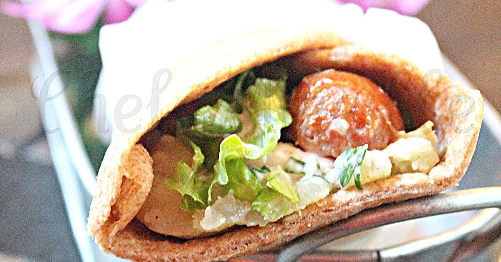

# Tunnbrödsrulle (Swedish Flatbread Hot Dog)

*Sweden's flatbread-rolled hot dog: a grilled sausage piled with mashed potato, shrimp salad, lettuce, sliced cucumber, fried onions and ketchup-mustard, all rolled inside a soft Swedish tunnbröd flatbread into a portable wrap. The Stockholm late-night street-food classic, sold from korvkiosk (sausage kiosks) across the country.*

**Serves:** 4

**Prep Time:** 30 minutes

**Cook Time:** 15 minutes

## Overview
The tunnbrödsrulle (literally "thin bread roll") is Sweden's distinctive answer to the hot dog and a fixture of Swedish street food and korvkiosk culture across Stockholm, Gothenburg and Malmö: a soft Swedish tunnbröd flatbread (a thin soft wheat-and-rye flatbread, traditionally baked unleavened) used as the wrapper instead of a hot-dog bun, piled high with a grilled sausage (canonically a long Swedish-style varmkorv), a generous spoon of warm Swedish mashed potato (potatismos - the Scandinavian dense buttery potato mash), a heap of Swedish shrimp salad (räksallad - small cold-water shrimps mixed with mayonnaise, dill and a touch of lemon), a layer of crisp lettuce, sliced cucumber, crispy fried onions, and finished with zigzags of ketchup and mustard. The whole thing is rolled up tightly into a portable wrap, eaten standing at the kiosk or walking down Drottninggatan.

## Ingredients

### Sausages
- 4 long Swedish-style varmkorv (or any quality long pork-and-beef hot dog)
- 1 tablespoon vegetable oil

### Tunnbröd (Swedish flatbread)
- 4 large round tunnbröd (about 25-30cm wide; or substitute with large soft tortilla wraps, lavash, or naan)

### Mashed potato (potatismos)
- 800 g floury potatoes (Maris Piper or Russet; peeled and cubed)
- 80 g butter
- 150 ml whole milk
- 1 teaspoon fine sea salt
- ½ teaspoon ground white pepper

### Swedish shrimp salad (räksallad)
- 200 g cooked small cold-water shrimps (or small prawns)
- 4 tablespoons mayonnaise
- 2 tablespoons sour cream or crème fraîche
- 1 tablespoon dill (chopped fine; or 1 teaspoon dried dill)
- 1 teaspoon Dijon mustard
- Juice of ½ lemon
- ½ teaspoon fine sea salt
- ¼ teaspoon ground white pepper

### Toppings
- 1 small head lettuce (any soft variety; leaves separated)
- ½ cucumber (sliced into thin rounds)
- 6 tablespoons crispy fried onions (ristede løg / French-fried onion)
- Yellow mustard
- Ketchup

### To serve
- A cold Swedish beer (Pripps Blå, Mariestads, Falcon)
- Or a Swedish glögg (mulled wine; for winter version)

## Method

### Stage 1 - Make mashed potato
1. Boil potatoes in salted water 15-18 minutes till very tender.
2. Drain thoroughly; return to the hot pot off heat to dry out 2 minutes.
3. Mash through a ricer (Swedish style - smooth, no lumps).
4. Add butter, milk, salt, white pepper.
5. Beat with a wooden spoon till smooth and silky.
6. Keep warm.

### Stage 2 - Make shrimp salad
1. Drain shrimps if from a jar; pat dry.
2. Mix with mayonnaise, sour cream, dill, mustard, lemon juice, salt, white pepper.
3. Refrigerate till assembly.

### Stage 3 - Cook the sausages
1. Heat oil in a wide pan over medium-high heat.
2. Cook the sausages 6-8 minutes, turning, till lightly browned.

### Stage 4 - Warm the tunnbröd
1. Briefly warm each tunnbröd in a dry pan over medium heat 20 seconds per side (or wrap in foil and warm in oven at 150°C for 5 minutes).
2. The bread should be pliable, not crispy.

### Stage 5 - Build the tunnbrödsrulle
1. Lay a warm tunnbröd flat on a board.
2. Spread a generous strip of warm mashed potato down the centre (across the diameter - like a wide stripe).
3. Lay a warm sausage on top of the mash.
4. Add a generous spoon of cold shrimp salad alongside the sausage.
5. A heap of crispy fried onions.
6. A row of cucumber slices.
7. A few lettuce leaves.
8. A zigzag of mustard down the length.
9. A zigzag of ketchup.

### Stage 6 - Roll
1. Fold one end of the flatbread up over the bottom of the filling.
2. Fold one long side over the top.
3. Continue rolling tightly to make a burrito-style wrap.
4. Tuck the loose end underneath; or wrap in greaseproof paper from the bottom up.

### Stage 7 - Serve immediately
1. Wrap in paper for handheld eating.
2. Cold Swedish beer.

## Notes
- **Tunnbröd, not a bun:** the flatbread wrap is the structural and cultural signature. Soft tortillas work as substitute.
- **Mashed potato AND shrimp salad together:** the warm + cold Scandinavian combination. Unexpected but defining.
- **Roll tight:** loose rolls fall apart when eaten.
- **Eat standing at a kiosk:** the proper korvkiosk experience.

## Variations
**Bröd vegetariskt:** swap the sausage for a grilled halloumi finger or veggie sausage.
**With räkost (shrimp cheese spread):** swap the shrimp salad for the Swedish shrimp-cheese spread.
**Kebab-style:** add chopped lettuce, sliced tomato, garlic sauce in addition to the standard toppings.
**With pickled red onion:** add Swedish pickled red onion strips.
**Spicier:** add a zigzag of sriracha or chopped fresh chillies (less traditional but increasingly common).

## Serving
At a Stockholm korvkiosk at midnight after the bars; at a Swedish Christmas market; at home with cold beer.

## Storage
- Mashed potato refrigerates 4 days; reheat with a splash of milk and butter.
- Shrimp salad refrigerates 2 days.
- Cooked sausages refrigerate 4 days.
- Don't assemble in advance.
