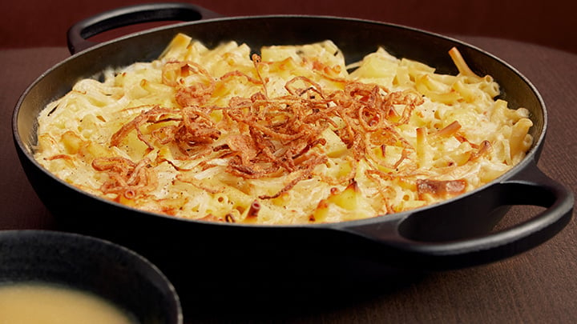

# Älplermagronen

*Swiss Alpine "shepherd's macaroni": pasta and diced potato cooked together in cream, layered with melted gruyère and topped with crispy fried onions. Served with stewed apple sauce on the side.*

**Serves:** 4

**Prep Time:** 15 minutes

**Cook Time:** 30 minutes

## Overview
Älplermagronen is the dish Alpine herdsmen ate during summer transhumance, when they took the cattle up to high pastures and lived for months in small huts. The fridgeless larder allowed only what kept: pasta, potatoes, dried cheese, butter, milk, and stored apples. The result is a one-pot-becomes-baked-dish of macaroni and diced potato cooked together (the pasta water gives the sauce body), tossed with cream and grated Alpine cheese (Gruyère, Bergkäse), then topped with butter-fried onions until crisp. Served with stewed apple sauce on the side - the sweet-sharp apple cuts the richness of the cheese and is genuinely traditional, not an afterthought. Comfort food at altitude.

## Ingredients

### Apple sauce (Apfelmus)
- 4 dessert apples (Bramley + Cox mix; or Bramley alone for tart), peeled, cored, chopped
- 2 tbsp caster sugar
- 1 tbsp water
- A pinch of cinnamon (optional)

### Älplermagronen
- 300 g macaroni or short pasta tubes (penne works)
- 400 g waxy potatoes, peeled, cut into 1 cm cubes
- 1 tsp salt
- 250 ml double cream
- 200 g Gruyère, grated
- 50 g Emmental, grated (or more Gruyère)
- Freshly ground black pepper
- A pinch of nutmeg

### Crispy onions
- 2 medium onions, thinly sliced into rings
- 50 g unsalted butter
- 1 tbsp vegetable oil
- Salt

## Method

### Stage 1 - Apple sauce
1. Place the chopped apples in a saucepan with the sugar and water.
2. Cook over medium-low heat, covered, 10-12 minutes, stirring occasionally.
3. The apples collapse into a coarse-textured sauce.
4. Mash with a fork if you want it smoother (or leave chunky).
5. Stir in cinnamon if using; keep warm.

### Stage 2 - Crispy onions
1. Heat the butter and oil in a heavy frying pan over medium heat.
2. Add the onion rings; spread evenly.
3. Cook 12-15 minutes, stirring every couple of minutes, until deeply golden and crisp at the edges.
4. Season with a pinch of salt; drain on kitchen paper.

### Stage 3 - Cook the pasta and potato together
1. Bring a large pot of water to a boil; salt heavily.
2. Add the potato cubes; boil 5 minutes.
3. Add the pasta; cook together until both are just tender, about 8-10 minutes (check pasta packet timing).
4. Drain, reserving 100 ml of the starchy cooking water.

### Stage 4 - Combine
1. Return the pasta-potato mix to the pot over low heat.
2. Pour in the cream and a splash (50 ml) of the reserved cooking water.
3. Stir to coat; let it bubble gently for 1 minute.
4. Off the heat, scatter in two-thirds of the grated cheeses; fold gently until melted and glossy.
5. Add a generous twist of black pepper and the nutmeg.
6. Taste for salt.

### Stage 5 - Plate
1. Tip into a warm shallow serving dish.
2. Scatter the remaining grated cheese over the top.
3. Pile the crispy onions on top of the cheese.
4. Bring to the table immediately.
5. Serve with the apple sauce in a small bowl alongside.

## Notes
- **Pasta and potato together:** Cooking them in the same water means the pasta picks up potato starch and gives the dish its silky body. Don't be tempted to cook them separately.
- **The apple sauce isn't optional:** Älplermagronen without Apfelmus is incomplete - the sweet-acid apple is the crucial counterpoint to the heavy cheese. Skip it and the dish is a heavy mass of cream and starch.
- **Cheese:** Genuine Swiss Alpine cheese (Gruyère, Appenzeller, Bergkäse) is what defines the flavour. Cheddar is a substitution; mature comté is closer if you can find it.

## Serving
Serve straight from the pot or in a single big dish in the centre of the table. A simple green salad with vinaigrette on the side balances the richness. White Swiss wine or sparkling water with a slice of lemon.

## Storage
- Leftovers refrigerate 3 days.
- Reheat in a pan with a splash of milk to loosen the sauce; the crispy onions go soft on reheating - refry a small batch fresh.
- Apple sauce keeps refrigerated 5 days; eat cold or warm.
