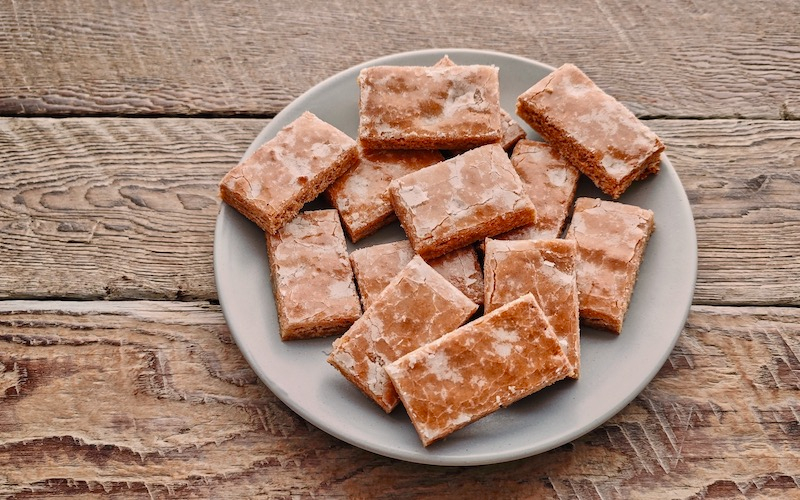

# Basler Läckerli

*Basel's medieval honey-spice biscuit: a chewy slab studded with candied peel and almonds, scented with honey, kirsch and warm spice. Cut into rectangles and stored in a tin to soften over a week. Christmas pantry staple.*

**Serves:** Makes about 40 biscuits

**Prep Time:** 30 minutes (plus overnight rest)

**Cook Time:** 25 minutes (plus 5-7 days mellowing)

## Overview
Basler Läckerli are the spiced honey biscuits of Basel, a tradition that goes back to the city's medieval position on the spice trade routes between Italy and northern Europe. The recipe relies on the spices the city imported: cinnamon, cloves, nutmeg, ginger. Honey is the sweetener, kirsch the liquid, and the dough is bound with almonds and candied citrus peel into a stiff slab that's rolled out, baked, glazed and then cut while warm. They start out hard from the oven and soften into a chewy texture over five to seven days stored in a tin. They keep for months. The name means "little delicacy" - they were prized enough to be a regular gift to visiting dignitaries.

## Ingredients

### Dough
- 250 g clear runny honey
- 250 g caster sugar
- 50 ml Kirsch (or any fruit brandy)
- 2 tsp ground cinnamon
- 1 tsp ground cloves
- 1 tsp ground nutmeg
- 1 tsp ground ginger
- 1 tsp ground white pepper (yes, really)
- Zest of 1 lemon
- 200 g whole almonds, roughly chopped
- 150 g mixed candied peel (orange and lemon)
- 400 g plain flour
- 1 tsp bicarbonate of soda

### Glaze
- 100 g icing sugar
- 30 ml water
- 1 tbsp Kirsch (optional)

## Method

### Stage 1 - Heat the honey mixture
1. In a medium saucepan, combine the honey and caster sugar.
2. Heat gently over low-medium heat, stirring until the sugar dissolves and the mixture is hot but not boiling (about 60°C).
3. Pour into a large mixing bowl.

### Stage 2 - Add spices and aromatics
1. Stir in the Kirsch, cinnamon, cloves, nutmeg, ginger, white pepper and lemon zest.
2. Stir in the chopped almonds and candied peel.
3. Let cool 5 minutes (the mixture shouldn't be hot enough to cook the flour when added).

### Stage 3 - Combine the dry
1. Sift the flour with the bicarbonate of soda.
2. Add to the honey mixture; stir to combine.
3. The dough is sticky and stiff - work it with a wooden spoon, then briefly with your hands until uniform.

### Stage 4 - Rest
1. Press into a flat disc; wrap in cling film.
2. Rest at room temperature overnight (or up to 2 days). The flavours develop and the dough firms up.

### Stage 5 - Roll and bake
1. Preheat the oven to 180°C.
2. Line a large baking tray (40 x 30 cm or two smaller) with greaseproof paper.
3. Roll the dough on a lightly floured surface (or directly on the paper) into a 1 cm thick rectangle, sized to fit the tray.
4. Transfer to the tray; pat flat.
5. Bake 20-25 minutes until firm and deeply golden at the edges.

### Stage 6 - Glaze and cut
1. While the slab bakes, mix the icing sugar with water and Kirsch into a smooth glaze (consistency of single cream).
2. As soon as the slab comes out of the oven, brush the glaze over the top in a generous layer.
3. The heat sets the glaze to a thin shiny crust.
4. While still warm and soft, cut into rectangles (about 4 x 5 cm) with a long sharp knife.
5. Cool on the tray.

### Stage 7 - Mellow
1. Once completely cool, transfer to an airtight tin.
2. Leave at room temperature 5-7 days before eating.
3. The biscuits soften from rock-hard to pleasantly chewy.

## Notes
- **Don't skip the rest:** Both the overnight dough rest and the week of mellowing after baking are non-negotiable - they're how the spices marry and the texture develops.
- **White pepper:** Looks strange in a biscuit recipe, but the medieval Basel tradition includes it. Adds a faint warmth, not heat.
- **Cutting while warm:** Once the slab cools fully, it's too hard to cut cleanly. Cut while still warm but set.

## Serving
- Serve with coffee or strong black tea, especially at Christmas. They're also part of the Swiss "Adventsteller" - the Advent biscuit plate that includes Mailänderli, Brunsli, Zimtsterne and more.

## Storage
- Room temperature in a tin lined with greaseproof paper: 3 months.
- A slice of apple in the tin keeps them soft (replace weekly).
- Don't refrigerate (dries them out); don't freeze (alters the glaze).
