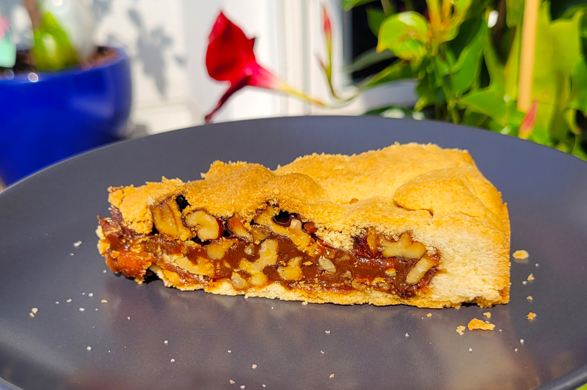

# Engadiner Nusstorte

*The walnut tart of the Engadin valley: short pastry filled with caramelised walnuts in honey and cream. Dense, fudgy and famously good with coffee. The dessert that travels home from every St Moritz holiday.*

**Serves:** 10

**Prep Time:** 30 minutes (plus 2 hours pastry rest)

**Cook Time:** 45 minutes

## Overview
The Engadiner Nusstorte comes from the Engadin valley in Graubünden - the long high valley that gives the world St Moritz and Pontresina. It's a rich, dense tart with a top and bottom of buttery sweet shortcrust, filled with a caramel of sugar, honey and cream studded with toasted walnuts. Originally a creation of Engadin pastry chefs who emigrated to work across Europe and brought walnut-pastry traditions home; today it's the souvenir tart of the valley, sold in flat tins from every bakery to take down the mountain. Made well, it keeps for a fortnight - which historically was the point. Eat in small slices with strong coffee or a glass of Kirsch.

## Ingredients

### Pastry
- 400 g plain flour
- 200 g caster sugar
- 250 g cold unsalted butter, diced
- 2 medium eggs
- 1 tsp vanilla extract
- A pinch of fine salt
- Zest of half a lemon

### Filling
- 250 g caster sugar
- 50 ml water
- 300 g walnuts, roughly chopped
- 200 ml double cream
- 3 tbsp clear honey
- 30 g unsalted butter
- A pinch of salt

### Glaze
- 1 egg yolk
- 1 tbsp milk

## Method

### Stage 1 - Pastry
1. In a large bowl, combine the flour, sugar, salt and lemon zest.
2. Rub in the cold butter with your fingertips until the mixture resembles coarse breadcrumbs.
3. Add the eggs and vanilla; bring together with your hands into a dough.
4. Don't overwork - stop as soon as the dough holds.
5. Divide into two pieces (one slightly larger for the base); wrap each in cling film.
6. Refrigerate 2 hours minimum, or overnight.

### Stage 2 - Toast the walnuts
1. Spread the chopped walnuts on a baking tray.
2. Toast in a 180°C oven 8 minutes until fragrant and lightly coloured.
3. Cool.

### Stage 3 - Caramel filling
1. In a heavy saucepan, combine the sugar and water.
2. Bring to a boil over medium heat without stirring; swirl the pan occasionally.
3. Cook 8-12 minutes until the caramel turns a deep amber.
4. Off the heat, carefully pour in the cream (it bubbles violently); stir to combine.
5. Return to low heat; stir until any caramel lumps dissolve.
6. Stir in the honey, butter and salt.
7. Add the toasted walnuts; stir to coat.
8. Let cool to room temperature (this is important - hot filling melts the pastry).

### Stage 4 - Roll and line
1. Preheat the oven to 180°C.
2. Roll the larger pastry piece on a floured surface into a 32 cm circle, 4 mm thick.
3. Line a 23 cm round tart tin (springform or loose-bottomed), pressing the pastry up the sides.
4. Trim flush with the rim.

### Stage 5 - Fill and top
1. Tip the cooled walnut caramel into the lined tin; spread level.
2. Roll the second pastry piece into a 25 cm circle.
3. Lay over the filling, sealing the edges by pressing onto the pastry rim with the tines of a fork.
4. Trim any overhang.
5. Whisk the egg yolk with the milk; brush over the top.
6. Score a decorative cross-hatch pattern lightly with a knife (don't cut through).
7. Prick a few small steam holes with a skewer.

### Stage 6 - Bake
1. Bake 40-45 minutes until the top is deeply golden.
2. Cool in the tin 20 minutes, then turn out onto a wire rack.
3. Cool completely before slicing - at least 4 hours.

### Stage 7 - Serve
1. Slice into thin wedges (it's very rich).
2. Best at room temperature.

## Notes
- **The caramel:** Watch it carefully in the last minute - it goes from amber to burnt fast. Pull the pan off the heat slightly before it reaches your target colour; the residual heat keeps it cooking.
- **Cool the filling fully:** Pouring warm caramel into raw pastry makes the bottom soggy. Patience pays off.
- **Keeps for a fortnight:** Wrapped tightly in foil at room temperature. The flavour actually improves after 2-3 days as the caramel mellows.

## Serving
- Serve in thin wedges with strong black coffee or espresso, or a small glass of Kirsch. The Engadin tradition is at 4pm with afternoon coffee.

## Storage
- Room temperature, tightly wrapped in foil, 2 weeks.
- Refrigerates 1 month but loses some buttery softness; bring back to room temperature before eating.
- Freezes whole 3 months.
