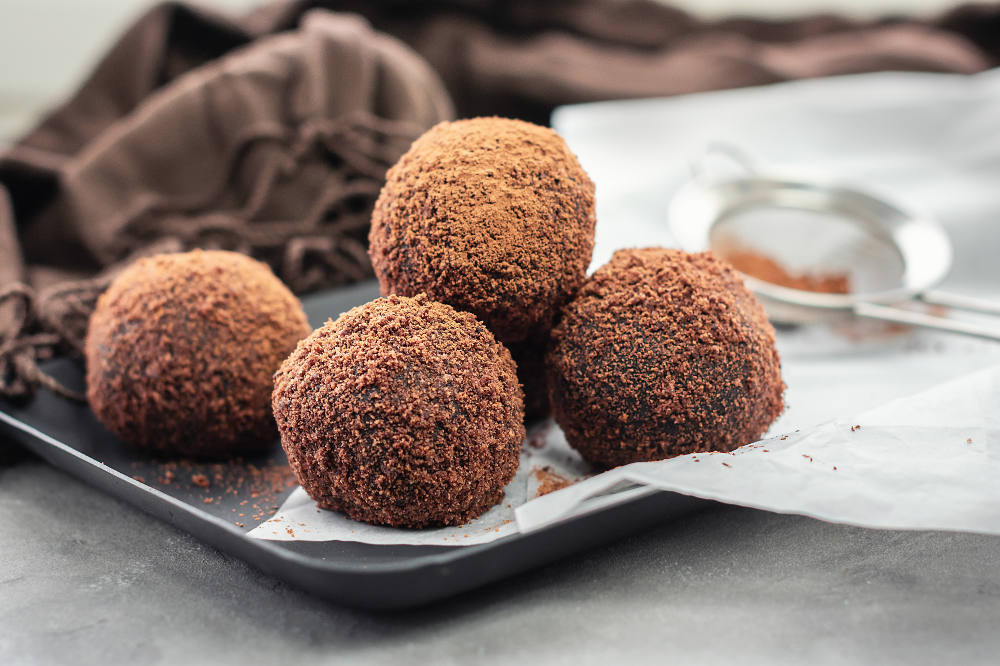

# Swiss Chocolate Truffles

*Hand-rolled Swiss-style chocolate truffles: dark ganache (chocolate + cream + butter) cooled, scooped, rolled in cocoa. Three ingredients made deeply elegant. Wrap them in greaseproof paper as a gift, or eat them after dinner with espresso.*

**Serves:** Makes about 30 truffles

**Prep Time:** 20 minutes (plus 4 hours chilling)

**Cook Time:** 5 minutes

## Overview
Switzerland built the modern chocolate industry. Lindt invented conching (the long, slow mechanical refining that gives Swiss chocolate its melt-in-the-mouth smoothness) in 1879; Cailler, Suchard and Tobler all came from the same Romande tradition of Alpine dairy plus tropical cacao. The home version of all that engineering is the chocolate truffle - a ganache of just dark chocolate, cream and butter, cooled until firm, scooped into rough balls and rolled in cocoa. They look rustic, taste sophisticated, and use only what's in any kitchen. The "truffle" name comes from the rough cocoa-dusted exterior resembling the fungus; the inside should be barely set, almost soft.

## Ingredients

### Ganache
- 300 g good-quality dark chocolate (60-70% cocoa solids), chopped fine
- 250 ml double cream
- 40 g unsalted butter, soft
- 1 tbsp glucose syrup or honey (optional, for smoother texture and shelf life)
- A pinch of fine salt

### Optional flavour add-ins (one only, not all)
- 30 ml Kirsch (Swiss cherry brandy) or Kirsch-substitute brandy
- 30 ml double espresso, cooled
- Zest of 1 orange
- 1 tsp ground cinnamon

### Coating
- 60 g unsweetened cocoa powder
- Optional: 30 g icing sugar mixed with the cocoa (less bitter)

## Method

### Stage 1 - Chop the chocolate
1. Use a serrated knife to chop the chocolate into small even pieces (no larger than a pea).
2. Place in a heatproof bowl.

### Stage 2 - Heat the cream
1. In a small saucepan, heat the cream over medium heat until it just reaches a simmer (small bubbles around the edge).
2. Don't let it boil - boiling damages the emulsion.

### Stage 3 - Combine
1. Pour the hot cream over the chopped chocolate.
2. Let stand 2 minutes without stirring (the heat melts the chocolate gently).
3. Now stir with a wooden spoon, starting from the centre and working outwards in small circles, until the mixture is smooth and glossy.
4. Stir in the soft butter, glucose (if using), salt and any flavour add-in.
5. The mixture should be silky and uniform.

### Stage 4 - Chill
1. Cover the bowl with cling film pressed onto the surface of the ganache (stops a skin forming).
2. Refrigerate 4 hours, or overnight.
3. The ganache should be firm enough to scoop but not rock-hard - if it is, leave at room temperature 15 minutes before rolling.

### Stage 5 - Roll
1. Set out a tray lined with greaseproof paper.
2. Tip the cocoa into a wide shallow bowl.
3. Scoop the ganache with a teaspoon or small melon-baller; roll quickly between your palms into a rough ball (about 2 cm).
4. Drop into the cocoa; roll to coat.
5. Lift out; set on the lined tray.
6. Continue until all the ganache is rolled. Wash your hands and dust them with cocoa between batches if they get warm and sticky.

### Stage 6 - Set
1. Refrigerate the rolled truffles 30 minutes to firm up.
2. Bring to room temperature 10 minutes before serving (cold chocolate doesn't taste of much).

## Notes
- **Chocolate quality:** A truffle is 60% chocolate by weight. Use the best you can - Swiss Lindt 70%, or Valrhona, Callebaut, Green & Black's. Bargain-bin chocolate gives a flat, waxy truffle.
- **Cream temperature:** Just-simmered, not boiled. Boiling damages the cocoa fat and gives a grainy ganache.
- **Don't overstir:** Stir until uniform, then stop. Overstirring incorporates air and the truffles look pale and bubbly instead of glossy.
- **Quick hands:** The ganache warms in your palm as you roll. Work fast; rest a few minutes if your hands get hot.

## Serving
Serve at room temperature with espresso after dinner, or with a glass of Kirsch. Wrap individually in small squares of greaseproof paper and pack in a tin for a gift.

## Storage
- Refrigerate in a tin or airtight container 2 weeks.
- Freeze 3 months; thaw in the fridge overnight before bringing to room temperature.
- Don't store at warm room temperature; the butter softens and the cocoa coating goes spotty.
