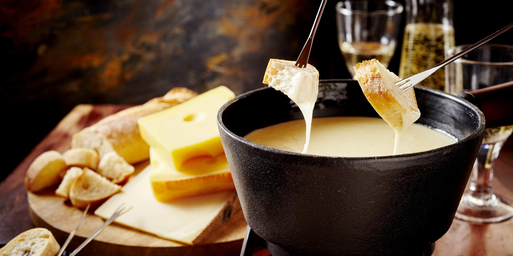

# Swiss Fondue

*Switzerland's classic shared pot: Gruyère and Vacherin melted into white wine and kirsch, kept warm over a flame at the table while diners dip cubes of crusty bread on long forks.*

**Serves:** 4

**Prep Time:** 15 minutes

**Cook Time:** 15 minutes

## Overview
Fondue is the Swiss communal eating ritual at its purest - a pot of melted cheese sitting over a small flame at the centre of the table, with everyone armed with a long-handled fork spearing cubes of stale white bread to swirl through the cheese. The classic Fribourgeois mix is half Gruyère, half Vacherin Fribourgeois (a softer, runnier cheese from the same region); the Vaudois version uses just Gruyère; the Neuchâteloise adds Emmental. White wine and a generous shot of kirsch (Swiss cherry brandy) keep the cheese liquid and add the characteristic bite; garlic and a little cornflour stabilise the emulsion. The bottom of the pot develops a crusty layer called la religieuse ("the nun") which is the prize at the end - scrape it out and eat with a fork.

## Ingredients
- 400 g Gruyère cheese, grated
- 400 g Vacherin Fribourgeois (or Emmental as substitute), grated
- 1 large clove garlic, halved
- 400 ml dry Swiss white wine (Fendant ideal; sub a crisp Sauvignon Blanc or dry Riesling)
- 1 tbsp lemon juice
- 30 ml kirsch (Swiss cherry brandy) - or any neutral fruit brandy
- 1.5 tbsp cornflour
- Freshly ground black pepper
- A pinch of freshly grated nutmeg
- 1 large loaf rustic crusty bread (preferably day-old), cut into 3 cm cubes - the crust should be on every piece for skewering

## Method

### Stage 1 - Prep the pot
1. Rub the inside of a fondue pot (caquelon - ceramic or enamelled cast-iron) thoroughly with the cut garlic clove; discard the clove.

### Stage 2 - Warm the wine
1. Pour the wine and lemon juice into the pot.
2. Set over a low-medium heat on the hob.
3. Heat to just below a simmer (small bubbles forming around the edges - don't let it boil hard).

### Stage 3 - Add the cheese
1. Add the grated cheese a handful at a time, stirring continuously with a wooden spoon in a figure-of-eight pattern.
2. Wait for each addition to fully melt before adding the next.
3. Continue until all the cheese is incorporated and the mixture is smooth - takes about 8-10 minutes.

### Stage 4 - Stabilise
1. In a small bowl, whisk the kirsch and cornflour into a smooth slurry.
2. Pour into the fondue, stirring constantly.
3. The cheese thickens and emulsifies fully within 30 seconds.
4. Add black pepper and nutmeg; taste.

### Stage 5 - Transfer and serve
1. Transfer the pot to a fondue stand at the centre of the table; light the spirit burner underneath (kept low).
2. Each diner gets a long-handled fondue fork.
3. Spear a bread cube; dip into the cheese, swirling in a figure-of-eight to keep the cheese moving.
4. Eat directly from the fork.

### Stage 6 - La religieuse
1. As the fondue gets lower, a crispy golden crust forms on the bottom of the pot.
2. When the pot is nearly empty, leave the heat on a few minutes more to fully crisp the bottom.
3. Lift out with a fork - this caramelised layer is the prize.

## Notes
- **Two cheeses, not one:** The Gruyère gives the savoury depth; the Vacherin gives the silky creaminess. Using just one (especially supermarket Gruyère alone) gives a thinner, less luxurious result.
- **The wine:** Dry, acidic and Swiss is the ideal. Fendant from Valais is the traditional choice; any dry European white works. The acidity is what stops the cheese curdling.
- **Stirring figure-of-eight:** Both during the melt and while eating. Continuous motion prevents the cheese separating into a watery layer underneath and a cheesy crust on top.

## Serving
- Serve in the middle of the table with the bread piled in a basket alongside. Cornichons, pickled pearl onions, and a small dish of cumin or paprika to dip the bread in for variety. A glass of the same wine on the side, or a small glass of kirsch as digestif.

## Storage
- Best fresh. Leftover fondue refrigerates 2 days; reheat very gently with a splash of wine, stirring constantly.
- The crust (religieuse) doesn't reheat well; eat the same day.
