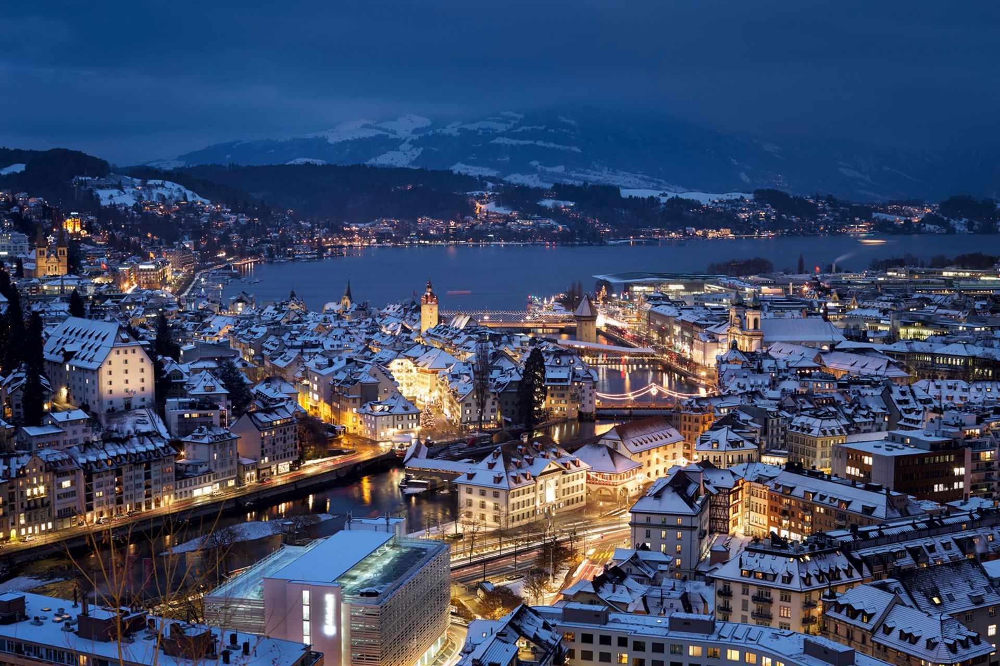

# Swiss Cuisine

A four-language Alpine cuisine: French-influenced western cantons (Geneva, Vaud), German-speaking central and east (Zurich, Bern, Basel, Graubünden), Italian-flavoured Ticino in the south, and the small Romansh-speaking valleys. The shared culture is cheese (fondue, raclette, gruyère, emmental), cured Alpine meat (bündnerfleisch, cervelat), fried potato (rösti), and the dark chocolate that built the modern Swiss industry. Home cooking is hearty, dairy-rich and built around the Sunday family table.
