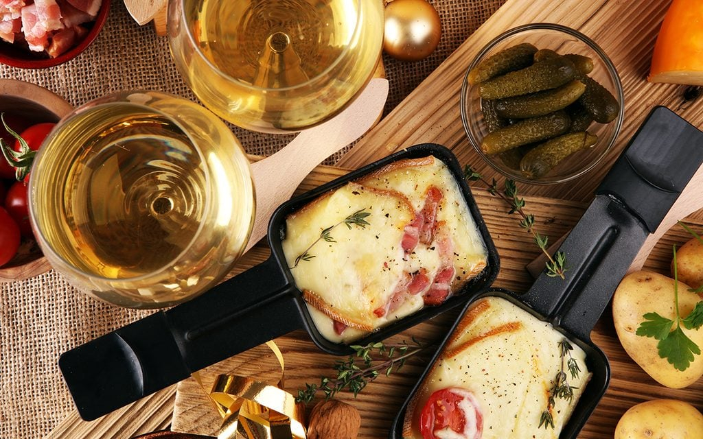

# Raclette

*Swiss melted-cheese dish: a half wheel of raclette cheese held over heat (traditionally an open fire; now a tabletop grill), the molten surface scraped onto plates of boiled potatoes, gherkins and pickled onions.*

**Serves:** 6

**Prep Time:** 15 minutes

**Cook Time:** 20 minutes (plus melting time per round at the table)

## Overview
Raclette is the Swiss winter eating ritual that even fondue can't beat. The name comes from "racler" (French: to scrape) - a half wheel of the eponymous raclette cheese is melted by exposure to a heat source, and the gooey surface is then scraped off onto each diner's plate. Traditionally the cheese is held in front of an open hearth fire; the modern home version uses a tabletop electric raclette machine that melts small individual portions on small spatulas. Either way, the melted cheese is scraped over boiled new potatoes (raclette potatoes - small, waxy), with cornichons, silverskin onions, dried Bündnerfleisch and pickled vegetables alongside. The cheese course is the meal.

## Ingredients

### Cheese and meats
- 1.5 kg raclette cheese (the genuine Swiss or French AOC version); substitute Gruyère or another semi-firm melting cheese only as a last resort
- 200 g Bündnerfleisch (Swiss air-dried beef) or any thinly-sliced cured meat (jambon cru, prosciutto)

### Potatoes
- 1.5 kg small waxy potatoes (Charlotte, Anya, or new potatoes)
- 2 tsp salt
- A few sprigs of fresh thyme

### Pickles + sides
- 200 g cornichons
- 200 g silverskin pickled onions
- 100 g pickled gherkins
- A small dish of crushed black pepper
- A small dish of paprika
- A small dish of cumin
- A small dish of dried oregano (optional)

## Method

### Stage 1 - Boil the potatoes
1. Wash the potatoes; leave the skins on for the rustic Swiss style.
2. Place in a large pot; cover with cold salted water; add the thyme.
3. Bring to a boil; simmer 18-22 minutes until a knife slides through cleanly.
4. Drain; keep warm in a covered serving bowl.

### Stage 2 - Set up the raclette
- **Tabletop electric raclette machine:** Cut the cheese into 1 cm thick slices, sized to fit the small spatulas (coupelles). Each diner places a slice on their coupelle and slides it under the heating element. The cheese melts in 3-4 minutes; the diner lifts the coupelle out and scrapes the molten cheese over their potatoes.
- **No machine, oven method:** Lay slices of cheese on a heatproof plate; place under a hot grill for 2-3 minutes until bubbling and starting to brown. Bring the whole plate to the table for scraping.

### Stage 3 - Arrange the table
1. Set the centre of the table with the raclette machine (or the cheese-melting plate).
2. Around it: the serving bowl of potatoes, the pickles, the meats, and the seasoning dishes.
3. Each diner has a plate, a knife and a fork (the small wooden raclette spatula if using the machine).

### Stage 4 - Eat in rounds
1. Each diner places 2-3 potatoes on their plate (split open or quartered, skin on).
2. Add a few cornichons and onions.
3. Melt a slice of cheese on their coupelle (or take from the grilled plate).
4. Scrape the molten cheese over the potatoes.
5. Sprinkle with a pinch of paprika or cumin if liked.
6. Eat with a fork.
7. Refill, melt again, scrape again. Repeat 4-6 times per diner.

## Notes
- **Genuine raclette cheese:** This dish is named for the cheese. Substitutes lose the character. AOC raclette from Valais or the French Savoie regions is the gold standard.
- **Pace yourself:** Raclette is meant to be slow eating. A diner takes 3-4 rounds over an hour; it's not a quick meal.
- **No raclette machine substitution:** A hot grill in the oven works for portion-sized melts. A blowtorch is impractical. The tabletop machine is worth the kitchen space if you cook raclette more than once a year.

## Serving
Serve in winter, ideally with a fire nearby and a long evening ahead. White Swiss wine (Fendant from Valais), dry Swiss Chasselas, or a kirsch shot at the end. Crusty bread alongside if you want extra carbs beyond the potatoes.

## Storage
- Best fresh, the same evening.
- Leftover cheese keeps refrigerated 1 week in cling film; eat plain or grilled.
- Leftover boiled potatoes refrigerate 3 days; reheat or eat cold in a salad.
