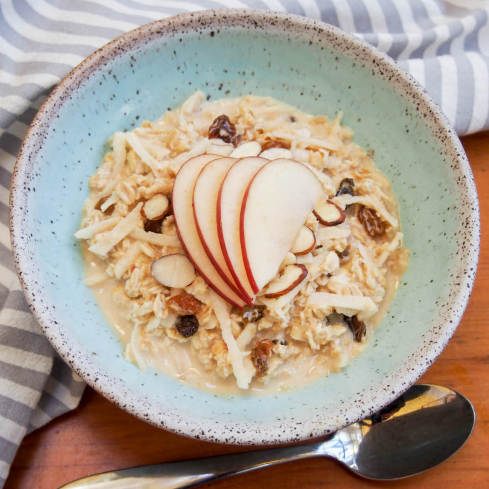

# Bircher Müesli

*The original Swiss muesli: rolled oats soaked overnight in apple juice and yoghurt, folded with grated apple, nuts and honey. Created in a Zurich sanatorium in 1900 and still the standard Swiss breakfast.*

**Serves:** 4

**Prep Time:** 10 minutes (plus overnight soak)

**Cook Time:** None

## Overview
Bircher müesli is the dish Dr Maximilian Bircher-Benner invented around 1900 at his Zurich health sanatorium, where he believed raw fruit was the foundation of health. The original was a small spoon of soaked oats with grated apple, lemon juice, condensed milk, and ground hazelnuts; the modern Swiss home version uses yoghurt instead of condensed milk and is generous with the apple and nuts. The trick is overnight soaking: the oats absorb the apple juice and become creamy without ever being cooked. It's a breakfast served all year round in Switzerland and the dish that quietly conquered global breakfast menus in the late twentieth century.

## Ingredients
- 150 g rolled oats (porridge oats, not instant)
- 250 ml unsweetened apple juice (or milk for a milder version)
- 200 g full-fat plain yoghurt
- 2 large eating apples (Cox, Braeburn, Gala), grated with skin on
- Juice of 1 lemon
- 2 tbsp clear honey (or maple syrup)
- 50 g hazelnuts, toasted and roughly chopped
- 50 g almonds, roughly chopped
- 50 g sultanas or raisins
- 1 tsp ground cinnamon (optional)

### To serve
- A handful of fresh berries (raspberries, strawberries, blueberries) or seasonal fruit
- A spoonful of extra yoghurt
- A drizzle of honey

## Method

### Stage 1 - Soak (night before)
1. Combine the rolled oats, apple juice and sultanas in a bowl.
2. Stir; cover; refrigerate overnight (or at least 4 hours).
3. The oats absorb the liquid and become creamy.

### Stage 2 - Grate the apple
1. In the morning, grate the apples coarsely (skin on for fibre and colour).
2. Immediately squeeze the lemon juice over to stop the apple browning.

### Stage 3 - Combine
1. To the soaked oats, add the yoghurt, grated apple (with lemon juice), honey and cinnamon.
2. Fold to combine.
3. Add half the nuts; reserve the rest for topping.

### Stage 4 - Rest and adjust
1. Let the müesli sit 10 minutes; the texture settles.
2. Taste; adjust honey if you like it sweeter.
3. The mixture should be loose and spoonable, not stiff; loosen with a splash of milk or apple juice if needed.

### Stage 5 - Serve
1. Spoon into bowls.
2. Top with the reserved nuts and the fresh berries.
3. A small extra dollop of yoghurt and a drizzle of honey on top.

## Notes
- **Rolled oats, not instant:** Instant oats turn to paste overnight. Rolled (or jumbo) oats keep some chew.
- **Apple juice vs milk:** Original Bircher used apple juice (or just water with grated apple) - this gives a sharper, fruitier breakfast. Milk gives a creamier, milder one. Switzerland uses both; try both.
- **Don't skip the nuts:** Bircher's original recipe was specifically about hazelnuts for their nutritional density. A nut-free version loses the texture and richness.

## Serving
- Serve at breakfast or as a light dessert after a heavy meal. At the sanatorium the original was served as the starter to a meal, before any cooked dishes.

## Storage
- Refrigerates 3 days; the texture thickens further over time - loosen with milk or yoghurt.
- The fresh berry topping goes on per serving, not into the bulk mix.
- Doesn't freeze.
